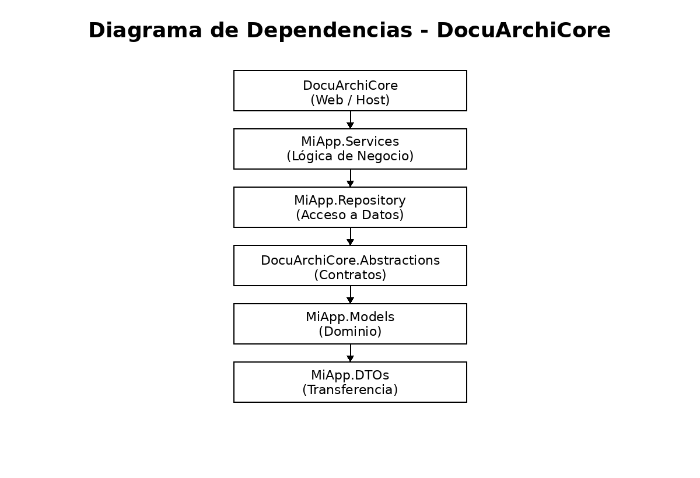

# 📘 Arquitectura DocuArchiCore – v1.0

**Estado:** Vigente / Congelado  
**Fecha:** _(coloca la fecha actual)_  
**Arquitecto responsable:** Miguel Urueta  

---

## 1. Propósito del documento

Este documento define la **arquitectura base oficial** del sistema **DocuArchiCore**, estableciendo:

- Estructura modular
- Estrategia de repositorios
- Dependencias permitidas
- Gobierno técnico
- Uso de Git y GitKraken

Cualquier desviación de este documento requiere **validación arquitectónica**.

---

## 2. Visión general del sistema

**DocuArchiCore** es una plataforma **modular de gestión documental**, orientada a:

- Escalabilidad
- Mantenibilidad
- Separación de responsabilidades
- Trabajo colaborativo por perfiles

La arquitectura está basada en:
- ASP.NET Core
- Principios DDD
- Separación estricta por capas
- Contratos explícitos
- Arquitectura Multi-Repositorio

---

## 3. Arquitectura de repositorios (Multi-Repo)

### Decisión arquitectónica #1 (OFICIAL)

DocuArchiCore adopta una **arquitectura Multi-Repositorio**, donde **cada módulo funcional es un repositorio Git independiente**.

### Repositorios oficiales

| Repositorio | Responsabilidad |
|------------|-----------------|
| **DocuArchiCore** | Host / Web / Controllers |
| **MiApp.Services** | Lógica de negocio |
| **MiApp.Repository** | Acceso a datos |
| **MiApp.Models** | Entidades de dominio |
| **MiApp.DTOs** | Objetos de transferencia |
| **DocuArchiCore.Abstractions** | Contratos e interfaces |

Ningún repositorio es opcional.

---

## 4. DocuArchiCore.Abstractions (Contrato central)

### Rol del módulo

`DocuArchiCore.Abstractions` es el **núcleo contractual del sistema**.

Contiene únicamente:
- Interfaces
- Enums
- Constantes
- Contratos compartidos

### Restricciones

- ❌ No contiene implementaciones
- ❌ No contiene acceso a datos
- ❌ No depende de ningún otro módulo

> Un cambio en este módulo impacta a todo el sistema.

---

## 5. Dependencias permitidas (regla de oro)

Las dependencias entre módulos siguen un **flujo unidireccional estricto**.

### Diagrama lógico de dependencias

```
MiApp.DTOs
   ↓
MiApp.Models
   ↓
DocuArchiCore.Abstractions
   ↓
MiApp.Repository
   ↓
MiApp.Services
   ↓
DocuArchiCore (Web / Host)
```

### Reglas estrictas

- No se permiten dependencias circulares
- Web no es referenciado por ningún módulo
- Repository no depende de Services
- Abstractions no depende de ningún otro módulo

Si una dependencia no está en este diagrama, **no está permitida**.

---

## 6. Estrategia Git oficial

### Ramas estándar (en TODOS los repositorios)

```
main        → rama estable / producción
develop     → rama de integración
feature/*   → ramas de trabajo diario
```

### Reglas de trabajo

- ❌ Prohibido trabajar directamente en `main`
- ❌ Prohibido hacer merge directo a `main`
- ✅ Todo cambio debe ingresar mediante Pull Request a `develop`
- ✅ Cada tarea debe realizarse en una rama `feature/*`

---

## 7. GitKraken como herramienta oficial

### Decisión arquitectónica #2

GitKraken Desktop es la **herramienta oficial** para la gestión de repositorios Git del proyecto.

### Uso obligatorio

- Uso de **Workspace DocuArchiCore**
- Un repositorio por módulo
- Revisión visual de ramas, commits y sincronización

---

## 8. Gobierno y congelación de la arquitectura

A partir de esta versión:

- Se congela:
  - Estructura de módulos
  - Nombres de repositorios
  - Flujo de dependencias
- Cualquier cambio estructural:
  - Debe ser aprobado por arquitectura
  - Debe quedar documentado

---

## 9. Estado actual de la arquitectura

- Arquitectura base implementada
- Repositorios sincronizados
- Workspace configurado
- Lista para incorporación de equipo
- Lista para evolución controlada

---

## 10. Documentos derivados

Este documento habilita la creación de:

- Guía Git DocuArchiCore
- Guías por perfil (Arquitecto, Services, Repository, Frontend)
- Manual de versionado entre módulos
- Diagramas UML formales
- Manuales técnicos específicos

---

## ✍️ Firma arquitectónica

**Arquitecto:** Miguel Urueta  
**Proyecto:** DocuArchiCore  
**Versión:** 1.0  
