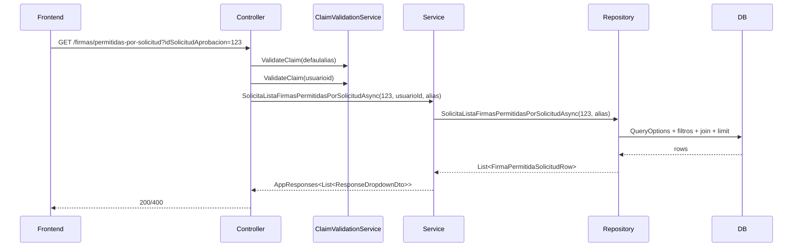
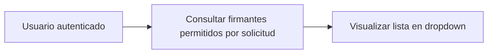
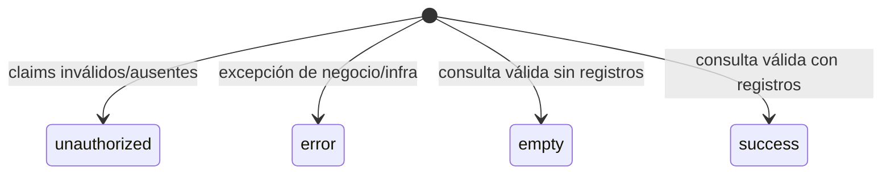

# SCRUM-159 - Arquitectura

## METADATA
- Identificador del ticket: `SCRUM-159`
- Usuario que creó el ticket: `No especificado en artefactos locales`
- Fecha de creación: `No especificada en artefactos locales`
- Módulo afectado: `GestionCorrespondencia/Firmas`
- Objetivo resumido: `Exponer API para listar firmantes permitidos por solicitud de aprobación`
- Relación con tickets previos: `Patrón alineado con endpoints de GestionCorrespondencia/Firmas existentes`
- Autor de implementación: `Equipo backend (sesión actual)`
- Autor de documentación: `Equipo backend (sesión actual)`
- Estado del ticket: `En implementación/validación`

## Objetivo arquitectónico
Agregar un endpoint HTTP GET para consultar firmantes autorizados de una solicitud de aprobación con validación de claims, separación por capas (Controller/Service/Repository), respuesta estandarizada `AppResponses<List<ResponseDropdownDto>>` y reglas de negocio de deduplicación/limite.

## Contexto funcional
El frontend necesita poblar un dropdown/listado de firmas permitidas para una solicitud específica (`idSolicitudAprobacion`) en el flujo de Gestión de Correspondencia.

## Alcance y no alcance
- Alcance:
  - Endpoint `GET /api/gestion-correspondencia/firmas/permitidas-por-solicitud`.
  - Validación de claims `defaulalias` y `usuarioid`.
  - Consulta filtrada por autorización (`ESTADO_AUTORIZACION_FIRMA = 1`) e id solicitud.
  - Mapeo a `ResponseDropdownDto` con deduplicación por `Id`.
  - Respuesta `success/empty/error` estandarizada.
- No alcance:
  - Cambios de esquema de base de datos.
  - Nuevas tablas o migraciones.
  - Cambios de autenticación global/JWT.

## Componentes involucrados
- Controller:
  - `SolicitaListaFirmasPermitidasSolicitudAprobacionController`
- Service:
  - `ServiceSolicitaListaFirmasPermitidasSolicitudAprobacion`
- Repository:
  - `SolicitaListaFirmasPermitidasSolicitudAprobacionRepository`
- DTO:
  - `ResponseDropdownDto`
  - `AppResponses<T>`, `AppMeta`, `AppError`
- ClaimValidationService:
  - `IClaimValidationService`
- QueryOptions:
  - Construcción de query con `TableName`, `Columns`, `Joins`, `Filters`, `OrderByFields`, `Limit`, `DefaultAlias`

## Diagrama de clases

```mermaid
classDiagram
    class SolicitaListaFirmasPermitidasSolicitudAprobacionController {
      +Get(idSolicitudAprobacion) ActionResult<AppResponses<List<ResponseDropdownDto>>>
    }
    class IServiceSolicitaListaFirmasPermitidasSolicitudAprobacion {
      +SolicitaListaFirmasPermitidasPorSolicitudAsync(idSolicitudAprobacion, usuarioId, defaultDbAlias)
    }
    class ServiceSolicitaListaFirmasPermitidasSolicitudAprobacion {
      -_repository ISolicitaListaFirmasPermitidasSolicitudAprobacionRepository
    }
    class ISolicitaListaFirmasPermitidasSolicitudAprobacionRepository {
      +SolicitaListaFirmasPermitidasPorSolicitudAsync(idSolicitudAprobacion, defaultDbAlias)
    }
    class SolicitaListaFirmasPermitidasSolicitudAprobacionRepository {
      -_dapperCrudEngine IDapperCrudEngine
      -_logger ILogger
    }
    class IClaimValidationService
    class ResponseDropdownDto
    class FirmaPermitidaSolicitudRow

    SolicitaListaFirmasPermitidasSolicitudAprobacionController --> IClaimValidationService
    SolicitaListaFirmasPermitidasSolicitudAprobacionController --> IServiceSolicitaListaFirmasPermitidasSolicitudAprobacion
    ServiceSolicitaListaFirmasPermitidasSolicitudAprobacion --> ISolicitaListaFirmasPermitidasSolicitudAprobacionRepository
    SolicitaListaFirmasPermitidasSolicitudAprobacionRepository --> FirmaPermitidaSolicitudRow
```

## Diagrama de secuencia

## Diagrama de casos de uso

## Diagrama de estados

## Flujo end-to-end
1. Frontend envía `idSolicitudAprobacion`.
2. Controller valida claims (`defaulalias`, `usuarioid`) y parámetro.
3. Service valida reglas de entrada y solicita datos al repository.
4. Repository consulta tabla principal + join a `remit_dest_interno`.
5. Service deduplica, aplica fallback de nulls y retorna `AppResponses`.
6. Controller responde `200 OK` (success/empty) o `400 BadRequest` (unauthorized/validación/error).

## Reglas de seguridad
- Endpoint protegido con `[Authorize]`.
- No se procesa consulta sin claims válidos.
- No se exponen datos sensibles adicionales.

## Reglas de autorización
- Claim `usuarioid` debe ser entero positivo.
- Claim `defaulalias` debe existir para resolver `DefaultAlias` de conexión.

## Regla de deduplicación
- Dedupe por `Id` de firmante antes de armar `ResponseDropdownDto`.

## Regla de cardinalidad
- `Limit = 100` en query.
- `Take(100)` adicional en service como defensa.

## Validación SOLID
- S: Cada capa tiene responsabilidad única (control HTTP, negocio, acceso datos).
- O: Extensible por nuevos filtros/columnas sin romper contrato externo.
- L: Implementaciones respetan interfaces.
- I: Interfaces específicas por caso de uso.
- D: Dependencias invertidas vía DI (`IService...`, `IRepository...`, `IClaimValidationService`).

## Deuda técnica identificada
- Falta estandarizar metadatos de observabilidad entre controller/service/repository.
- Falta batería de integración específica para esta consulta (solo unitarias del ticket).

## Riesgos técnicos
- Diferencias de collation/espacios en datos podrían afectar deduplicación visual.
- Cambios futuros en esquema de `remit_dest_interno` pueden romper columnas seleccionadas.

## Decisiones arquitectónicas
- Mantener patrón existente ApiController -> Service -> Repository.
- Usar `AppResponses<T>` para uniformidad transversal.
- Validar claims en controller y reglas funcionales en service.
- Reforzar límite de cardinalidad en DB y capa de negocio.
