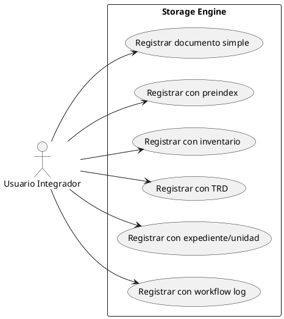
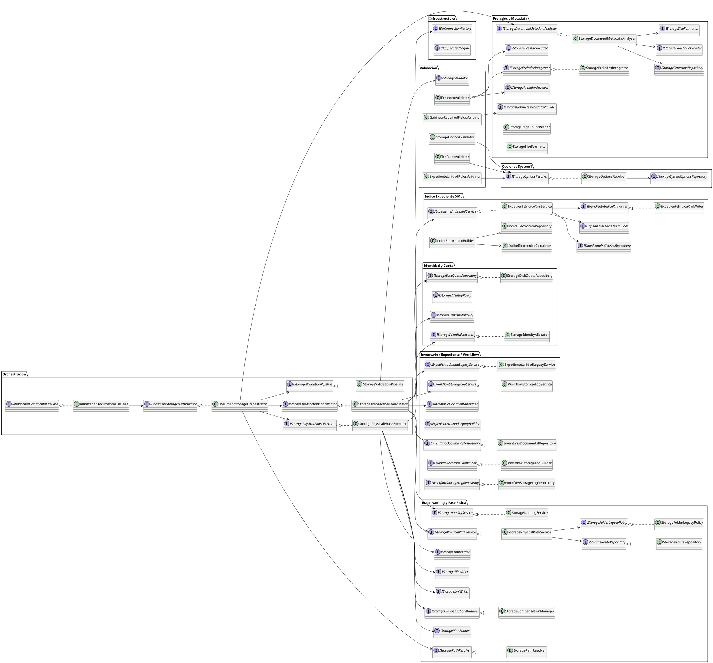
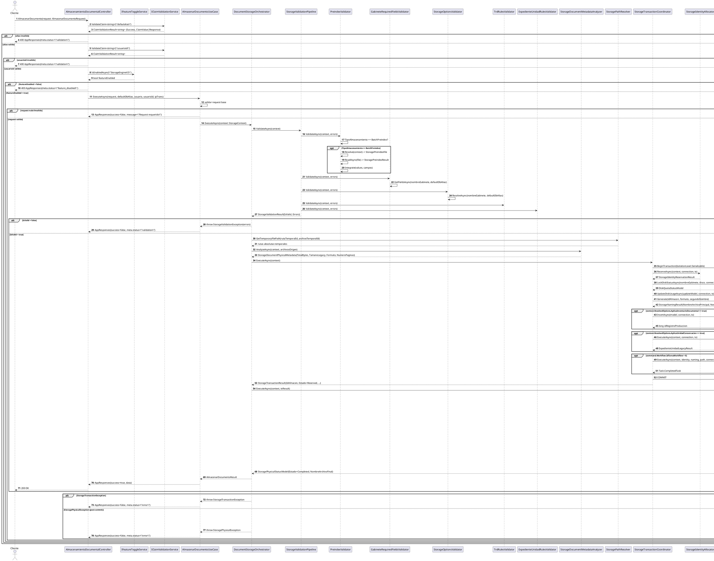
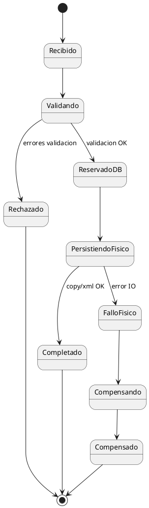
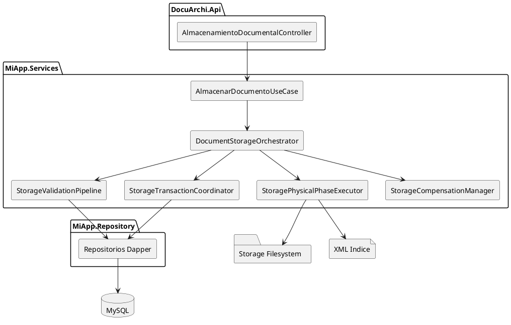
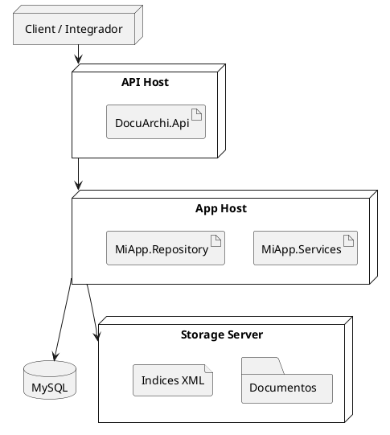

# SCRUM-189 - Diagramas StorageEngine (UML / PlantUML)

## Alcance
Documento de diagramas en formato UML compatible con PlantUML para publicacion tecnica enterprise.

## Estado de Cierre
- Documento actualizado para cierre arquitectonico SCRUM-192.
- Los diagramas reflejan el flujo objetivo implementado en StorageEngineV2 y su separacion DB/FS/XML con compensacion.
- Riesgo residual fuera de diagrama funcional: cuando `StorageEngineV2=false` no hay fallback legacy operativo activo.

## 1) Diagrama de Casos de Uso

## 2) Diagrama de Clases (Nucleo)

```plantuml
@startuml
skinparam classAttributeIconSize 0

interface IAlmacenarDocumentoUseCase {
  +ExecuteAsync(request, defaultDbAlias, usuario, usuarioId, ipTrans) : Task<AppResponses<AlmacenarDocumentoResponse?>>
}

interface IDocumentStorageOrchestrator {
  +ExecuteAsync(context) : Task<AlmacenarDocumentoResult>
}

interface IStorageValidationPipeline {
  +ValidateAsync(context) : Task<StorageValidationResult>
}

interface IStorageTransactionCoordinator {
  +ExecuteAsync(context) : Task<StorageTransactionResult>
}

interface IStoragePhysicalPhaseExecutor {
  +ExecuteAsync(context, transactionResult) : Task<StoragePhysicalStatusModel>
}

interface IStorageCompensationManager {
  +ExecuteAsync(compensationPlan, requestId) : Task
}

class AlmacenamientoDocumentalController {
  +AlmacenarDocumento(request) : Task<IActionResult>
}

class AlmacenarDocumentoUseCase {
  -_orchestrator : IDocumentStorageOrchestrator
  -_logger : ILogger<AlmacenarDocumentoUseCase>
  +ExecuteAsync(request, defaultDbAlias, usuario, usuarioId, ipTrans) : Task<AppResponses<AlmacenarDocumentoResponse?>>
  -Validation(field, message, storageErrors) : AppResponses<AlmacenarDocumentoResponse?>
  -Error(message, details) : AppResponses<AlmacenarDocumentoResponse?>
}

class DocumentStorageOrchestrator {
  -_logger : ILogger<DocumentStorageOrchestrator>
  -_metadataAnalyzer : IStorageDocumentMetadataAnalyzer
  -_pathResolver : IStoragePathResolver
  +ExecuteAsync(context) : Task<AlmacenarDocumentoResult>
}

class StorageValidationPipeline {
  -_validators : IReadOnlyList<IStorageValidator>
  -_logger : ILogger<StorageValidationPipeline>
  +ValidateAsync(context) : Task<StorageValidationResult>
}

class StorageTransactionCoordinator {
  -_dbConnectionFactory : IDbConnectionFactory
  -_identityAllocator : IStorageIdentityAllocator
  -_storageDiskQuotaRepository : IStorageDiskQuotaRepository
  -_inventarioBuilder : IInventarioDocumentalBuilder
  -_inventarioRepository : IInventarioDocumentalRepository
  -_namingService : IStorageNamingService
  -_expedienteUnidadLegacyService : IExpedienteUnidadLegacyService
  -_workflowStorageLogService : IWorkflowStorageLogService
  -_storagePhysicalPathService : IStoragePhysicalPathService
  -_logger : ILogger<StorageTransactionCoordinator>
  +ExecuteAsync(context) : Task<StorageTransactionResult>
  -TryInsertWorkflowLogAsync(context, reservation, connection, transaction) : Task<bool>
  -TryInsertInventarioAsync(context, reservation, connection, transaction) : Task<long?>
  -TryExecuteExpedienteUnidadLegacyAsync(context, connection, transaction) : Task<ExpedienteUnidadLegacyResult?>
  -ResolveNumeroPaginasDocumento(context) : int
}

class StoragePhysicalPhaseExecutor {
  -_storagePlanBuilder : IStoragePlanBuilder
  -_storageXmlBuilder : IStorageXmlBuilder
  -_storageFileWriter : IStorageFileWriter
  -_storageXmlWriter : IStorageXmlWriter
  -_compensationManager : IStorageCompensationManager
  -_expedienteIndiceXmlService : IExpedienteIndiceXmlService
  -_logger : ILogger<StoragePhysicalPhaseExecutor>
  +ExecuteAsync(context, transactionResult) : Task<StoragePhysicalStatusModel>
  -TryUpdateExpedienteIndiceXmlAsync(context, transactionResult, filePlan, compensationPlan) : Task<ExpedienteIndiceXmlUpdateResult?>
}

class StorageCompensationManager {
  -_logger : ILogger<StorageCompensationManager>
  +ExecuteAsync(compensationPlan, requestId) : Task
  -DeleteFiles(files, requestId, phase) : void
  -DeleteDirectories(directories, requestId) : void
}

class StorageContext {
  +DefaultDbAlias : string
  +Usuario : string
  +UsuarioId : int
  +RequestId : string
  +NombreGabinete : string
  +RutaTemporalId : string
  +NombreDocumento : string
  +ArchivosTemporales : IReadOnlyList<string>
  +IpTrans : string?
  +Command : AlmacenarDocumentoCommand?
  +PreindexValues : IReadOnlyList<string>
  +EffectiveCamposIndexacion : IReadOnlyList<CampoIndexacionDto>
  +GabineteFieldsMetadata : IReadOnlyList<GabineteFieldMetadata>
  +ResolvedOptions : StorageResolvedOptionsModel?
  +PhysicalMetadata : StorageDocumentPhysicalMetadata?
  +ExpedienteUnidadResult : ExpedienteUnidadLegacyResult?
}

class AlmacenarDocumentoCommand {
  +NombreGabinete : string
  +RutaTemporalId : string
  +NombreDocumento : string
  +RequestId : string
  +Documentos : IReadOnlyList<DocumentoEntradaDto>
  +CamposIndexacion : IReadOnlyList<CampoIndexacionDto>
  +Inventario : InventarioDocumentalDto?
  +Trd : TrdStorageDto?
  +Expediente : ExpedienteStorageDto?
  +Workflow : WorkflowStorageDto?
  +FullText : string?
  +NumeroPaginasDeclaradas : int
  +TipoAlmacenamiento : TipoAlmacenamientoEnum
  +EvaluarCamposObligatorios : bool
}

class StorageResolvedOptionsModel {
  +NombreGabinete : string
  +AplicaInventarioDocumental : bool
  +AplicaTrd : bool
  +AplicaUnidadConservacion : bool
}

class StorageValidationResult {
  +IsValid : bool
  +Errors : List<StorageError>
}

class StorageError {
  +Code : string
  +Message : string
  +Phase : StoragePhase?
}

class StoragePlanModel {
  +Identity : StorageIdentityModel
  +Metadata : StorageMetadataModel
  +RutaFinal : string
}

class StorageTransactionResult {
  +IdAlmacen : long
  +IdentityReservation : StorageIdentityReservationResult
  +IdRegistroProduccionDocumental : long?
  +Success : bool
  +Estado : StorageDocumentState
  +RequestId : string
  +FechaEjecucion : DateTime
  +DuracionMs : long
  +DiskUsageUpdated : bool
  +WorkflowLogInserted : bool
  +ExpedienteUnidadResult : ExpedienteUnidadLegacyResult?
}

class AlmacenarDocumentoResult {
  +IdAlmacen : long
  +IdRegistroProduccionDocumental : long?
  +NombreArchivoFinal : string
  +RequestId : string
  +Estado : StorageDocumentState
}

IAlmacenarDocumentoUseCase <|.. AlmacenarDocumentoUseCase
IDocumentStorageOrchestrator <|.. DocumentStorageOrchestrator
IStorageValidationPipeline <|.. StorageValidationPipeline
IStorageTransactionCoordinator <|.. StorageTransactionCoordinator
IStoragePhysicalPhaseExecutor <|.. StoragePhysicalPhaseExecutor
IStorageCompensationManager <|.. StorageCompensationManager

AlmacenamientoDocumentalController --> IAlmacenarDocumentoUseCase
AlmacenarDocumentoUseCase --> IDocumentStorageOrchestrator
DocumentStorageOrchestrator --> StorageContext
DocumentStorageOrchestrator --> AlmacenarDocumentoResult
StorageValidationPipeline --> StorageContext
StorageValidationPipeline --> StorageValidationResult
StorageTransactionCoordinator --> StorageContext
StorageTransactionCoordinator --> StorageTransactionResult
StoragePhysicalPhaseExecutor --> StorageContext
StoragePhysicalPhaseExecutor --> StorageTransactionResult
StoragePhysicalPhaseExecutor --> IStorageCompensationManager
StorageContext --> AlmacenarDocumentoCommand
StorageContext --> StorageResolvedOptionsModel
@enduml
```

## 2.1) Diagrama de Clases de Modelos y DTOs (Detalle Completo de Atributos)

```plantuml
@startuml
skinparam classAttributeIconSize 0

class AlmacenarDocumentoRequest {
  +NombreGabinete : string
  +RutaTemporalId : string
  +NombreDocumento : string
  +RequestId : string
  +Documentos : IReadOnlyList<DocumentoEntradaDto>
  +CamposIndexacion : IReadOnlyList<CampoIndexacionDto>
  +Inventario : InventarioDocumentalDto?
  +Trd : TrdStorageDto?
  +Expediente : ExpedienteStorageDto?
  +Workflow : WorkflowStorageDto?
  +FullText : string?
  +NumeroPaginasDeclaradas : int
}

class AlmacenarDocumentoResponse {
  +IdAlmacen : long
  +IdRegistroProduccionDocumental : long?
  +NombreArchivoFinal : string
  +RequestId : string
}

class DocumentoEntradaDto {
  +IdDocumento : string
  +ArchivoTemporalId : string
  +NombreOriginal : string?
  +Extension : string?
  +NumeroPaginas : int
}

class CampoIndexacionDto {
  +NombreCampo : string
  +Valor : string?
  +EsObligatorio : bool
}

class InventarioDocumentalDto {
  +IdUsuarioGestion : int
  +IdEmpresa : int
  +Radicado : string?
  +FechaElaboracion : string?
  +SegundoNombreDocumento : string?
}

class TrdStorageDto {
  +IdArea : int?
  +IdSerie : int?
  +IdSubSerie : int?
  +IdTipoDocumento : int?
  +NombreArea : string?
  +NombreSerie : string?
  +NombreSubSerie : string?
  +NombreTipoDocumento : string?
}

class ExpedienteStorageDto {
  +IdExpediente : int?
  +IdTipoExpediente : int?
  +IdTipoUnidadConservacion : int?
  +IdUnidadConservacion : int?
  +IdClaseDocumento : int?
  +NombreExpediente : string?
  +ClaseDocumento : string?
  +NombreUnidadConservacion : string?
}

class WorkflowStorageDto {
  +IdTareaWorkflow : long?
  +IdRutaWorkflow : int?
}

class AlmacenarDocumentoCommand {
  +NombreGabinete : string
  +RutaTemporalId : string
  +NombreDocumento : string
  +RequestId : string
  +Documentos : IReadOnlyList<DocumentoEntradaDto>
  +CamposIndexacion : IReadOnlyList<CampoIndexacionDto>
  +Inventario : InventarioDocumentalDto?
  +Trd : TrdStorageDto?
  +Expediente : ExpedienteStorageDto?
  +Workflow : WorkflowStorageDto?
  +FullText : string?
  +NumeroPaginasDeclaradas : int
  +TipoAlmacenamiento : TipoAlmacenamientoEnum
  +EvaluarCamposObligatorios : bool
}

class StorageContext {
  +DefaultDbAlias : string
  +Usuario : string
  +UsuarioId : int
  +RequestId : string
  +NombreGabinete : string
  +RutaTemporalId : string
  +NombreDocumento : string
  +ArchivosTemporales : IReadOnlyList<string>
  +IpTrans : string?
  +Command : AlmacenarDocumentoCommand?
  +PreindexValues : IReadOnlyList<string>
  +EffectiveCamposIndexacion : IReadOnlyList<CampoIndexacionDto>
  +GabineteFieldsMetadata : IReadOnlyList<GabineteFieldMetadata>
  +ResolvedOptions : StorageResolvedOptionsModel?
  +PhysicalMetadata : StorageDocumentPhysicalMetadata?
  +ExpedienteUnidadResult : ExpedienteUnidadLegacyResult?
}

class StorageResolvedOptionsModel {
  +NombreGabinete : string
  +AplicaInventarioDocumental : bool
  +AplicaTrd : bool
  +AplicaUnidadConservacion : bool
}

class StorageDocumentPhysicalMetadata {
  +TotalBytes : long
  +TamanoLegacy : string
  +Formato : string
  +NumeroPaginas : int
  +PaginasCalculadasDesdeArchivo : bool
}

class GabineteFieldMetadata {
  +FieldName : string
  +IsRequired : bool
  +Orden : int
}

class StorageIdentityModel {
  +IdAlmacen : long
  +Disco : int
  +Carpeta : int
  +NumeroPaginasCarpeta : int
}

class StorageMetadataModel {
  +Formato : string
  +Tamano : string
  +NumeroPaginas : int
  +NombreFinalDocumento : string
}

class StorageIdentityReservationResult {
  +Identity : StorageIdentityModel
  +PreviousProxId : long
  +NewProxId : long
  +PreviousFolder : int
  +NewFolder : int
  +PreviousFolderPages : int
  +NewFolderPages : int
  +TamDisc : long
}

class StoragePlanModel {
  +Identity : StorageIdentityModel
  +Metadata : StorageMetadataModel
  +RutaFinal : string
}

class StorageFilePlanModel {
  +StorageRoot : string
  +RutaFinal : string
  +NombreArchivoPrincipal : string
  +NombreXml : string
  +SegundoNombreDocumental : string
  +ArchivosOrigen : List<string>
}

class StorageNamingResult {
  +NombreArchivoPrincipal : string
  +NombreXml : string
  +SegundoNombre : string
}

class StorageCompensationPlan {
  +ArchivosTemporales : List<string>
  +ArchivosFinales : List<string>
  +XmlTemporales : List<string>
  +XmlFinales : List<string>
  +XmlIndiceExpedienteTemporales : List<string>
  +XmlIndiceExpedienteFinales : List<string>
  +DirectoriosCreados : List<string>
}

class ExpedienteIndiceXmlUpdateResult {
  +Updated : bool
  +RutaArchivoXml : string
  +Estado : string
}

class ExpedienteUnidadLegacyResult {
  +Ejecutado : bool
  +TieneExpediente : bool
  +TieneUnidadConservacion : bool
  +IdTipoUnidadDocumental : int?
  +EstadoExpedienteElectronico : int?
  +NumeroFolios : int
  +UnidadConservaTipo : UnidadConservaTipoEnum
}

class StorageTransactionResult {
  +IdAlmacen : long
  +IdentityReservation : StorageIdentityReservationResult
  +IdRegistroProduccionDocumental : long?
  +Success : bool
  +Estado : StorageDocumentState
  +RequestId : string
  +FechaEjecucion : DateTime
  +DuracionMs : long
  +DiskUsageUpdated : bool
  +WorkflowLogInserted : bool
  +ExpedienteUnidadResult : ExpedienteUnidadLegacyResult?
}

class StoragePhysicalStatusModel {
  +RequestId : string
  +IdAlmacen : long
  +NombreArchivoFinal : string
  +Estado : StorageDocumentState
  +ErrorMessage : string?
  +FechaActualizacion : DateTime
  +ExpedienteIndiceXmlResult : ExpedienteIndiceXmlUpdateResult?
  +InconsistenciaPostCommit : string?
}

class StorageError {
  +Code : string
  +Message : string
  +Phase : StoragePhase?
}

class StorageValidationResult {
  +IsValid : bool
  +Errors : List<StorageError>
}

class AlmacenarDocumentoResult {
  +IdAlmacen : long
  +IdRegistroProduccionDocumental : long?
  +NombreArchivoFinal : string
  +RequestId : string
  +Estado : StorageDocumentState
}

enum StoragePhase {
  RequestReceived
  Validation
  Transaction
  IdentityReservation
  GabineteInsert
  InventarioInsert
  ExpedienteIndex
  FileSystem
  Xml
  Compensation
  Completed
  Failed
}

enum StorageDocumentState {
  Pending
  Reserved
  Completed
  PhysicalFailed
  Failed
}

enum TipoAlmacenamientoEnum {
  BatchPreindex
  Manual
  Digitalizacion
  Workflow
}

enum UnidadConservaTipoEnum {
  Ninguna
  Digitalizado
  Electronico
}

AlmacenarDocumentoRequest "1" *-- "1..*" DocumentoEntradaDto
AlmacenarDocumentoRequest "1" *-- "0..*" CampoIndexacionDto
AlmacenarDocumentoRequest "1" o-- "0..1" InventarioDocumentalDto
AlmacenarDocumentoRequest "1" o-- "0..1" TrdStorageDto
AlmacenarDocumentoRequest "1" o-- "0..1" ExpedienteStorageDto
AlmacenarDocumentoRequest "1" o-- "0..1" WorkflowStorageDto

AlmacenarDocumentoCommand "1" *-- "1..*" DocumentoEntradaDto
AlmacenarDocumentoCommand "1" *-- "0..*" CampoIndexacionDto
AlmacenarDocumentoCommand "1" o-- "0..1" InventarioDocumentalDto
AlmacenarDocumentoCommand "1" o-- "0..1" TrdStorageDto
AlmacenarDocumentoCommand "1" o-- "0..1" ExpedienteStorageDto
AlmacenarDocumentoCommand "1" o-- "0..1" WorkflowStorageDto
AlmacenarDocumentoCommand --> TipoAlmacenamientoEnum

StorageContext "1" o-- "0..1" AlmacenarDocumentoCommand
StorageContext "1" *-- "0..*" CampoIndexacionDto
StorageContext "1" *-- "0..*" GabineteFieldMetadata
StorageContext "1" o-- "0..1" StorageResolvedOptionsModel
StorageContext "1" o-- "0..1" StorageDocumentPhysicalMetadata
StorageContext "1" o-- "0..1" ExpedienteUnidadLegacyResult

StorageIdentityReservationResult "1" *-- "1" StorageIdentityModel
StoragePlanModel "1" *-- "1" StorageIdentityModel
StoragePlanModel "1" *-- "1" StorageMetadataModel
StorageTransactionResult "1" *-- "1" StorageIdentityReservationResult
StorageTransactionResult "1" o-- "0..1" ExpedienteUnidadLegacyResult
StorageTransactionResult --> StorageDocumentState

StoragePhysicalStatusModel "1" o-- "0..1" ExpedienteIndiceXmlUpdateResult
StoragePhysicalStatusModel --> StorageDocumentState
ExpedienteUnidadLegacyResult --> UnidadConservaTipoEnum

StorageValidationResult "1" *-- "0..*" StorageError
StorageError --> StoragePhase
AlmacenarDocumentoResult --> StorageDocumentState
@enduml
```

## 2.2) Diagrama de Clases Expandido (Servicios e Integraciones StorageEngine)

### Cobertura del diagrama 2.2
- Este diagrama amplía la vista y cubre clases/interfaces realmente involucradas en el StorageEngine (orquestación, validación, metadata/preindex, opciones `system1`, transacción, fase física, expediente XML y workflow log).
- La selección se consolidó contra contratos y pruebas del repositorio (`StorageEngineContractsTests`, `StorageValidationPipelineTests`, `StorageTransactionCoordinatorTests`, `ExpedienteIndiceXml*Tests`, `WorkflowStorageLog*Tests`, `AlmacenarDocumentoUseCaseTests`).

## 3) Diagrama de Secuencia Integral (Unico)

### 3.1 Participantes, roles y responsabilidades
| Participante | Rol | Responsabilidad |
|---|---|---|
| `Cliente` | Actor externo | Dispara operación de almacenamiento documental |
| `AlmacenamientoDocumentalController` | Entrada API | Valida claims (`defaulalias`, `usuarioid`), feature flag, delega a UseCase |
| `AlmacenarDocumentoUseCase` | Aplicación | Valida request base, arma `StorageContext`, traduce excepciones a `AppResponses` |
| `DocumentStorageOrchestrator` | Orquestación | Ejecuta pipeline completo validación -> metadata -> transacción -> fase física |
| `StorageValidationPipeline` + validadores | Validación | Ejecuta reglas de preindex, metadata obligatoria, opciones, TRD y expediente/unidad |
| `StorageTransactionCoordinator` | Núcleo transaccional | Reserva identidad, actualiza cuota, inserta inventario/log, procesa expediente/unidad |
| `StoragePhysicalPhaseExecutor` | Fase post-DB | Copia archivos, genera XML, actualiza índice expediente, gestiona compensación |
| `MySQL` | Persistencia | `BEGIN/COMMIT/ROLLBACK`, `INSERT/UPDATE/LOCK` |
| `FileSystem/XML` | Persistencia física | Crea/copias DIG/FXL y XML índice de expediente |

### 3.2 Variables clave transmitidas
| Variable | Tipo | Uso principal |
|---|---|---|
| `requestId` | `string` | Trazabilidad end-to-end y correlación de logs |
| `defaultDbAlias` | `string` | Selección de tenant/base para consultas/escrituras |
| `usuario`, `usuarioId` | `string`, `int` | Autoría y ownership de operación |
| `ipTrans` | `string?` | Auditoría de red en flujo workflow/log |
| `nombreGabinete` | `string` | Selección de metadata/tabla/ruta/opciones |
| `rutaTemporalId`, `archivosTemporales` | `string`, `IReadOnlyList<string>` | Resolución de archivos origen |
| `tipoAlmacenamiento` | `enum` | Dispara rama preindex (`BatchPreindex`) |
| `resolvedOptions` | `StorageResolvedOptionsModel` | Activa/desactiva inventario/TRD/unidad |
| `idAlmacen` | `long` | Identidad documental reservada (legacy parity) |
| `idRegistroProduccionDocumental` | `long?` | Relación con inventario documental |
| `statusCode/meta.status` | `int/string` | Resultado API (`validation`, `feature_disabled`, `error`, `ok`) |

### 3.3 Condiciones y ramificaciones (alt/opt)
| Bloque | Condición disparadora | Camino |
|---|---|---|
| `alt alias invalido` | `ValidateClaim("defaulalias").Success == false` | 400 validación |
| `alt usuarioid invalido` | `ValidateClaim("usuarioid")` no numérico/invalid | 400 validación |
| `alt feature off` | `IsEnabledAsync("StorageEngineV2") == false` | 400 `feature_disabled` |
| `alt request invalido` | request nulo o base inválida en UseCase | respuesta de validación |
| `alt IsValid = false` | `StorageValidationResult.IsValid == false` | `StorageValidationException` |
| `opt preindex` | `TipoAlmacenamiento == BatchPreindex` | resolución + lectura + integración |
| `opt inventario` | `ResolvedOptions.AplicaInventarioDocumental == true` | insert inventario |
| `opt unidad/expediente` | `ResolvedOptions.AplicaUnidadConservacion == true` | servicio legacy expediente |
| `opt workflow` | `Workflow.IdTareaWorkflow > 0` | insert logdocuarchi |
| `opt índice expediente` | `TieneExpediente && EstadoExpedienteElectronico==2` | update xml índice |
| `alt error transaccional` | `StorageTransactionException` | rollback y error API |
| `alt error físico` | `StoragePhysicalException` | compensación FS/XML y error API |

### 3.4 Secuencia paso a paso
1. Cliente invoca `AlmacenarDocumento(request)`.
2. Controller valida claim `defaulalias`.
3. Controller valida claim `usuarioid`.
4. Controller consulta `StorageEngineV2`.
5. Controller invoca `ExecuteAsync(...)` del UseCase.
6. UseCase valida request y crea `StorageContext`.
7. UseCase invoca `DocumentStorageOrchestrator.ExecuteAsync(context)`.
8. Orchestrator ejecuta `StorageValidationPipeline.ValidateAsync(context)`.
9. Pipeline ejecuta `PreindexValidator`.
10. Pipeline ejecuta `GabineteRequiredFieldsValidator`.
11. Pipeline ejecuta validadores de opciones/TRD/expediente.
12. Si validación falla, se corta flujo con `StorageValidationException`.
13. Si validación pasa, Orchestrator resuelve rutas temporales.
14. Orchestrator calcula metadata física (formato/tamaño/páginas).
15. Orchestrator invoca `StorageTransactionCoordinator.ExecuteAsync(context)`.
16. Coordinator abre transacción serializable y reserva identidad.
17. Coordinator bloquea/actualiza cuota de disco.
18. Coordinator genera naming DIG/FXL.
19. Coordinator inserta inventario (si aplica).
20. Coordinator ejecuta expediente/unidad (si aplica).
21. Coordinator registra workflow log (si aplica).
22. Coordinator hace `COMMIT` y retorna `StorageTransactionResult`.
23. Orchestrator invoca `StoragePhysicalPhaseExecutor.ExecuteAsync(...)`.
24. Physical ejecuta plan, copia archivos y escribe XML FXL.
25. Physical actualiza XML índice expediente (si aplica).
26. Physical retorna `Completed`; Orchestrator retorna resultado final.
27. UseCase mapea respuesta de éxito; Controller responde `200 OK`.
28. Si falla fase física, se ejecuta compensación y se responde error controlado.

### 3.5 Tabla complementaria de interacciones
| Paso | Actor origen | Actor destino | Función/Evento | Parámetros | Retorno |
|---|---|---|---|---|---|
| 1 | Cliente | Controller | `AlmacenarDocumento` | `request` | `ActionResult<AppResponses<...>>` |
| 2 | Controller | ClaimValidation | `ValidateClaim<string>` | `"defaulalias"` | `ClaimValidationResult<string>` |
| 3 | Controller | ClaimValidation | `ValidateClaim<string>` | `"usuarioid"` | `ClaimValidationResult<string>` |
| 4 | Controller | FeatureToggle | `IsEnabledAsync` | `"StorageEngineV2"` | `bool` |
| 5 | Controller | UseCase | `ExecuteAsync` | `request, defaultDbAlias, usuario, usuarioId, ipTrans` | `AppResponses<AlmacenarDocumentoResponse?>` |
| 6 | UseCase | Orchestrator | `ExecuteAsync` | `StorageContext` | `AlmacenarDocumentoResult` |
| 7 | Orchestrator | ValidationPipeline | `ValidateAsync` | `StorageContext` | `StorageValidationResult` |
| 8 | ValidationPipeline | PreindexValidator | `ValidateAsync` | `context, errors` | `Task` |
| 9 | ValidationPipeline | GabineteRequiredFieldsValidator | `ValidateAsync` | `context, errors` | `Task` |
| 10 | ValidationPipeline | StorageOptionsValidator | `ValidateAsync` | `context, errors` | `Task` |
| 11 | ValidationPipeline | TrdRulesValidator | `ValidateAsync` | `context, errors` | `Task` |
| 12 | ValidationPipeline | ExpedienteUnidadRulesValidator | `ValidateAsync` | `context, errors` | `Task` |
| 13 | Orchestrator | PathResolver | `GetTemporaryFilePath` | `rutaTemporalId, archivoTemporalId` | `string` |
| 14 | Orchestrator | MetadataAnalyzer | `AnalyzeAsync` | `context, archivos` | `StorageDocumentPhysicalMetadata` |
| 15 | Orchestrator | TransactionCoordinator | `ExecuteAsync` | `context` | `StorageTransactionResult` |
| 16 | TxCoordinator | IdentityAllocator | `ReserveAsync` | `context, connection, tx` | `StorageIdentityReservationResult` |
| 17 | TxCoordinator | DiskRepo | `LockDiskStatusAsync` | `gabinete, disco, connection, tx` | `DiskQuotaStatusModel` |
| 18 | TxCoordinator | DiskRepo | `UpdateDiskUsageAsync` | `DiskQuotaUpdateModel, connection, tx` | `int` |
| 19 | TxCoordinator | NamingService | `Generate` | `idAlmacen, extension, segundoNombre` | `StorageNamingResult` |
| 20 | TxCoordinator | InventarioRepo | `InsertAsync` | `InventarioDocumentalInsertModel, connection, tx` | `long` |
| 21 | TxCoordinator | ExpedienteUnidadService | `ExecuteAsync` | `context, connection, tx` | `ExpedienteUnidadLegacyResult` |
| 22 | TxCoordinator | WorkflowLogService | `ExecuteAsync` | `context, identity, naming, path, connection, tx` | `Task` |
| 23 | Orchestrator | PhysicalExecutor | `ExecuteAsync` | `context, txResult` | `StoragePhysicalStatusModel` |
| 24 | PhysicalExecutor | PlanBuilder | `BuildFilePlanAsync` | `context, txResult` | `StorageFilePlanModel` |
| 25 | PhysicalExecutor | FileWriter | `CopyAsync` | `plan, compensationPlan, requestId` | `string` |
| 26 | PhysicalExecutor | XmlBuilder | `BuildXmlModel` | `context, txResult` | `StorageXmlModel` |
| 27 | PhysicalExecutor | XmlWriter | `WriteAsync` | `plan, xmlModel, compensationPlan, requestId` | `string` |
| 28 | PhysicalExecutor | ExpedienteIndiceXmlService | `ExecuteAsync` | `context, txResult, naming, path` | `ExpedienteIndiceXmlUpdateResult` |
| 29 | PhysicalExecutor | CompensationManager | `ExecuteAsync` | `compensationPlan, requestId` | `Task` |

### 3.6 Auditoría de funciones (implementadas/invocaciones/mejoras)
| Función | Parámetros | Retorno | Invoca a | Invocada por | Riesgo/Observación |
|---|---|---|---|---|---|
| `AlmacenamientoDocumentalController.AlmacenarDocumento` | `AlmacenarDocumentoRequest` | `ActionResult<AppResponses<...>>` | `ValidateClaim`, `IsEnabledAsync`, `UseCase.ExecuteAsync` | Cliente/API | Ya aplica guardas de alias/usuario/feature flag |
| `IAlmacenarDocumentoUseCase.ExecuteAsync` | `request, defaultDbAlias, usuario, usuarioId, ipTrans` | `Task<AppResponses<...>>` | `Orchestrator.ExecuteAsync` | Controller | Debe preservar mapeo consistente de excepciones |
| `IDocumentStorageOrchestrator.ExecuteAsync` | `StorageContext` | `Task<AlmacenarDocumentoResult>` | Validation, Metadata, Transaction, Physical | UseCase | Punto crítico de coordinación |
| `IStorageValidationPipeline.ValidateAsync` | `StorageContext` | `Task<StorageValidationResult>` | Validadores | Orchestrator | Orden de validadores impacta paridad |
| `PreindexValidator.ValidateAsync` | `context, errors` | `Task` | Resolver/Reader/Integrator | Pipeline | Rama sensible a `TipoAlmacenamiento` |
| `GabineteRequiredFieldsValidator.ValidateAsync` | `context, errors` | `Task` | `GetFieldsAsync` | Pipeline | Riesgo de desalineación campo/orden |
| `StorageOptionsValidator.ValidateAsync` | `context, errors` | `Task` | `ResolveAsync` | Pipeline | Depende de `system1` real |
| `TrdRulesValidator.ValidateAsync` | `context, errors` | `Task` | `ResolveAsync` | Pipeline | Reglas de IDs > 0 |
| `ExpedienteUnidadRulesValidator.ValidateAsync` | `context, errors` | `Task` | `ResolveAsync` | Pipeline | Ambigüedad expediente/unidad debe evitarse |
| `IStorageTransactionCoordinator.ExecuteAsync` | `StorageContext` | `Task<StorageTransactionResult>` | allocator/quota/inventario/expediente/workflow | Orchestrator | Núcleo ACID; rollback obligatorio |
| `IStorageIdentityAllocator.ReserveAsync` | `context, connection, tx` | `Task<StorageIdentityReservationResult>` | DB (`FOR UPDATE`) | TxCoordinator | Concurrencia crítica |
| `IStorageDiskQuotaRepository.LockDiskStatusAsync` | `gabinete, disco, connection, tx` | `Task<DiskQuotaStatusModel>` | DB | TxCoordinator | Debe bloquear fila |
| `IStorageDiskQuotaRepository.UpdateDiskUsageAsync` | `updateModel, connection, tx` | `Task<int>` | DB | TxCoordinator | Falla debe disparar rollback |
| `IInventarioDocumentalRepository.InsertAsync` | `model, connection, tx` | `Task<long>` | DB | TxCoordinator | Sólo si opción activa |
| `IWorkflowStorageLogService.ExecuteAsync` | `context, identity, naming, path, connection, tx` | `Task` | `Insert logdocuarchi` | TxCoordinator | Solo si `IdTareaWorkflow > 0` |
| `IStoragePhysicalPhaseExecutor.ExecuteAsync` | `context, txResult` | `Task<StoragePhysicalStatusModel>` | plan/file/xml/indice/compensación | Orchestrator | Post-commit; riesgo de inconsistencia |
| `IStorageFileWriter.CopyAsync` | `plan, compensationPlan, requestId` | `Task<string>` | FS | PhysicalExecutor | Debe registrar artefactos para compensación |
| `IStorageXmlWriter.WriteAsync` | `plan, xmlModel, compensationPlan, requestId` | `Task<string>` | FS/XML | PhysicalExecutor | Igual política de compensación |
| `IExpedienteIndiceXmlService.ExecuteAsync` | `context, txResult, naming, path` | `Task<ExpedienteIndiceXmlUpdateResult>` | FS/XML índice | PhysicalExecutor | Falla post-commit se marca inconsistencia |
| `IStorageCompensationManager.ExecuteAsync` | `compensationPlan, requestId` | `Task` | delete archivos/directorios | PhysicalExecutor | Obligatorio en fallas físicas |

#### Automatizaciones pendientes o redundancias detectadas
- No se evidencia en este repositorio un generador automático único de diagramas/tabla desde firmas reales (trazabilidad manual-documental).
- Existen múltiples documentos SCRUM con información solapada de secuencias; riesgo de deriva documental.
- Hay rutas de error post-commit que se documentan como inconsistencia controlada; requieren runbook operativo estricto.

#### Recomendaciones para optimizar trazabilidad y evitar regresiones
1. Generar una extracción automática de firmas públicas (`interfaces` + `clases core`) en cada build y compararla con el documento de secuencia.
2. Añadir prueba de contrato para el orden del pipeline de validadores y para la presencia de ramas `alt/opt` críticas (feature flag, inventario, workflow, compensación).
3. Publicar esta tabla 3.5 como artefacto versionado por release (CSV/Excel) para auditoría cruzada con JIRA/OpenSpec.
4. Establecer política de “single source of truth” para secuencia integral (este documento) y enlazar desde el resto de SCRUM.

## 4) Diagrama de Estados

## 5) Diagrama de Componentes

## 6) Diagrama de Despliegue

## Nota de compatibilidad
- Formato: `PlantUML`.
- Compatible con: PlantUML Server, IntelliJ PlantUML, VSCode PlantUML, Azure DevOps (ext), GitLab (plugin).
- Si tu visor no procesa PlantUML embebido, exporta a PNG/SVG desde PlantUML y adjunta los artefactos.

