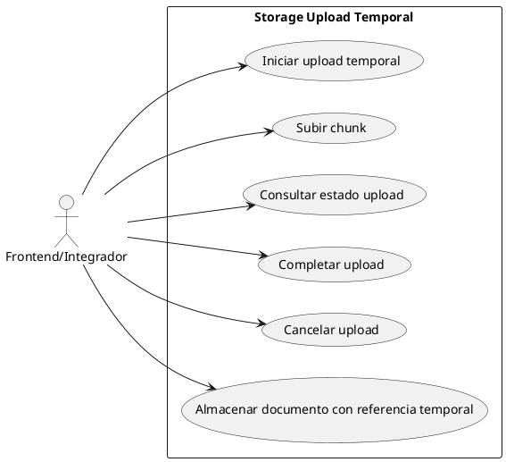
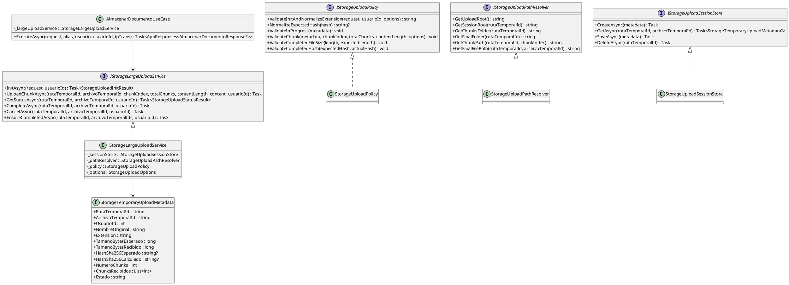
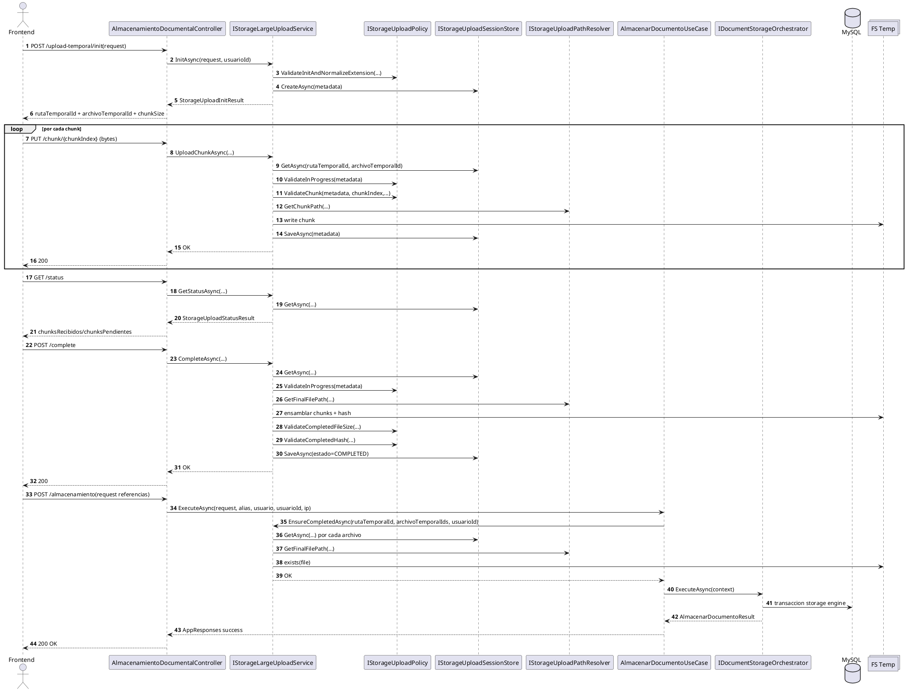
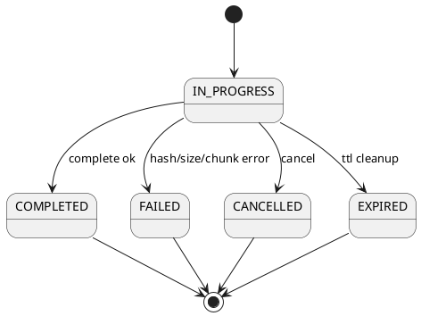
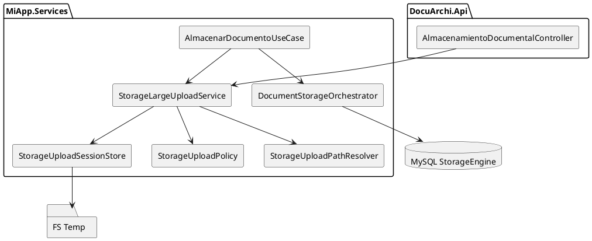
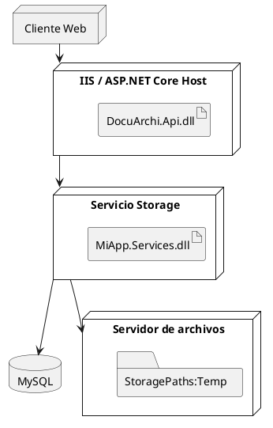

# SCRUM-195 - Diagramas Upload Temporal StorageEngine (UML / PlantUML)

## Alcance
Documento de arquitectura de la capacidad de upload temporal por streaming/chunks y su integración con `POST /almacenamiento` del Storage Engine.

## Estado de cierre
- Contrato API de upload temporal implementado.
- Validación `COMPLETED` integrada en `AlmacenarDocumentoUseCase`.
- Política de validación aislada en `IStorageUploadPolicy`.

## 1) Diagrama de Casos de Uso

## 2) Diagrama de Clases (Núcleo Upload Temporal)

## 3) Diagrama de Secuencia Integral (Frontend + Upload + Almacenamiento)

## 3.1 Tabla de interacciones principales
| Paso | Origen | Destino | Función | Parámetros clave | Retorno |
|---|---|---|---|---|---|
| 1 | Frontend | Controller | `init` | `nombreOriginal,tamanoBytes,extension,numeroChunks` | `rutaTemporalId,archivoTemporalId,chunkSize` |
| 2 | Frontend | Controller | `chunk` | `rutaTemporalId,archivoTemporalId,chunkIndex,bytes` | `OK` |
| 3 | Frontend | Controller | `status` | `rutaTemporalId,archivoTemporalId` | `estado,chunks` |
| 4 | Frontend | Controller | `complete` | `rutaTemporalId,archivoTemporalId` | `OK` |
| 5 | Frontend | Controller | `almacenamiento` | `rutaTemporalId,documentos[].archivoTemporalId` | `idAlmacen,requestId` |
| 6 | UseCase | UploadService | `EnsureCompletedAsync` | `rutaTemporalId,archivoTemporalIds,usuarioId` | `OK/Error` |
| 7 | UseCase | Orchestrator | `ExecuteAsync` | `StorageContext` | `AlmacenarDocumentoResult` |

## 4) Diagrama de Estados (Sesión temporal)

## 5) Diagrama de Componentes

## 6) Diagrama de Despliegue

## 7) Nota de compatibilidad
- Formato: `PlantUML`.
- Compatible con VSCode/IntelliJ/PlantUML Server.
- Documento guía para integración frontend: usar siempre flujo `init -> chunk -> status -> complete -> almacenamiento`.
