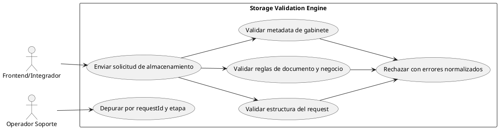
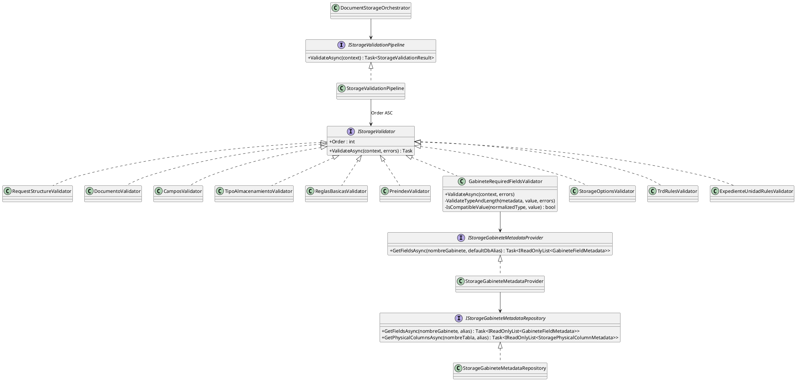
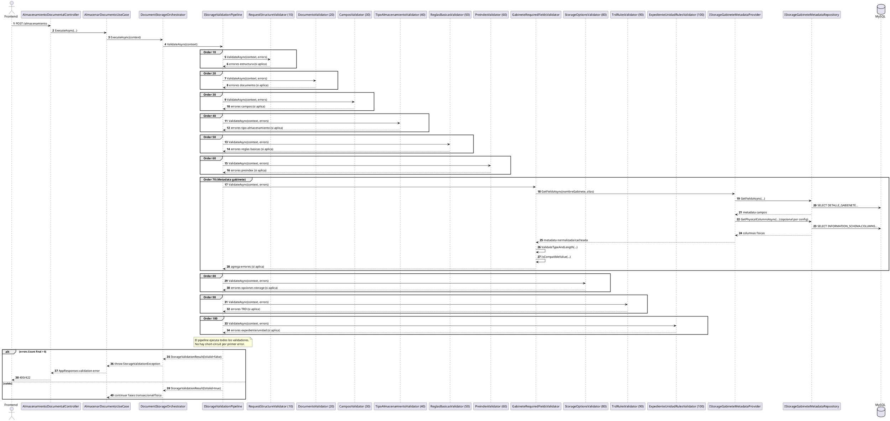
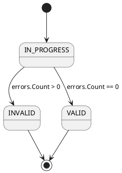
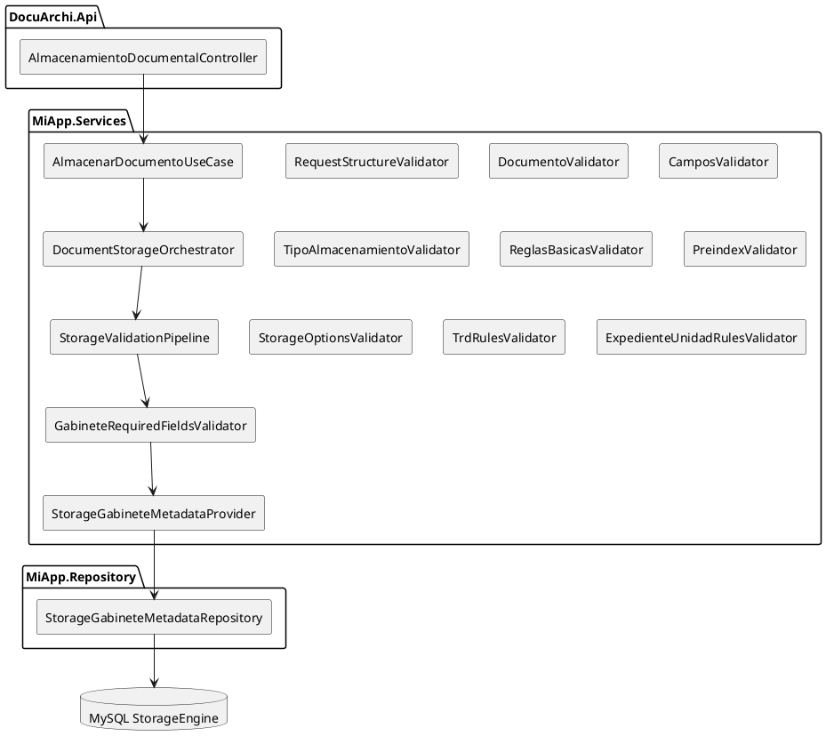
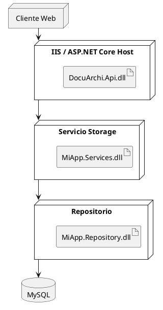

# SCRUM-196 - Diagramas Validación StorageEngine (UML / PlantUML)

## Alcance
Documento de arquitectura de la validación del flujo `POST /almacenamiento` en Storage Engine, incluyendo orden de validadores, consulta de metadata de gabinete, validación de tipos/longitudes y guía de depuración.

## Estado de cierre
- Pipeline de validación activo en `DocumentStorageOrchestrator`.
- Matriz de validadores registrada por DI y ejecutada por `Order`.
- Validación de metadata de gabinete aplicada (campo requerido, tipo, longitud, compatibilidad de esquema).

## 1) Diagrama de Casos de Uso

## 2) Diagrama de Clases (Núcleo Validación)

## 3) Diagrama de Secuencia (Orquestador + Pipeline + Metadata)

## 3.1 Matriz de validadores (orden real)
| Order | Clase | Objetivo |
|---|---|---|
| 10 | `RequestStructureValidator` | Integridad estructural inicial del request |
| 20 | `DocumentoValidator` | Reglas de documentos enviados |
| 30 | `CamposValidator` | Reglas base de campos de indexación |
| 40 | `TipoAlmacenamientoValidator` | Compatibilidad tipo de almacenamiento |
| 50 | `ReglasBasicasValidator` | Reglas funcionales generales |
| 60 | `PreindexValidator` | Reglas de preindexación |
| 70 | `GabineteRequiredFieldsValidator` | Metadata de gabinete: requerido/tipo/longitud/esquema |
| 80 | `StorageOptionsValidator` | Opciones/configuración de storage |
| 90 | `TrdRulesValidator` | Reglas TRD |
| 100 | `ExpedienteUnidadRulesValidator` | Reglas de expediente/unidad |

## 3.2 Validaciones y alcance funcional
| Order | Validador | Qué valida | Errores típicos |
|---|---|---|---|
| 10 | `RequestStructureValidator` | Existencia de `StorageContext` y `Command`. | `CTX_REQUIRED`, `COMMAND_REQUIRED` |
| 20 | `DocumentoValidator` | Que exista al menos un documento y que cada documento tenga `ArchivoTemporalId`. | `DOC_REQUIRED`, `DOC_TEMP_ID_REQUIRED` |
| 30 | `CamposValidator` | Consistencia mínima de campos de indexación (nombre de campo obligatorio). | `CAMPO_NOMBRE_REQUIRED` |
| 40 | `TipoAlmacenamientoValidator` | Que `TipoAlmacenamiento` esté dentro de los valores soportados del dominio. | `TIPO_ALMACENAMIENTO_INVALID` |
| 50 | `ReglasBasicasValidator` | Reglas base de entrada: `NombreGabinete`, `RutaTemporalId`, `NombreDocumento`. | `NOMBRE_GABINETE_REQUIRED`, `RUTA_TEMP_REQUIRED`, `NOMBRE_DOCUMENTO_REQUIRED` |
| 60 | `PreindexValidator` | Integración con preindex: existencia/lectura de archivo, formato, cantidad de valores y mapeo contra campos de indexación. | `PREINDEX_NOT_FOUND`, `PREINDEX_PATH_INVALID`, `PREINDEX_FIELDS_EMPTY`, `PREINDEX_FIELDS_MISMATCH`, `PREINDEX_INVALID_FORMAT`, `PREINDEX_READ_ERROR` |
| 70 | `GabineteRequiredFieldsValidator` | Consulta metadata de gabinete, valida campos desconocidos, campos obligatorios, compatibilidad de esquema físico, tipo de dato y longitud máxima por campo. | `GAB_FIELDS_NOT_FOUND`, `GAB_FIELD_UNKNOWN`, `GAB_SCHEMA_MISMATCH`, `GAB_REQUIRED_EMPTY`, `GAB_TYPE_UNSUPPORTED`, `GAB_FIELD_TYPE_INVALID`, `GAB_FIELD_LENGTH_INVALID` |
| 80 | `StorageOptionsValidator` | Reglas activadas por opciones legacy del gabinete (por ejemplo requerir inventario y datos obligatorios asociados). | `INV_REQUIRED`, `INV_USER_REQUIRED`, `INV_EMPRESA_REQUIRED`, `STORAGE_OPTIONS` |
| 90 | `TrdRulesValidator` | Si TRD aplica según configuración, valida presencia y rango de `IdArea`, `IdSerie`, `IdSubSerie`, `IdTipoDocumento`. | `TRD_REQUIRED`, `TRD_AREA_REQUIRED`, `TRD_SERIE_REQUIRED`, `TRD_TIPO_DOCUMENTO_REQUIRED`, `TRD_INVALID_AREA`, `TRD_INVALID_SERIE`, `TRD_INVALID_SUBSERIE`, `TRD_INVALID_TIPO_DOCUMENTO` |
| 100 | `ExpedienteUnidadRulesValidator` | Reglas de expediente/unidad: obligatoriedad por configuración, exclusión mutua, ids válidos y requerimiento de clase documental según caso. | `EXP_UNI_REQUIRED`, `EXP_UNI_AMBIGUO`, `EXP_UNI_INVALID`, `EXP_CLASE_REQUIRED`, `UNI_CLASE_REQUIRED` |

## 4) Diagrama de Estados (Resultado de validación)

## 5) Diagrama de Componentes

## 6) Diagrama de Despliegue

## 7) Guía de depuración operativa
1. Generar/ubicar `requestId` de la solicitud y filtrar todo el log por ese valor.
2. Ver inicio/fin del pipeline para validar duración total y conteo final de errores.
3. Trazar por `Order` (10 a 100) e identificar en qué validador aumenta `errors.Count`.
4. Si falla en `Order=70`, validar:
   - `nombreGabinete` y `alias` en `StorageContext`.
   - retorno de `GetFieldsAsync` (vacío dispara `GAB_FIELDS_NOT_FOUND`).
   - discrepancias de campo (`GAB_FIELD_UNKNOWN`).
   - incompatibilidad de esquema físico (`GAB_SCHEMA_MISMATCH`).
   - tipo inválido (`GAB_FIELD_TYPE_INVALID`) o longitud inválida (`GAB_FIELD_LENGTH_INVALID`).
5. Confirmar si `StorageMetadata:ValidatePhysicalSchema` está activo y si existe cache previa que deba expirar.
6. Reproducir con payload mínimo e ir agregando campos de indexación uno a uno.

## 8) Funciones críticas de seguimiento
- `DocumentStorageOrchestrator.ExecuteAsync`: punto de entrada de validación.
- `StorageValidationPipeline.ValidateAsync`: ejecuta secuencia completa.
- `GabineteRequiredFieldsValidator.ValidateAsync`: valida campos contra metadata.
- `GabineteRequiredFieldsValidator.ValidateTypeAndLength`: valida tipo y tamaño.
- `GabineteRequiredFieldsValidator.IsCompatibleValue`: regla de parseo por tipo.
- `StorageGabineteMetadataProvider.GetFieldsAsync`: cache/normalización y schema check opcional.
- `StorageGabineteMetadataRepository.GetFieldsAsync`: consulta `DETALLE_GABIENETE`.
- `StorageGabineteMetadataRepository.GetPhysicalColumnsAsync`: consulta `INFORMATION_SCHEMA.COLUMNS`.

## 9) Nota de compatibilidad
- Formato: `PlantUML`.
- Compatible con VSCode/IntelliJ/PlantUML Server.
- Documento guía para soporte y desarrollo al depurar validaciones de `POST /almacenamiento`.
