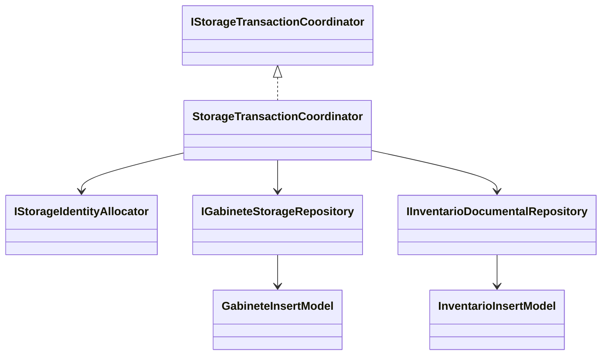
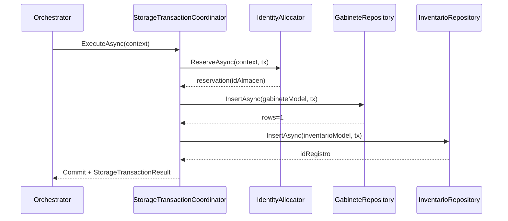
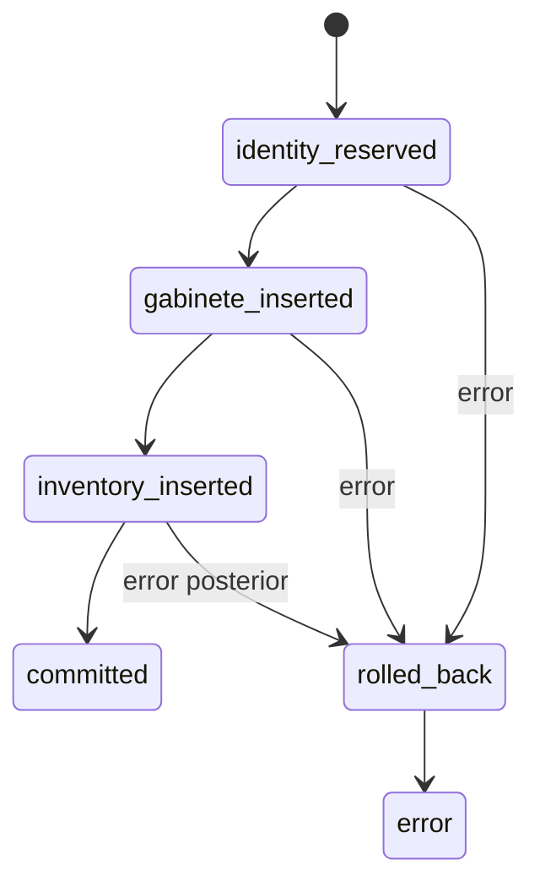

# SCRUM-168 Arquitectura Gabinete Inventario

## Objetivo arquitectonico
Implementar la fase de persistencia principal del StorageEngine para registrar:
- insercion en gabinete dinamico (tabla variable validada),
- insercion en `registro_producion_documental`,
- coordinacion transaccional en el flujo existente del `StorageTransactionCoordinator`.

## Flujo objetivo
1. `DocumentStorageOrchestrator` delega a `IStorageTransactionCoordinator`.
2. `StorageTransactionCoordinator` reserva identidad mediante `IStorageIdentityAllocator`.
3. Coordinator construye modelos de insercion para gabinete e inventario.
4. Repositories ejecutan inserciones seguras con contexto transaccional compartido.
5. Coordinator completa commit unico o rollback total.

## Diagrama de clases

## Diagrama de secuencia

## Diagrama de estados

## Relacion entre prompts/tickets
- SCRUM-163: contratos y modelos base.
- SCRUM-166: reserva de identidad y reglas de disco.
- SCRUM-167: coordinador transaccional.
- SCRUM-168: extension gabinete + inventario.
- SCRUM-169: fases posteriores (expediente/unidad/indice).

## Regla SQL dinamico seguro
- Identificadores de tabla/columna deben validarse por patron estricto (`^[a-zA-Z0-9_]+$`).
- Solo se permite SQL dinamico para identificadores validados.
- Valores siempre parametrizados.
- Repositories no deben abrir conexion ni hacer commit/rollback.

## Estado actual multi-repo
La implementacion funcional fue publicada en PRs satelite:
- DocuArchi.Api PR 82
- MiApp.DTOs PR 60
- MiApp.Services PR 112
- MiApp.Models PR 27

En este repositorio coordinador se conserva la trazabilidad OpenSpec y gobernanza del flujo orquestado.

## Riesgos tecnicos y deuda
- Confirmar metadata/whitelist de columnas dinamicas por gabinete en capa repository.
- Confirmar limite final de `FULTEXT_DOCUMENTO`.
- Validar cobertura de concurrencia real en integracion MySQL para rollback entre gabinete/inventario.
