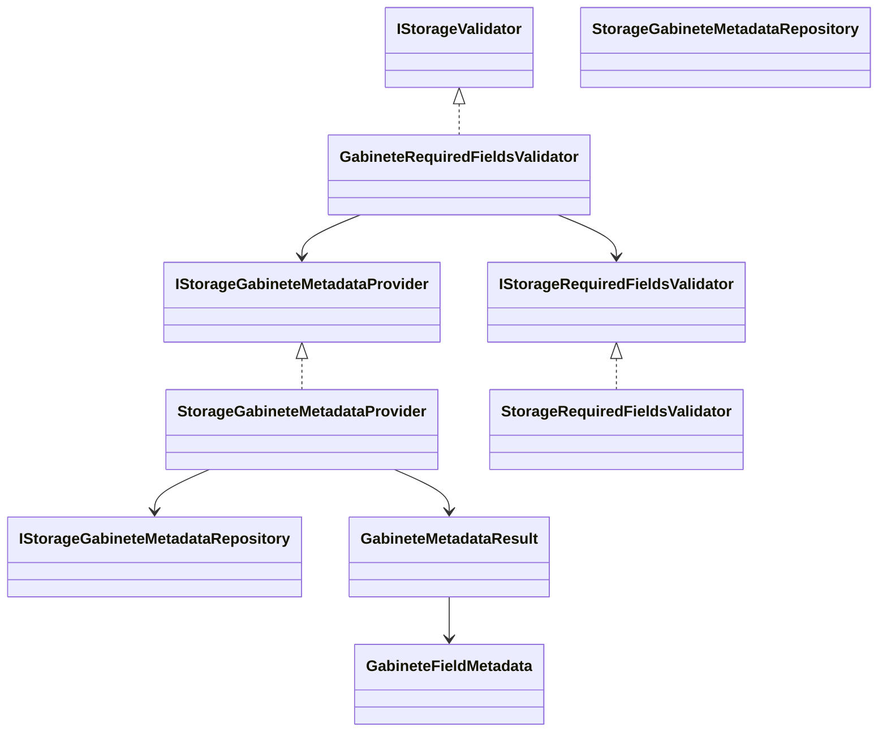
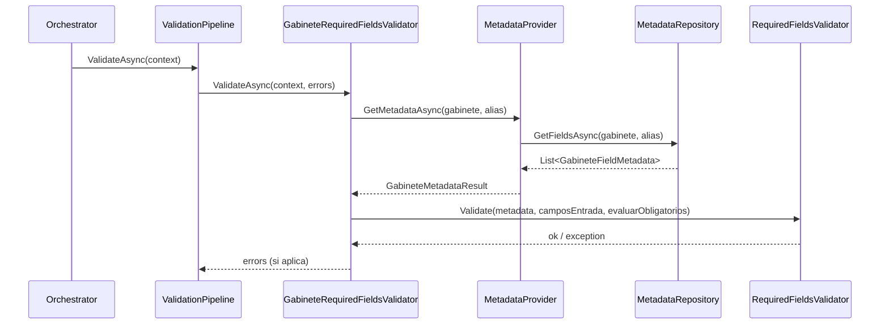

# SCRUM-177 Arquitectura Metadata Campos Obligatorios

## Objetivo arquitectonico
Cerrar la brecha de paridad legacy VB en la validacion de metadata dinamica por gabinete:
- consulta real de campos en `DETALLE_GABIENETE`,
- orden y alineacion exacta campo/valor,
- validacion de obligatoriedad antes de la fase transaccional.

## Alcance del cambio
- `StorageGabineteMetadataProvider` deja de ser placeholder.
- Se incorpora `IStorageGabineteMetadataRepository` en capa Repository para consulta DB.
- Se incorpora `IStorageRequiredFieldsValidator` para regla funcional pura.
- `GabineteRequiredFieldsValidator` pasa a orquestar provider + validador dedicado.

## Flujo de validacion
1. `DocumentStorageOrchestrator` ejecuta `StorageValidationPipeline`.
2. `GabineteRequiredFieldsValidator` consulta metadata por gabinete/alias.
3. `StorageRequiredFieldsValidator` valida:
   - metadata no nula,
   - cantidad exacta metadata vs request,
   - alineacion por posicion y nombre,
   - obligatoriedad cuando `EvaluarCamposObligatorios = true`.
4. Si falla, se agrega `StorageError` y el pipeline corta la fase transaccional.

## Diagrama de clases

## Diagrama de secuencia

## Paridad legacy cubierta
- `Consulta_Campos_Obligatorio` -> `StorageGabineteMetadataRepository + StorageGabineteMetadataProvider`
- `Matri_Campos_Obli Is Nothing` -> `Metadata nula / no existe metadata`
- `UBound(Matri_Campos_Obli) <> UBound(_Matri_Datos)` -> `Cantidad de campos no coincide`
- `Campo obligatorio vacio` -> `GAB_REQUIRED_EMPTY`

## Decisiones de diseno
- Se mantiene validacion dentro de pipeline (no en controller ni usecase).
- Se separa consulta DB (Repository) de regla funcional (Validator).
- Se evita confiar en frontend para orden, cantidad o obligatoriedad.
