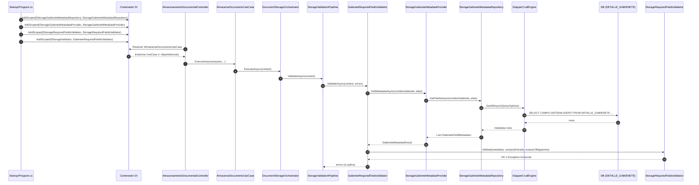

# SCRUM-177 Implementacion Detallada Metadata Campos Obligatorios

## Resumen
Se implemento la consulta real de metadata de gabinete y la validacion estricta de campos obligatorios/alineacion en la fase de validacion del StorageEngine.

## Archivos creados

### MiApp.Models
- `Models/GestorDocumental/AlmacenamientoDocumental/GabineteMetadataResult.cs`

### MiApp.Repository
- `Repositorio/GestorDocumental/AlmacenamientoDocumental/GabineteMetadata/IStorageGabineteMetadataRepository.cs`

### MiApp.Services
- `Service/GestorDocumental/AlmacenamientoDocumental/Validation/IStorageRequiredFieldsValidator.cs`
- `Service/GestorDocumental/AlmacenamientoDocumental/Metadata/StorageGabineteMetadataProvider.cs` (reemplazo de placeholder)
- `Service/GestorDocumental/AlmacenamientoDocumental/Validation/GabineteRequiredFieldsValidator.cs` (refactor)

## Archivos actualizados

### MiApp.Services
- `Service/GestorDocumental/AlmacenamientoDocumental/Metadata/IStorageGabineteMetadataProvider.cs`

### DocuArchi.Api
- `Program.cs`
  - registro `IStorageRequiredFieldsValidator`
  - registro `IStorageGabineteMetadataRepository`

### DocuArchiCore (tests)
- `tests/TramiteDiasVencimiento.Tests/StorageValidationPipelineTests.cs`

## Diagrama de secuencia (instanciacion y ejecucion)

## Detalle funcional por componente

### 1) StorageGabineteMetadataRepository
- Tabla: `DETALLE_GABIENETE`
- Filtros: `GABINETE = nombreGabinete`, `VISIBLE = 1`
- Orden: `IDENTI ASC`
- Mapeo:
  - `CAMPO` -> `FieldName`
  - `SISTEMA` -> `RequiredFlag` -> `IsRequired`
  - `IDENTI` -> `Orden`
- Uso de `IDapperCrudEngine.GetAllAsync<T>(QueryOptions)` sin SQL embebido.

### 2) StorageGabineteMetadataProvider
- Delega consulta al repository.
- Ordena por `Orden`.
- Lanza error funcional si metadata vacia:
  - `"No existe metadata para gabinete"`.

### 3) StorageRequiredFieldsValidator
Reglas:
- metadata no puede ser `null`.
- metadata no puede estar vacia.
- campos de entrada no pueden ser `null`.
- cantidad metadata y cantidad entrada deben ser iguales.
- nombre de campo por posicion debe coincidir (case-insensitive).
- si `evaluarCamposObligatorios = true`, no permite valor vacio en campos obligatorios.

### 4) GabineteRequiredFieldsValidator
- Orquesta provider + validador dedicado.
- Persiste metadata en `context.GabineteFieldsMetadata`.
- Mapea excepciones funcionales a codigos del pipeline:
  - `GAB_FIELDS_NOT_FOUND`
  - `GAB_FIELDS_MISMATCH`
  - `GAB_FIELD_UNKNOWN`
  - `GAB_REQUIRED_EMPTY`
  - fallback: `GABINETE_METADATA`

## Trazabilidad con Prompt 11
- Consulta real a DB: cumplido.
- Validacion exacta de cantidad/orden/nombre: cumplido.
- Validacion de obligatorios: cumplido.
- Integracion en pipeline: cumplido.
- Eliminacion de placeholder: cumplido.

## Deuda tecnica controlada
- Falta cubrir test de integracion con DB real para `DETALLE_GABIENETE` en ambiente CI.
- El build global presenta fallo de entorno MSBuild/SDK (`MSB4276`) no atribuible al cambio funcional.
