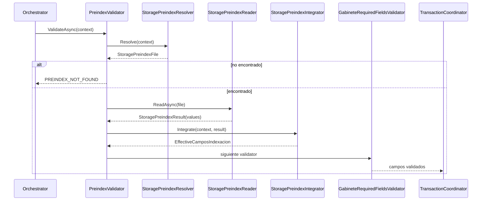

# SCRUM-178 — Arquitectura Preindex Integración

## Objetivo
Cerrar paridad legacy VB de preindex para `BatchPreindex` con tres responsabilidades separadas:
- Resolver archivo preindex real.
- Leer/parsear valores de preindex.
- Integrar valores en campos de indexación antes de validación/persistencia.

## Componentes
- `IStoragePreindexResolver` / `StoragePreindexResolver`
- `IStoragePreindexReader` / `StoragePreindexReader`
- `IStoragePreindexIntegrator` / `StoragePreindexIntegrator`
- `PreindexValidator` (coordinador de flujo)

## Principios
- SRP por componente.
- Validación temprana en pipeline.
- Integración sin sobrescribir valores manuales.
- Reutilización de `StorageContext` para propagar campos efectivos.

## Secuencia

## Decisiones
- `StorageContext.EffectiveCamposIndexacion` actúa como fuente prioritaria para validación y persistencia.
- Resolver usa candidatos múltiples: `ArchivoTemporalId`, nombre base de documento y candidato legacy normalizado.
- Reader no resuelve rutas: solo lee un archivo ya resuelto.
