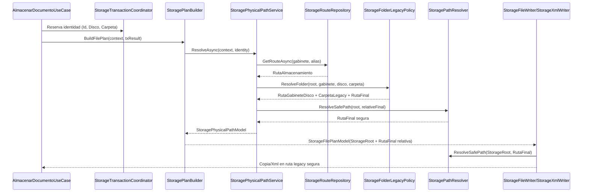
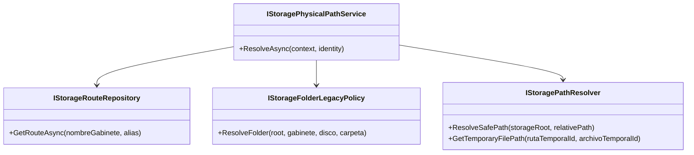

# SCRUM-180 — Arquitectura Ruta Física Legacy

## Objetivo
Restaurar la paridad de ruta física legacy para almacenamiento documental, eliminando el uso de `Path.GetTempPath()` como destino final.

## Paridad VB vs C#
| Legacy VB | Nuevo C# |
|---|---|
| `Consulta_Ruta_Almacenamiento` (tabla `SYSTEM1RUT`) | `IStorageRouteRepository.GetRouteAsync` (`system1rut`) |
| `RutaCarpet = _Ruta_Almacenamiento & _Nombre_Gabienete & disc` | `StorageFolderLegacyPolicy.ResolveFolder` (`{gabinete}{disco}`) |
| `carpealma + numcarpvar` (carpeta legacy) | `CarpetaLegacy = numCarpeta.ToString("D5")` |
| `Ruta_Alamce_Image = root\gabdisco\carpeta` | `StoragePhysicalPathService.ResolveAsync(...).RutaFinal` |

## Componentes
- `MiApp.Repository/.../StorageRoute/StorageRouteRepository.cs`
- `MiApp.Services/.../Physical/StorageFolderLegacyPolicy.cs`
- `MiApp.Services/.../Physical/StoragePhysicalPathService.cs`
- `MiApp.Services/.../Physical/StoragePathResolver.cs` (hardening)
- `MiApp.Services/.../Builders/StoragePlanBuilder.cs` (integración)
- `MiApp.Services/.../Physical/StorageFileWriter.cs` y `StorageXmlWriter.cs` (ruta segura final)

## Diagrama de Secuencia

## Diagrama de Clases

## Decisiones de Seguridad
- Ruta final solo desde DB (`SYSTEM1RUT`), nunca desde frontend.
- Validación anti-traversal con `ResolveSafePath`.
- `StorageFileWriter` y `StorageXmlWriter` resuelven ruta absoluta segura a partir de `StorageRoot` + ruta relativa.
