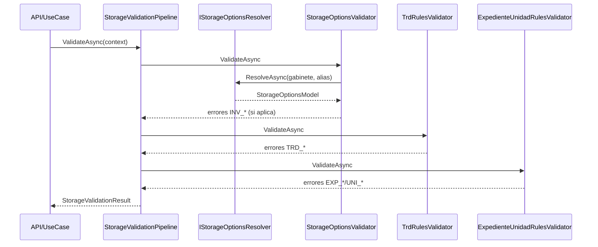

# SCRUM-181 - Arquitectura Opciones TRD/Inventario

## Objetivo
Consolidar la paridad funcional de reglas legacy para opciones de gabinete relacionadas con:

- aplicacion de inventario documental,
- validaciones TRD,
- validaciones de unidad/expediente previas a transaccion.

## Componentes
- `StorageOptionsValidator`
- `TrdRulesValidator`
- `ExpedienteUnidadRulesValidator`
- `IStorageOptionsResolver`

## Flujo

## Reglas clave
- Si `AplicaInventarioDocumental = true`, `Inventario` es obligatorio.
- Si `AplicaTrd = true`, IDs TRD no pueden ser negativos.
- Si `AplicaUnidadConservacion = true`, `IdClaseDocumento` es obligatorio cuando hay expediente o unidad.

## Repos impactados
- `MiApp.Services` PR #122
- `MiApp.DTOs` PR #66
- `DocuArchiCore` PR #239
