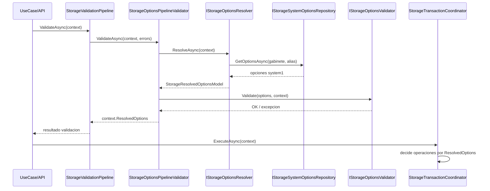

# SCRUM-188 - Arquitectura Opciones Legacy System1

## Objetivo
Consolidar paridad legacy para opciones de `system1` y dejar evidencia tecnica del flujo de decision de:

- `INVENTARIO_DOCUMENTAL`
- `APLICA_TRD`
- `ASIGNA_UNIDAD`

## Componentes de referencia funcional
- `IStorageSystemOptionsRepository` / `StorageSystemOptionsRepository`
- `IStorageOptionsResolver` / `StorageOptionsResolver`
- `IStorageOptionsValidator` / `StorageOptionsValidator`
- `StorageOptionsPipelineValidator`
- `StorageTransactionCoordinator` (consumo de opciones resueltas)

## Diagrama de secuencia (instanciacion y uso)

## Decision arquitectonica SCRUM-188
- SCRUM-188 no reimplementa runtime.
- SCRUM-188 documenta y asegura trazabilidad de la implementacion ya consolidada en SCRUM-181.
- Se evita duplicidad de codigo y riesgo de divergencia funcional entre tickets.
