# SCRUM-189 - Diagramas StorageEngine (UML / PlantUML)

## Alcance
Documento de diagramas en formato UML compatible con PlantUML para publicacion tecnica enterprise.

## 1) Diagrama de Casos de Uso
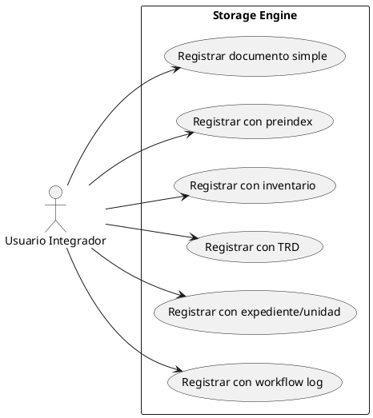

## 2) Diagrama de Clases (Nucleo)
```plantuml
@startuml
skinparam classAttributeIconSize 0

interface IAlmacenarDocumentoUseCase {
  +ExecuteAsync(request, defaultDbAlias, usuario, usuarioId, ipTrans) : Task<AppResponses<AlmacenarDocumentoResponse?>>
}

interface IDocumentStorageOrchestrator {
  +ExecuteAsync(context) : Task<AlmacenarDocumentoResult>
}

interface IStorageValidationPipeline {
  +ValidateAsync(context) : Task<StorageValidationResult>
}

interface IStorageTransactionCoordinator {
  +ExecuteAsync(context) : Task<StorageTransactionResult>
}

interface IStoragePhysicalPhaseExecutor {
  +ExecuteAsync(context, transactionResult) : Task<StoragePhysicalStatusModel>
}

interface IStorageCompensationManager {
  +ExecuteAsync(compensationPlan, requestId) : Task
}

class AlmacenamientoDocumentalController {
  +AlmacenarDocumento(request) : Task<IActionResult>
}

class AlmacenarDocumentoUseCase {
  -_orchestrator : IDocumentStorageOrchestrator
  -_logger : ILogger<AlmacenarDocumentoUseCase>
  +ExecuteAsync(request, defaultDbAlias, usuario, usuarioId, ipTrans) : Task<AppResponses<AlmacenarDocumentoResponse?>>
  -Validation(field, message, storageErrors) : AppResponses<AlmacenarDocumentoResponse?>
  -Error(message, details) : AppResponses<AlmacenarDocumentoResponse?>
}

class DocumentStorageOrchestrator {
  -_logger : ILogger<DocumentStorageOrchestrator>
  -_metadataAnalyzer : IStorageDocumentMetadataAnalyzer
  -_pathResolver : IStoragePathResolver
  +ExecuteAsync(context) : Task<AlmacenarDocumentoResult>
}

class StorageValidationPipeline {
  -_validators : IReadOnlyList<IStorageValidator>
  -_logger : ILogger<StorageValidationPipeline>
  +ValidateAsync(context) : Task<StorageValidationResult>
}

class StorageTransactionCoordinator {
  -_dbConnectionFactory : IDbConnectionFactory
  -_identityAllocator : IStorageIdentityAllocator
  -_storageDiskQuotaRepository : IStorageDiskQuotaRepository
  -_inventarioBuilder : IInventarioDocumentalBuilder
  -_inventarioRepository : IInventarioDocumentalRepository
  -_namingService : IStorageNamingService
  -_expedienteUnidadLegacyService : IExpedienteUnidadLegacyService
  -_workflowStorageLogService : IWorkflowStorageLogService
  -_storagePhysicalPathService : IStoragePhysicalPathService
  -_logger : ILogger<StorageTransactionCoordinator>
  +ExecuteAsync(context) : Task<StorageTransactionResult>
  -TryInsertWorkflowLogAsync(context, reservation, connection, transaction) : Task<bool>
  -TryInsertInventarioAsync(context, reservation, connection, transaction) : Task<long?>
  -TryExecuteExpedienteUnidadLegacyAsync(context, connection, transaction) : Task<ExpedienteUnidadLegacyResult?>
  -ResolveNumeroPaginasDocumento(context) : int
}

class StoragePhysicalPhaseExecutor {
  -_storagePlanBuilder : IStoragePlanBuilder
  -_storageXmlBuilder : IStorageXmlBuilder
  -_storageFileWriter : IStorageFileWriter
  -_storageXmlWriter : IStorageXmlWriter
  -_compensationManager : IStorageCompensationManager
  -_expedienteIndiceXmlService : IExpedienteIndiceXmlService
  -_logger : ILogger<StoragePhysicalPhaseExecutor>
  +ExecuteAsync(context, transactionResult) : Task<StoragePhysicalStatusModel>
  -TryUpdateExpedienteIndiceXmlAsync(context, transactionResult, filePlan, compensationPlan) : Task<ExpedienteIndiceXmlUpdateResult?>
}

class StorageCompensationManager {
  -_logger : ILogger<StorageCompensationManager>
  +ExecuteAsync(compensationPlan, requestId) : Task
  -DeleteFiles(files, requestId, phase) : void
  -DeleteDirectories(directories, requestId) : void
}

class StorageContext {
  +DefaultDbAlias : string
  +Usuario : string
  +UsuarioId : int
  +RequestId : string
  +NombreGabinete : string
  +RutaTemporalId : string
  +NombreDocumento : string
  +ArchivosTemporales : IReadOnlyList<string>
  +IpTrans : string?
  +Command : AlmacenarDocumentoCommand?
  +PreindexValues : IReadOnlyList<string>
  +EffectiveCamposIndexacion : IReadOnlyList<CampoIndexacionDto>
  +GabineteFieldsMetadata : IReadOnlyList<GabineteFieldMetadata>
  +ResolvedOptions : StorageResolvedOptionsModel?
  +PhysicalMetadata : StorageDocumentPhysicalMetadata?
  +ExpedienteUnidadResult : ExpedienteUnidadLegacyResult?
}

class AlmacenarDocumentoCommand {
  +NombreGabinete : string
  +RutaTemporalId : string
  +NombreDocumento : string
  +RequestId : string
  +Documentos : IReadOnlyList<DocumentoEntradaDto>
  +CamposIndexacion : IReadOnlyList<CampoIndexacionDto>
  +Inventario : InventarioDocumentalDto?
  +Trd : TrdStorageDto?
  +Expediente : ExpedienteStorageDto?
  +Workflow : WorkflowStorageDto?
  +FullText : string?
  +NumeroPaginasDeclaradas : int
  +TipoAlmacenamiento : TipoAlmacenamientoEnum
  +EvaluarCamposObligatorios : bool
}

class StorageResolvedOptionsModel {
  +NombreGabinete : string
  +AplicaInventarioDocumental : bool
  +AplicaTrd : bool
  +AplicaUnidadConservacion : bool
}

class StorageValidationResult {
  +IsValid : bool
  +Errors : List<StorageError>
}

class StorageError {
  +Code : string
  +Message : string
  +Phase : StoragePhase?
}

class StoragePlanModel {
  +Identity : StorageIdentityModel
  +Metadata : StorageMetadataModel
  +RutaFinal : string
}

class StorageTransactionResult {
  +IdAlmacen : long
  +IdentityReservation : StorageIdentityReservationResult
  +IdRegistroProduccionDocumental : long?
  +Success : bool
  +Estado : StorageDocumentState
  +RequestId : string
  +FechaEjecucion : DateTime
  +DuracionMs : long
  +DiskUsageUpdated : bool
  +WorkflowLogInserted : bool
  +ExpedienteUnidadResult : ExpedienteUnidadLegacyResult?
}

class AlmacenarDocumentoResult {
  +IdAlmacen : long
  +IdRegistroProduccionDocumental : long?
  +NombreArchivoFinal : string
  +RequestId : string
  +Estado : StorageDocumentState
}

IAlmacenarDocumentoUseCase <|.. AlmacenarDocumentoUseCase
IDocumentStorageOrchestrator <|.. DocumentStorageOrchestrator
IStorageValidationPipeline <|.. StorageValidationPipeline
IStorageTransactionCoordinator <|.. StorageTransactionCoordinator
IStoragePhysicalPhaseExecutor <|.. StoragePhysicalPhaseExecutor
IStorageCompensationManager <|.. StorageCompensationManager

AlmacenamientoDocumentalController --> IAlmacenarDocumentoUseCase
AlmacenarDocumentoUseCase --> IDocumentStorageOrchestrator
DocumentStorageOrchestrator --> StorageContext
DocumentStorageOrchestrator --> AlmacenarDocumentoResult
StorageValidationPipeline --> StorageContext
StorageValidationPipeline --> StorageValidationResult
StorageTransactionCoordinator --> StorageContext
StorageTransactionCoordinator --> StorageTransactionResult
StoragePhysicalPhaseExecutor --> StorageContext
StoragePhysicalPhaseExecutor --> StorageTransactionResult
StoragePhysicalPhaseExecutor --> IStorageCompensationManager
StorageContext --> AlmacenarDocumentoCommand
StorageContext --> StorageResolvedOptionsModel
@enduml
```

## 2.1) Diagrama de Clases de Modelos y DTOs (Detalle Completo de Atributos)
```plantuml
@startuml
skinparam classAttributeIconSize 0

class AlmacenarDocumentoRequest {
  +NombreGabinete : string
  +RutaTemporalId : string
  +NombreDocumento : string
  +RequestId : string
  +Documentos : IReadOnlyList<DocumentoEntradaDto>
  +CamposIndexacion : IReadOnlyList<CampoIndexacionDto>
  +Inventario : InventarioDocumentalDto?
  +Trd : TrdStorageDto?
  +Expediente : ExpedienteStorageDto?
  +Workflow : WorkflowStorageDto?
  +FullText : string?
  +NumeroPaginasDeclaradas : int
}

class AlmacenarDocumentoResponse {
  +IdAlmacen : long
  +IdRegistroProduccionDocumental : long?
  +NombreArchivoFinal : string
  +RequestId : string
}

class DocumentoEntradaDto {
  +IdDocumento : string
  +ArchivoTemporalId : string
  +NombreOriginal : string?
  +Extension : string?
  +NumeroPaginas : int
}

class CampoIndexacionDto {
  +NombreCampo : string
  +Valor : string?
  +EsObligatorio : bool
}

class InventarioDocumentalDto {
  +IdUsuarioGestion : int
  +IdEmpresa : int
  +Radicado : string?
  +FechaElaboracion : string?
  +SegundoNombreDocumento : string?
}

class TrdStorageDto {
  +IdArea : int?
  +IdSerie : int?
  +IdSubSerie : int?
  +IdTipoDocumento : int?
  +NombreArea : string?
  +NombreSerie : string?
  +NombreSubSerie : string?
  +NombreTipoDocumento : string?
}

class ExpedienteStorageDto {
  +IdExpediente : int?
  +IdTipoExpediente : int?
  +IdTipoUnidadConservacion : int?
  +IdUnidadConservacion : int?
  +IdClaseDocumento : int?
  +NombreExpediente : string?
  +ClaseDocumento : string?
  +NombreUnidadConservacion : string?
}

class WorkflowStorageDto {
  +IdTareaWorkflow : long?
  +IdRutaWorkflow : int?
}

class AlmacenarDocumentoCommand {
  +NombreGabinete : string
  +RutaTemporalId : string
  +NombreDocumento : string
  +RequestId : string
  +Documentos : IReadOnlyList<DocumentoEntradaDto>
  +CamposIndexacion : IReadOnlyList<CampoIndexacionDto>
  +Inventario : InventarioDocumentalDto?
  +Trd : TrdStorageDto?
  +Expediente : ExpedienteStorageDto?
  +Workflow : WorkflowStorageDto?
  +FullText : string?
  +NumeroPaginasDeclaradas : int
  +TipoAlmacenamiento : TipoAlmacenamientoEnum
  +EvaluarCamposObligatorios : bool
}

class StorageContext {
  +DefaultDbAlias : string
  +Usuario : string
  +UsuarioId : int
  +RequestId : string
  +NombreGabinete : string
  +RutaTemporalId : string
  +NombreDocumento : string
  +ArchivosTemporales : IReadOnlyList<string>
  +IpTrans : string?
  +Command : AlmacenarDocumentoCommand?
  +PreindexValues : IReadOnlyList<string>
  +EffectiveCamposIndexacion : IReadOnlyList<CampoIndexacionDto>
  +GabineteFieldsMetadata : IReadOnlyList<GabineteFieldMetadata>
  +ResolvedOptions : StorageResolvedOptionsModel?
  +PhysicalMetadata : StorageDocumentPhysicalMetadata?
  +ExpedienteUnidadResult : ExpedienteUnidadLegacyResult?
}

class StorageResolvedOptionsModel {
  +NombreGabinete : string
  +AplicaInventarioDocumental : bool
  +AplicaTrd : bool
  +AplicaUnidadConservacion : bool
}

class StorageDocumentPhysicalMetadata {
  +TotalBytes : long
  +TamanoLegacy : string
  +Formato : string
  +NumeroPaginas : int
  +PaginasCalculadasDesdeArchivo : bool
}

class GabineteFieldMetadata {
  +FieldName : string
  +IsRequired : bool
  +Orden : int
}

class StorageIdentityModel {
  +IdAlmacen : long
  +Disco : int
  +Carpeta : int
  +NumeroPaginasCarpeta : int
}

class StorageMetadataModel {
  +Formato : string
  +Tamano : string
  +NumeroPaginas : int
  +NombreFinalDocumento : string
}

class StorageIdentityReservationResult {
  +Identity : StorageIdentityModel
  +PreviousProxId : long
  +NewProxId : long
  +PreviousFolder : int
  +NewFolder : int
  +PreviousFolderPages : int
  +NewFolderPages : int
  +TamDisc : long
}

class StoragePlanModel {
  +Identity : StorageIdentityModel
  +Metadata : StorageMetadataModel
  +RutaFinal : string
}

class StorageFilePlanModel {
  +StorageRoot : string
  +RutaFinal : string
  +NombreArchivoPrincipal : string
  +NombreXml : string
  +SegundoNombreDocumental : string
  +ArchivosOrigen : List<string>
}

class StorageNamingResult {
  +NombreArchivoPrincipal : string
  +NombreXml : string
  +SegundoNombre : string
}

class StorageCompensationPlan {
  +ArchivosTemporales : List<string>
  +ArchivosFinales : List<string>
  +XmlTemporales : List<string>
  +XmlFinales : List<string>
  +XmlIndiceExpedienteTemporales : List<string>
  +XmlIndiceExpedienteFinales : List<string>
  +DirectoriosCreados : List<string>
}

class ExpedienteIndiceXmlUpdateResult {
  +Updated : bool
  +RutaArchivoXml : string
  +Estado : string
}

class ExpedienteUnidadLegacyResult {
  +Ejecutado : bool
  +TieneExpediente : bool
  +TieneUnidadConservacion : bool
  +IdTipoUnidadDocumental : int?
  +EstadoExpedienteElectronico : int?
  +NumeroFolios : int
  +UnidadConservaTipo : UnidadConservaTipoEnum
}

class StorageTransactionResult {
  +IdAlmacen : long
  +IdentityReservation : StorageIdentityReservationResult
  +IdRegistroProduccionDocumental : long?
  +Success : bool
  +Estado : StorageDocumentState
  +RequestId : string
  +FechaEjecucion : DateTime
  +DuracionMs : long
  +DiskUsageUpdated : bool
  +WorkflowLogInserted : bool
  +ExpedienteUnidadResult : ExpedienteUnidadLegacyResult?
}

class StoragePhysicalStatusModel {
  +RequestId : string
  +IdAlmacen : long
  +NombreArchivoFinal : string
  +Estado : StorageDocumentState
  +ErrorMessage : string?
  +FechaActualizacion : DateTime
  +ExpedienteIndiceXmlResult : ExpedienteIndiceXmlUpdateResult?
  +InconsistenciaPostCommit : string?
}

class StorageError {
  +Code : string
  +Message : string
  +Phase : StoragePhase?
}

class StorageValidationResult {
  +IsValid : bool
  +Errors : List<StorageError>
}

class AlmacenarDocumentoResult {
  +IdAlmacen : long
  +IdRegistroProduccionDocumental : long?
  +NombreArchivoFinal : string
  +RequestId : string
  +Estado : StorageDocumentState
}

enum StoragePhase {
  RequestReceived
  Validation
  Transaction
  IdentityReservation
  GabineteInsert
  InventarioInsert
  ExpedienteIndex
  FileSystem
  Xml
  Compensation
  Completed
  Failed
}

enum StorageDocumentState {
  Pending
  Reserved
  Completed
  PhysicalFailed
  Failed
}

enum TipoAlmacenamientoEnum {
  BatchPreindex
  Manual
  Digitalizacion
  Workflow
}

enum UnidadConservaTipoEnum {
  Ninguna
  Digitalizado
  Electronico
}

AlmacenarDocumentoRequest "1" *-- "1..*" DocumentoEntradaDto
AlmacenarDocumentoRequest "1" *-- "0..*" CampoIndexacionDto
AlmacenarDocumentoRequest "1" o-- "0..1" InventarioDocumentalDto
AlmacenarDocumentoRequest "1" o-- "0..1" TrdStorageDto
AlmacenarDocumentoRequest "1" o-- "0..1" ExpedienteStorageDto
AlmacenarDocumentoRequest "1" o-- "0..1" WorkflowStorageDto

AlmacenarDocumentoCommand "1" *-- "1..*" DocumentoEntradaDto
AlmacenarDocumentoCommand "1" *-- "0..*" CampoIndexacionDto
AlmacenarDocumentoCommand "1" o-- "0..1" InventarioDocumentalDto
AlmacenarDocumentoCommand "1" o-- "0..1" TrdStorageDto
AlmacenarDocumentoCommand "1" o-- "0..1" ExpedienteStorageDto
AlmacenarDocumentoCommand "1" o-- "0..1" WorkflowStorageDto
AlmacenarDocumentoCommand --> TipoAlmacenamientoEnum

StorageContext "1" o-- "0..1" AlmacenarDocumentoCommand
StorageContext "1" *-- "0..*" CampoIndexacionDto
StorageContext "1" *-- "0..*" GabineteFieldMetadata
StorageContext "1" o-- "0..1" StorageResolvedOptionsModel
StorageContext "1" o-- "0..1" StorageDocumentPhysicalMetadata
StorageContext "1" o-- "0..1" ExpedienteUnidadLegacyResult

StorageIdentityReservationResult "1" *-- "1" StorageIdentityModel
StoragePlanModel "1" *-- "1" StorageIdentityModel
StoragePlanModel "1" *-- "1" StorageMetadataModel
StorageTransactionResult "1" *-- "1" StorageIdentityReservationResult
StorageTransactionResult "1" o-- "0..1" ExpedienteUnidadLegacyResult
StorageTransactionResult --> StorageDocumentState

StoragePhysicalStatusModel "1" o-- "0..1" ExpedienteIndiceXmlUpdateResult
StoragePhysicalStatusModel --> StorageDocumentState
ExpedienteUnidadLegacyResult --> UnidadConservaTipoEnum

StorageValidationResult "1" *-- "0..*" StorageError
StorageError --> StoragePhase
AlmacenarDocumentoResult --> StorageDocumentState
@enduml
```

## 3) Diagrama de Secuencia (Flujo Principal)
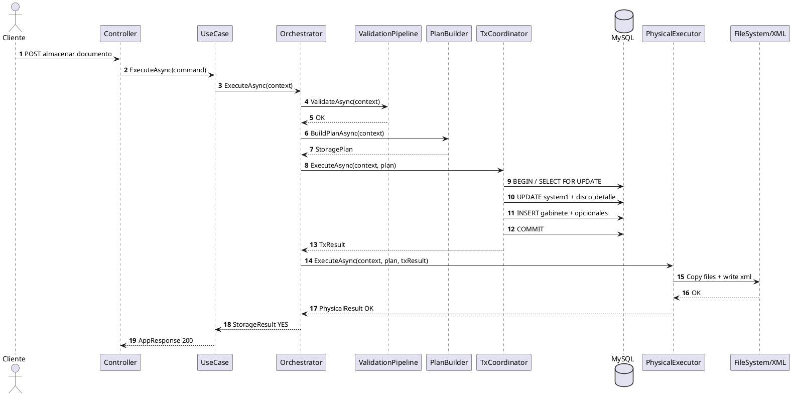

## 3.0) Fuentes PlantUML por Clase (Archivos .puml)
- `PlantUML/SCRUM-189/Sequence-AlmacenarDocumentoUseCase.puml`
- `PlantUML/SCRUM-189/Sequence-DocumentStorageOrchestrator.puml`
- `PlantUML/SCRUM-189/Sequence-StorageValidationPipeline.puml`
- `PlantUML/SCRUM-189/Sequence-StorageTransactionCoordinator.puml`
- `PlantUML/SCRUM-189/Sequence-StoragePhysicalPhaseExecutor.puml`
- `PlantUML/SCRUM-189/Sequence-StorageCompensationManager.puml`

## 3.1) Secuencia por Clase - AlmacenarDocumentoUseCase
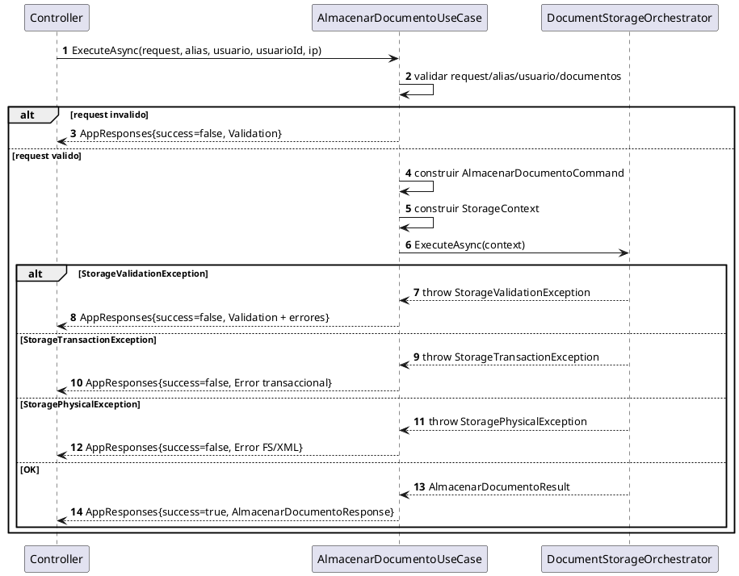

## 3.2) Secuencia por Clase - DocumentStorageOrchestrator
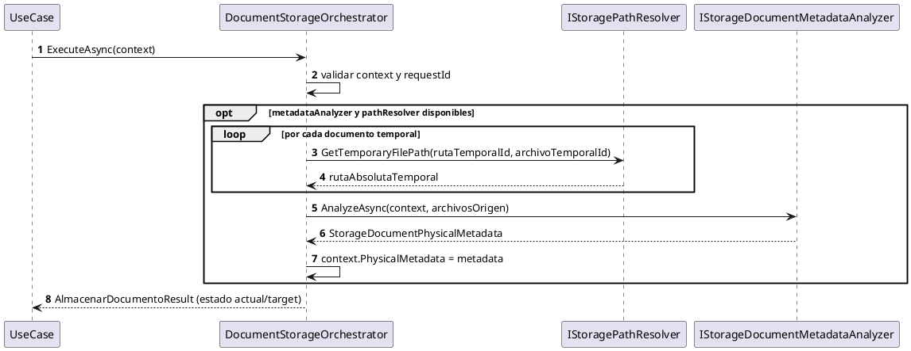

## 3.3) Secuencia por Clase - StorageValidationPipeline
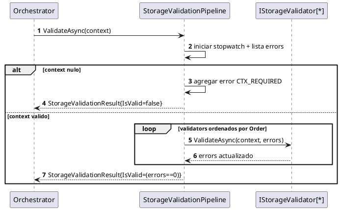

## 3.4) Secuencia por Clase - StorageTransactionCoordinator
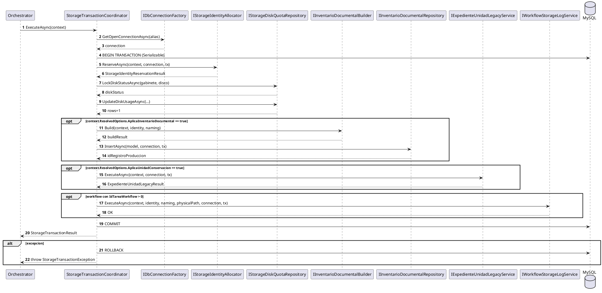

## 3.5) Secuencia por Clase - StoragePhysicalPhaseExecutor
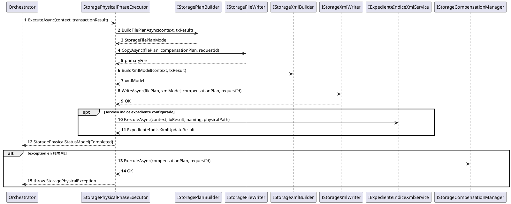

## 3.6) Secuencia por Clase - StorageCompensationManager
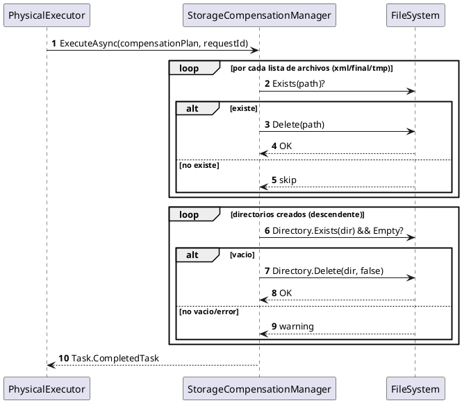

## 4) Diagrama de Estados
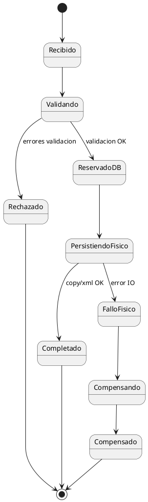

## 5) Diagrama de Componentes
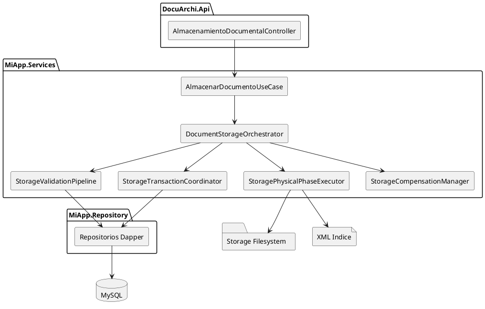

## 6) Diagrama de Despliegue
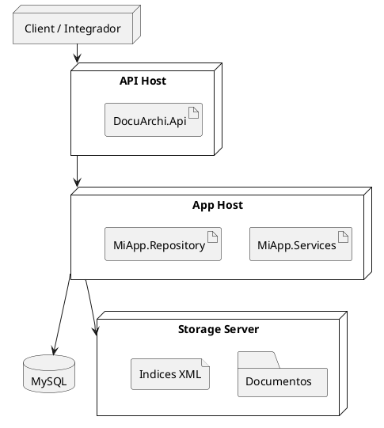

## 7) Secuencia de Error y Compensacion
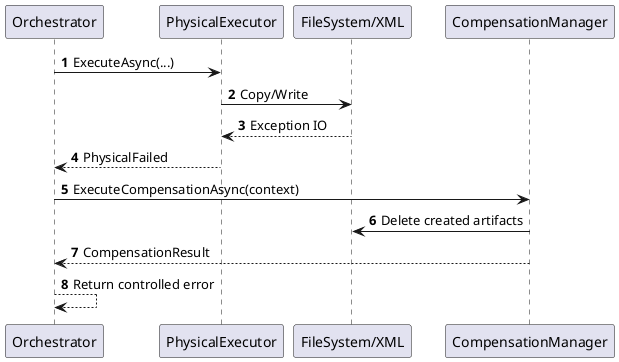

## Nota de compatibilidad
- Formato: `PlantUML`.
- Compatible con: PlantUML Server, IntelliJ PlantUML, VSCode PlantUML, Azure DevOps (ext), GitLab (plugin).
- Si tu visor no procesa PlantUML embebido, exporta a PNG/SVG desde PlantUML y adjunta los artefactos.
