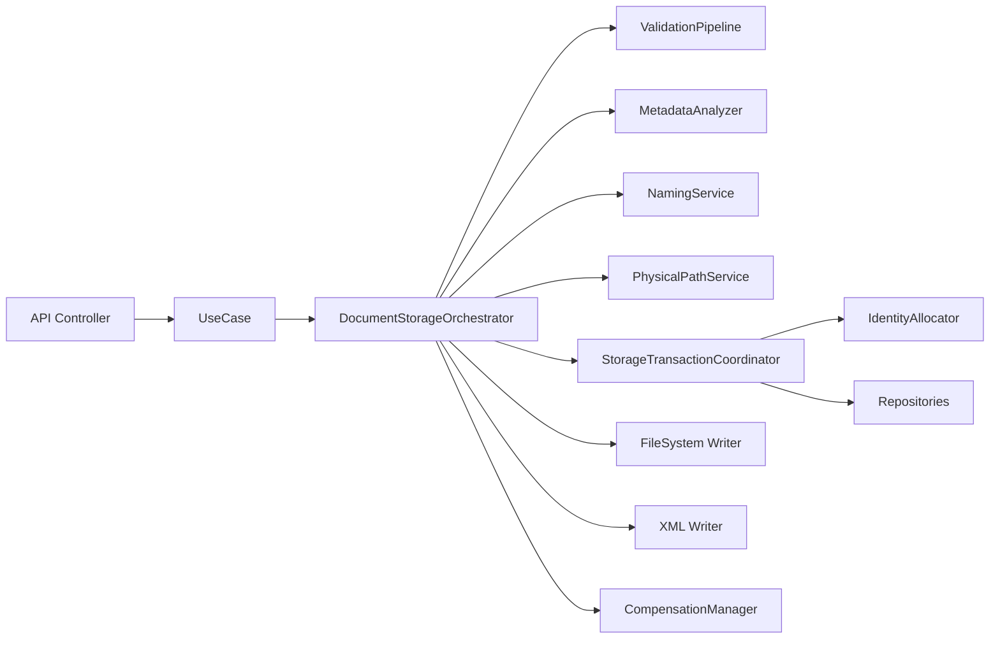
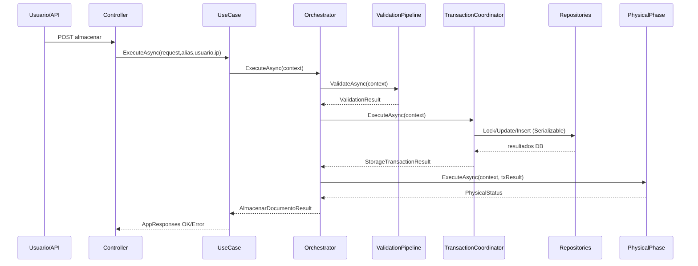
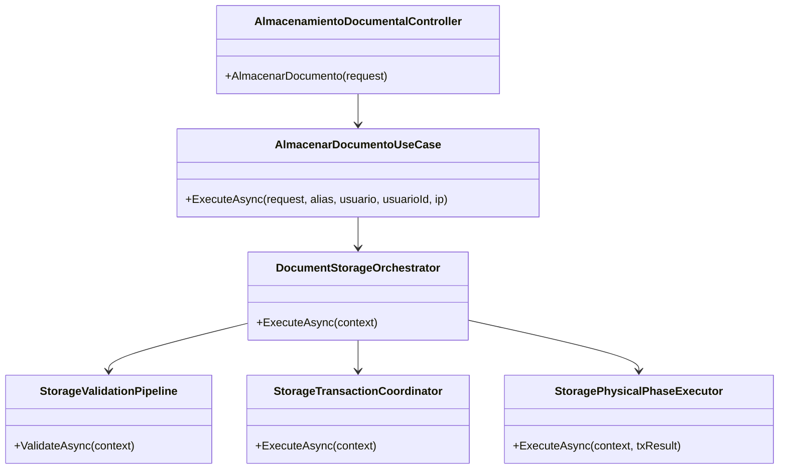
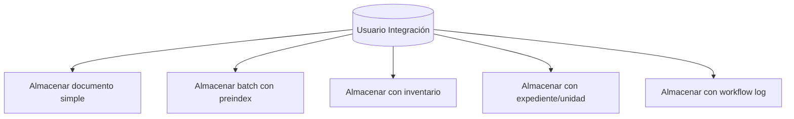
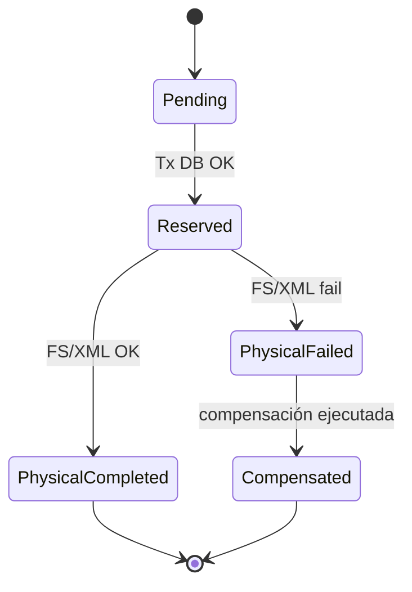
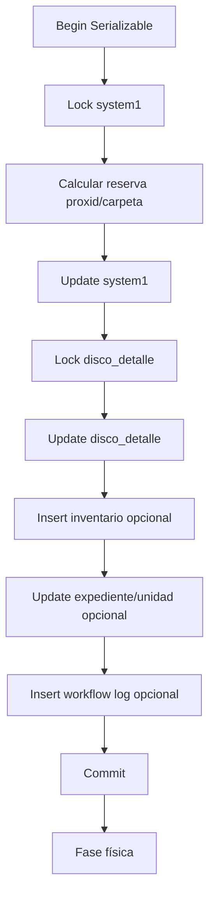
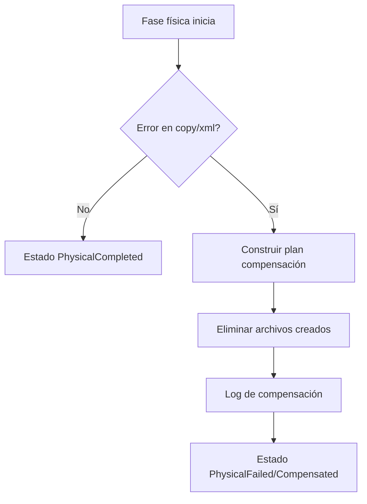
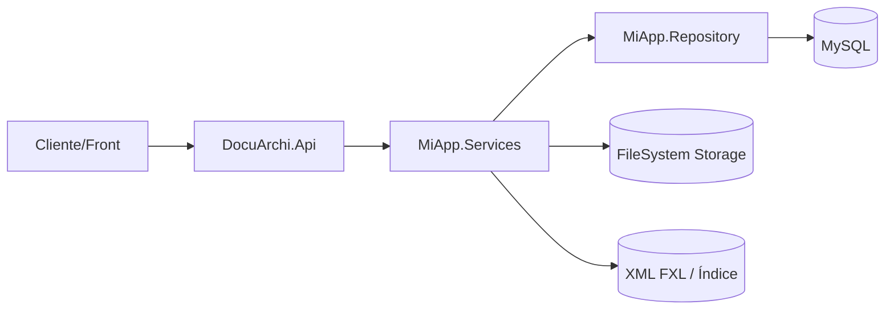

# SCRUM-189 — Diagramas StorageEngine

## 1. Diagrama de Componentes

## 2. Diagrama de Secuencia (flujo nominal)

## 3. Diagrama de Clases (núcleo)

## 4. Casos de Uso

## 5. Estados del Documento

## 6. Flujo transaccional

## 7. Flujo de compensación

## 8. Despliegue lógico

