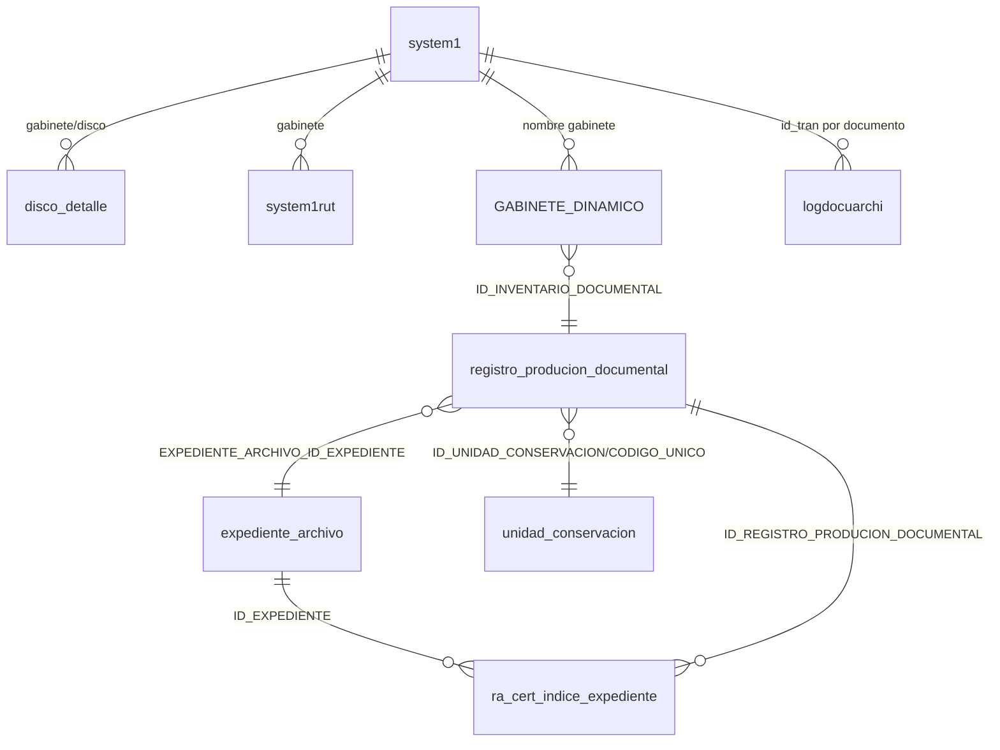

# SCRUM-189 — Modelo ER StorageEngine

## 1. Entidades críticas
| Tabla | Propósito | PK | FK relevantes | Operaciones StorageEngine |
|---|---|---|---|---|
| `system1` | Estado por gabinete (`PROXID`, `NUMCARP`, `NUMPAG_CARP`, opciones) | `id_gabinete` | n/a | lock `FOR UPDATE`, update reserva |
| `system1rut` | Ruta física por gabinete | (legacy) | n/a | consulta ruta raíz de almacenamiento |
| `disco_detalle` | Control de ocupación por disco | (`gabinete`,`disco`) lógica | n/a | lock, validación cuota, update contadores |
| `gabinete_detalle` / `DETALLE_GABIENETE` | Metadata dinámica de campos visibles/obligatorios | (legacy) | gabinete | consulta orden/campos/obligatoriedad |
| `DA_EXTENSION` | Mapeo tipo doc -> extensión | (legacy) | n/a | resolver extensión DIG principal |
| `{tabla_gabinete}` (dinámica) | Registro principal documental | `ID` | opcional a inventario/expediente | insert de metadatos + IDs core |
| `registro_producion_documental` | Inventario documental | `ID_REGISTRO_PRODUCION_DOCUMENTAL` | expediente/unidad | insert condicionado por options |
| `expediente_archivo` | Expediente y folios | `ID_EXPEDIENTE` | múltiples | lock/update folios/orden índice |
| `unidad_conservacion` | Unidad conservación y folios | `ID_UNIDAD_CONSERVACION` | múltiples | lock/update folios |
| `ra_cert_indice_expediente` | Índice electrónico por documento | `id_cert_indice_expediente` | expediente + inventario | insert índice por documento |
| `logdocuarchi` | Auditoría workflow | `Id_log_docuarchi` | n/a | insert cuando workflow activo |

## 2. Diagrama ER (lógico simplificado)

## 3. Riesgos de integridad
1. `system1.PROXID` sin lock adecuado produce colisiones.
2. `NUMPAG_CARP` desfasado afecta cálculo de carpeta siguiente.
3. Inserción parcial entre DB y FS/XML exige compensación y monitoreo.
4. Tabla dinámica de gabinete depende de metadata/orden; cambios sin control rompen inserción.
5. `expediente_archivo` y `unidad_conservacion` con actualizaciones concurrentes requieren locks explícitos.

## 4. Reglas de consistencia aplicadas
- `IsolationLevel.Serializable` en transacción principal.
- Locks `FOR UPDATE` en entidades de secuencia/folios.
- Commit DB previo a fase física con compensación de archivos en errores.
- Validadores previos para evitar persistencia de payload inconsistente.
