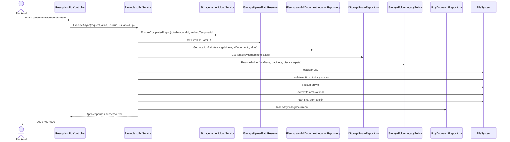

# SCRUM-202 Arquitectura Final Reemplazo PDF

## 1. Objetivo
Definir la arquitectura final del caso de uso de reemplazo físico de PDF en gabinete, aislado del módulo de almacenamiento masivo y expuesto como API dedicada `Documentos/ReemplazoPdf`.

## 2. Alcance
- Reemplazar el archivo físico final `DIG########.*` por un PDF nuevo cargado previamente en temporal.
- Mantener consistencia funcional: backup previo + validaciones + auditoría en `logdocuarchi`.
- Reutilizar infraestructura existente de rutas y upload temporal.

Fuera de alcance:
- Versionamiento documental legacy completo (`ra_ver_version_documento`).
- Reescritura de índice XML de expediente.
- Cambios en estructura de tablas.

## 3. Contexto Arquitectónico
`Controller -> Service (UseCase) -> Repositorios (Location + Route + Audit) -> FileSystem`

### 3.1 Separación por módulos
- API: `DocuArchi.Api/Controllers/GestorDocumental/Documentos/ReemplazoPdfController.cs`
- Servicio: `MiApp.Services/Service/GestorDocumental/Documentos/ReemplazoPdf/IReemplazoPdfService.cs`
- Repositorio ubicación documento: `MiApp.Repository/Repositorio/GestorDocumental/Documentos/ReemplazoPdf/IReemplazoPdfDocumentLocationRepository.cs`
- Repositorio auditoría transversal: `MiApp.Repository/Repositorio/GestorDocumental/Common/Audit/ILogDocuarchiRepository.cs`

## 4. Contrato API
- Método: `POST`
- Ruta: `/api/gestor-documental/documentos/reemplazopdf`
- Seguridad: JWT Bearer
- Claims requeridos:
  - `defaulalias`
  - `usuarioid`

Campos funcionales de auditoría (condicionales por caso):
- `DescOp`
- `ModuloRegistro`
- `Radicado`
- `IdTareaWorkflow`
- `IdRutaWorkflow`
- `TipologiaDocumental`

### 4.1 Contrato frontend completo por endpoint
El contrato de consumo frontend con ejemplo de request/response por cada API del módulo (init, chunk, status, complete, cancel y replace), además del paso a paso operativo, se documenta en:

- `Docs/GestorDocumental/Documentos/ReemplazoPdf/SCRUM-202-Integracion-Frontend-Reemplazo-PDF.md`

## 5. Flujo End-to-End
1. Controller valida claims y resuelve `usuario`, `usuarioId`, `ipTrans`.
2. Service valida request (`NombreGabinete`, `IdDocumento`, `RutaTemporalId`, `ArchivoTemporalId`).
3. Service exige que el upload temporal esté `Completed`.
4. Service resuelve archivo temporal final y valida extensión PDF.
5. Repositorio de ubicación consulta `DISC`, `IDEX`, `PAG`, `DBT`, `TIPODOCUMENTO` en gabinete.
6. Service resuelve ruta física destino con política legacy de carpeta.
7. Service localiza `DIG{idDocumento:D8}.*` y prioriza `.pdf`.
8. Service calcula hash/tamaño anterior y nuevo.
9. Service crea backup en temporal (`replacement-versions/{gabinete}/{id}/{timestamp}`).
10. Service reemplaza archivo final (`overwrite=true`).
11. Service recalcula hash final y verifica integridad.
12. Service registra auditoría técnica en `logdocuarchi`.
13. Service retorna resultado con ruta final, respaldo, hashes y `RequestId`.

## 6. Secuencia


## 7. Validaciones
### 7.1 Seguridad
- Claim `defaulalias` obligatorio.
- Claim `usuarioid` obligatorio y numérico > 0.

### 7.2 Funcionales
- Archivo temporal debe existir y estar completado.
- Extensión obligatoria `.pdf`.
- Documento debe existir en gabinete.
- Carpeta física final debe existir.
- Archivo destino `DIG########.*` debe existir.
- Hash final debe coincidir con hash del temporal.

### 7.3 Integridad de rutas
- Se usa `IStoragePathResolver` para evitar traversal.
- Backup se valida contra root temporal con `EnsureUnderRoot`.

## 8. Modelo de Auditoría (`logdocuarchi`)
Campos relevantes:
- `id_tran`: `IdDocumento`
- `desc_op`: operación funcional
- `USER_OPER`, `DATE_TRANS`, `HORA_REGISTRO`, `IP_TRANS`
- `RUT_DOCU`: ruta final del documento reemplazado
- `GABINETE`
- `CAMPOS`: JSON técnico (rutas, hashes, tamaños, motivo)
- `TIPOLOGIA_DOCUMENTAL`: `TIPODOCUMENTO` del registro de gabinete

Fuente de datos de auditoría:
- Vía request: `DescOp`, `ModuloRegistro`, `Radicado`, `IdTareaWorkflow`, `IdRutaWorkflow`, `TipologiaDocumental`.
- Fallback backend (solo si request no envía): `DescOp=REEMPLAZO_PDF_STORAGE_ENGINE`, `ModuloRegistro=DOCUARCHI`, `IdTareaWorkflow=0`, `IdRutaWorkflow=0`, `TipologiaDocumental=TIPODOCUMENTO gabinete`.

## 9. Manejo de Errores
- `400 Validation`: errores de entrada, estado temporal, mapeo de ruta, archivo no encontrado.
- `500`: fallos no controlados.
- Todas las funciones nuevas del SCRUM quedaron instrumentadas con `try/catch`.

## 10. Observabilidad
Logs mínimos:
- Inicio/fin de operación con `requestId`.
- Error de seguridad (`usuarioid`).
- Error de integridad de hash.
- Registro exitoso de reemplazo.

## 11. Riesgos y Mitigaciones
- Riesgo: sobrescritura de archivo incorrecto.
  - Mitigación: búsqueda estricta `DIG{id:D8}` + validación de carpeta legacy.
- Riesgo: pérdida de archivo previo.
  - Mitigación: backup previo obligatorio.
- Riesgo: inconsistencia de auditoría.
  - Mitigación: repositorio común centralizado `ILogDocuarchiRepository`.

## 12. Depuración Guiada
1. Verificar claims JWT (`defaulalias`, `usuarioid`).
2. Confirmar estado temporal `Completed`.
3. Confirmar ruta temporal final real.
4. Verificar consulta de ubicación en gabinete (`DISC`, `IDEX`).
5. Verificar ruta física resuelta (`storage route + folder policy`).
6. Confirmar existencia de `DIG########.PDF`.
7. Validar inserción en `logdocuarchi`.

## 13. Pruebas Técnicas
- `ReemplazoPdfControllerTests`
- `StorageDocumentReplacementServiceTests`
- `WorkflowStorageLogRepositoryTests` (por refactor de repositorio genérico de auditoría)
- `WorkflowStorageLogServiceTests`

Comando de validación aplicado:
```powershell
dotnet test tests\TramiteDiasVencimiento.Tests\TramiteDiasVencimiento.Tests.csproj --filter "FullyQualifiedName~ReemplazoPdfControllerTests|FullyQualifiedName~StorageDocumentReplacementServiceTests|FullyQualifiedName~WorkflowStorageLogRepositoryTests|FullyQualifiedName~WorkflowStorageLogServiceTests"
```
