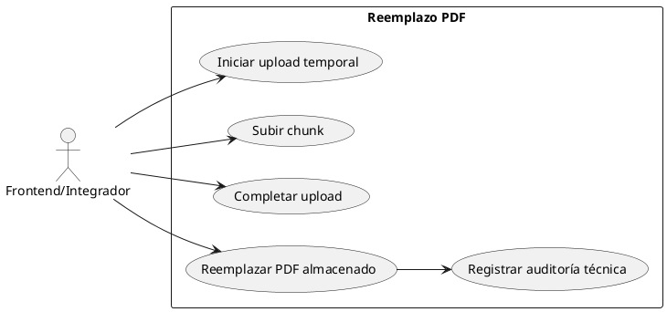
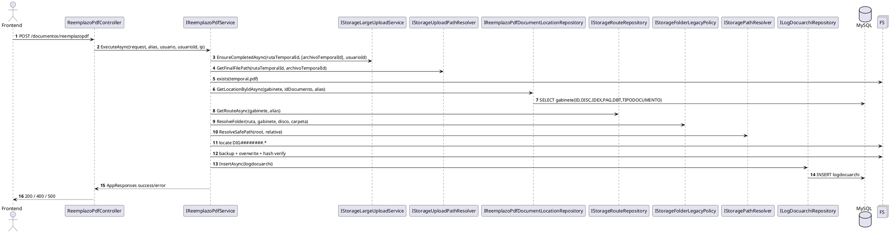
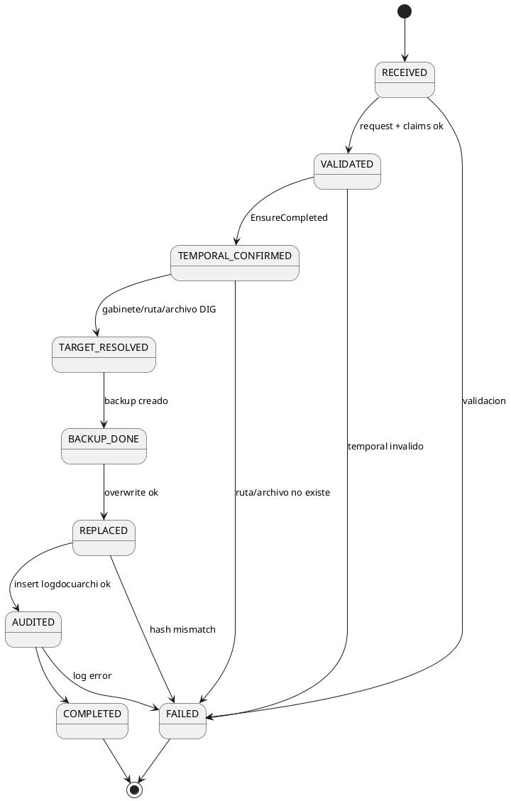
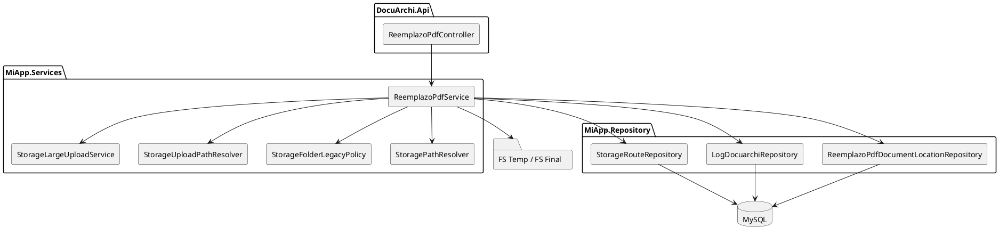
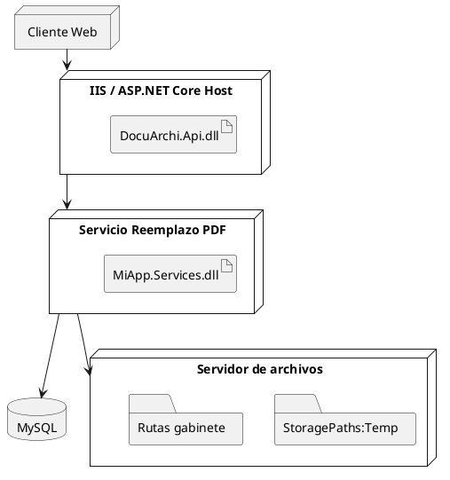

# SCRUM-202 - Diagramas Reemplazo PDF (UML / PlantUML)

## Alcance
Documento de arquitectura de la capacidad de reemplazo físico de PDF en gabinete (`Documentos/ReemplazoPdf`) y su integración con upload temporal existente.

## Estado de cierre
- Endpoint dedicado implementado en módulo `Documentos`.
- Reutilización de upload temporal (`EnsureCompletedAsync`) implementada.
- Auditoría transversal en `logdocuarchi` desacoplada mediante `ILogDocuarchiRepository`.

## 1) Diagrama de Casos de Uso

## 2) Diagrama de Clases (Núcleo Reemplazo)

```plantuml
@startuml
skinparam classAttributeIconSize 0

interface IReemplazoPdfService {
  +ExecuteAsync(request, defaultDbAlias, usuario, usuarioId, ipTrans) : Task<AppResponses<ReemplazarDocumentoPdfResponse?>>
}

interface IReemplazoPdfDocumentLocationRepository {
  +GetLocationByIdAsync(nombreGabinete, idDocumento, defaultDbAlias) : Task<StorageDocumentLocationModel?>
}

interface ILogDocuarchiRepository {
  +InsertAsync(model, defaultDbAlias) : Task<int>
  +InsertBeginTransAsync(model, connection, transaction, usuario) : Task<int>
}

interface IStorageLargeUploadService {
  +EnsureCompletedAsync(rutaTemporalId, archivoTemporalIds, usuarioId) : Task
}

interface IStorageUploadPathResolver {
  +GetFinalFilePath(rutaTemporalId, archivoTemporalId) : string
  +GetTempRoot() : string
}

interface IStorageRouteRepository {
  +GetRouteAsync(nombreGabinete, defaultDbAlias) : Task<StorageRouteModel?>
}

interface IStorageFolderLegacyPolicy {
  +ResolveFolder(rutaBase, nombreGabinete, disco, carpeta) : StorageFolderResolution
}

interface IStoragePathResolver {
  +ResolveSafePath(rootPath, relativePath) : string
}

class ReemplazoPdfService {
  -_largeUploadService : IStorageLargeUploadService
  -_uploadPathResolver : IStorageUploadPathResolver
  -_storagePathResolver : IStoragePathResolver
  -_routeRepository : IStorageRouteRepository
  -_folderPolicy : IStorageFolderLegacyPolicy
  -_locationRepository : IReemplazoPdfDocumentLocationRepository
  -_replacementLogRepository : ILogDocuarchiRepository
}

class ReemplazoPdfController
class ReemplazoPdfDocumentLocationRepository
class LogDocuarchiRepository

IReemplazoPdfService <|.. ReemplazoPdfService
IReemplazoPdfDocumentLocationRepository <|.. ReemplazoPdfDocumentLocationRepository
ILogDocuarchiRepository <|.. LogDocuarchiRepository
ReemplazoPdfController --> IReemplazoPdfService
ReemplazoPdfService --> IStorageLargeUploadService
ReemplazoPdfService --> IStorageUploadPathResolver
ReemplazoPdfService --> IStorageRouteRepository
ReemplazoPdfService --> IStorageFolderLegacyPolicy
ReemplazoPdfService --> IStoragePathResolver
ReemplazoPdfService --> IReemplazoPdfDocumentLocationRepository
ReemplazoPdfService --> ILogDocuarchiRepository
@enduml
```

## 3) Diagrama de Secuencia Integral

## 3.1 Tabla de interacciones principales
| Paso | Origen | Destino | Función | Parámetros clave | Retorno |
|---|---|---|---|---|---|
| 1 | Frontend | Controller | `reemplazopdf` | `NombreGabinete,IdDocumento,RutaTemporalId,ArchivoTemporalId,DescOp,ModuloRegistro,Radicado,IdTareaWorkflow,IdRutaWorkflow,TipologiaDocumental` | `AppResponses` |
| 2 | Service | UploadService | `EnsureCompletedAsync` | `rutaTemporalId,archivoTemporalIds,usuarioId` | `OK/Error` |
| 3 | Service | PathResolver | `GetFinalFilePath` | `rutaTemporalId,archivoTemporalId` | `ruta temporal final` |
| 4 | Service | LocationRepo | `GetLocationByIdAsync` | `gabinete,idDocumento,alias` | `DISC,IDEX,PAG,DBT,TIPODOCUMENTO` |
| 5 | Service | RouteRepo | `GetRouteAsync` | `gabinete,alias` | `ruta almacenamiento` |
| 6 | Service | FolderPolicy | `ResolveFolder` | `ruta,gabinete,disco,carpeta` | `ruta final carpeta` |
| 7 | Service | AuditRepo | `InsertAsync` | `LogDocuarchiEntryModel` | `rows=1` |

## 4) Diagrama de Estados (Reemplazo)

## 5) Diagrama de Componentes

## 6) Diagrama de Despliegue

## 7) Nota de compatibilidad
- Formato: `PlantUML`.
- Compatible con VSCode/IntelliJ/PlantUML Server.
- Flujo recomendado frontend: `init -> chunk -> complete -> reemplazopdf`.
