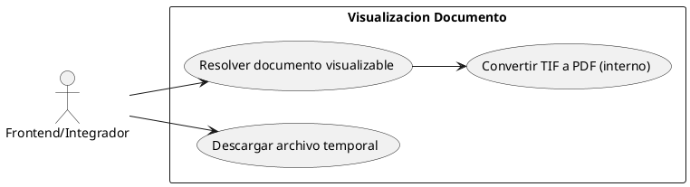
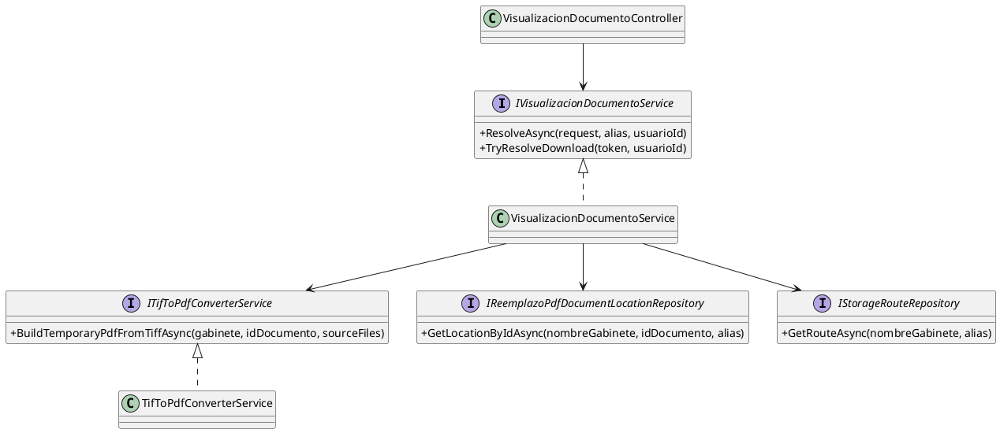
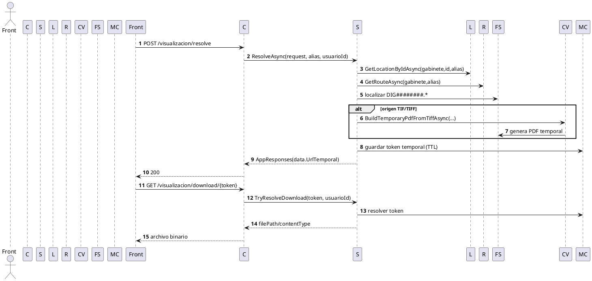
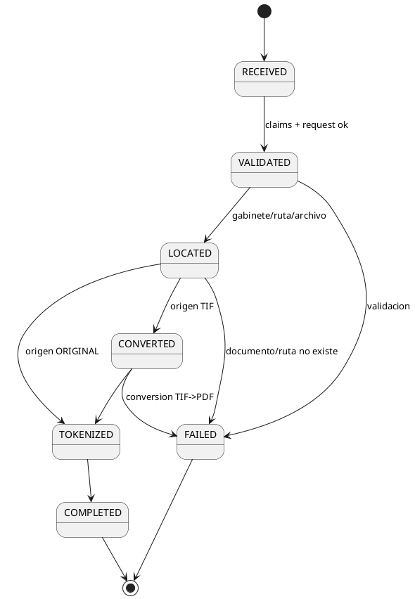

# SCRUM-204 - Diagramas Visualizacion Documento (UML / PlantUML)

## Alcance
Arquitectura de visualización documental (`Documentos/VisualizacionDocumento`) con token temporal y conversión TIF->PDF interna.

## 1) Diagrama de Casos de Uso

## 2) Diagrama de Clases

## 3) Diagrama de Secuencia

## 4) Diagrama de Estados
