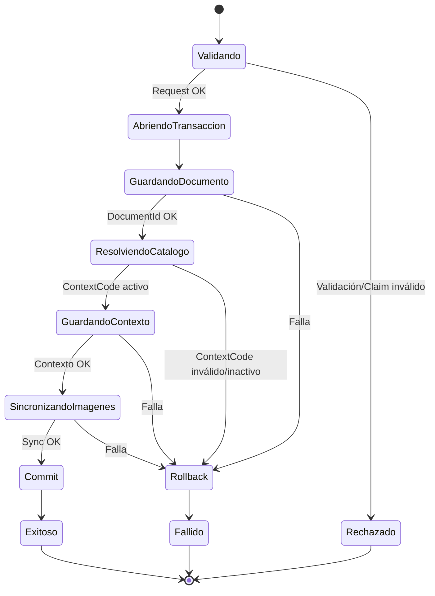
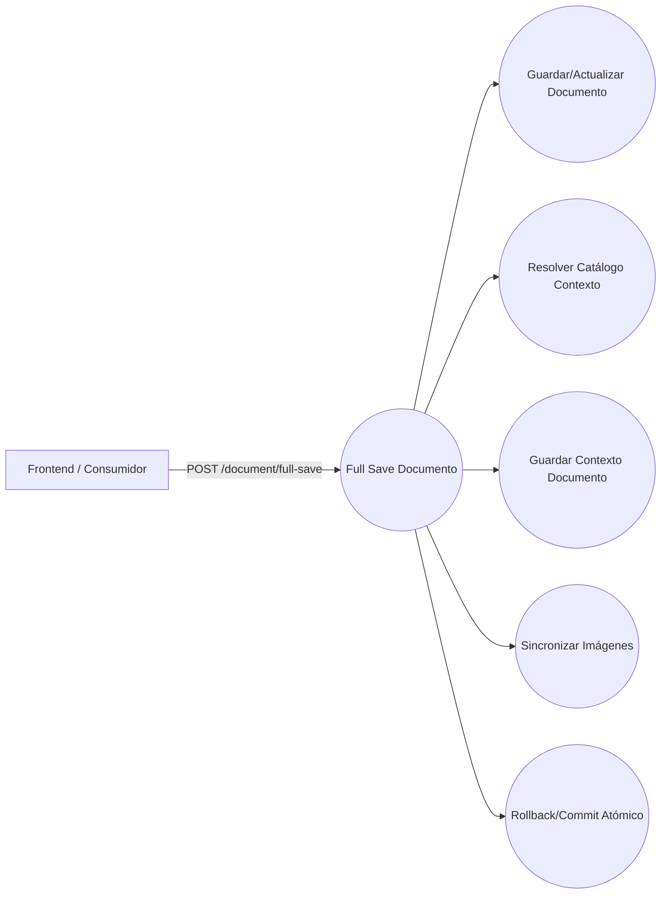
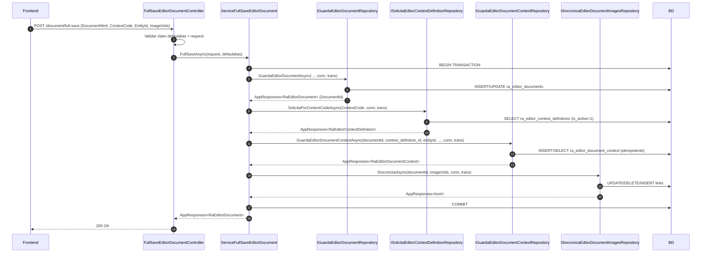

# SCRUM-148 — Arquitectura: Full Save Editor Document (Catálogo)

## Propósito

El Full Save es el **service orquestador** que garantiza atomicidad (una sola transacción) entre:

1) Guardar documento HTML  
2) Resolver catálogo de contexto (`ContextCode`)  
3) Guardar relación documento ↔ contexto  
4) Sincronizar imágenes

## Diagrama de Estado

## Diagrama de Casos de Uso

## Capas

Controller → Service (orquestador) → Repositorios → BD

### Controller

- Valida claim `defaulalias`
- Valida request y campos mínimos
- Delegación al service

### Service Full Save (orquestador)

- Abre `IDbConnection` y `IDbTransaction`
- Ejecuta repositorios reutilizados pasando `conn/trans`
- Ejecuta `COMMIT` solo si todo OK
- Ejecuta `ROLLBACK` ante cualquier error o excepción

## Repositorios reutilizados

- `IGuardaEditorDocumentRepository` (documento)
- `ISolicitaEditorContextDefinitionRepository` (catálogo)
- `IGuardaEditorDocumentContextRepository` (contexto)
- `ISincronizaEditorDocumentImagesRepository` (imágenes)

## Diagrama de Secuencia

## Diagrama de Clases

```mermaid
classDiagram
  class FullSaveEditorDocumentController {
    +FullSave(FullSaveEditorDocumentRequestDto) ActionResult
  }

  class ServiceFullSaveEditorDocument {
    +FullSaveAsync(FullSaveEditorDocumentRequestDto,string) Task~AppResponses~RaEditorDocument~~
  }

  class IGuardaEditorDocumentRepository {
    +GuardaEditorDocumentAsync(GuardaEditorDocumentRequestDto,string,IDbConnection,IDbTransaction) Task~AppResponses~RaEditorDocument~~
  }
  class ISolicitaEditorContextDefinitionRepository {
    +SolicitaPorContextCodeAsync(string,string,IDbConnection,IDbTransaction) Task~AppResponses~RaEditorContextDefinition~~
  }
  class IGuardaEditorDocumentContextRepository {
    +GuardaEditorDocumentContextAsync(long,long,long,string,string,IDbConnection,IDbTransaction) Task~AppResponses~RaEditorDocumentContext~~
  }
  class ISincronizaEditorDocumentImagesRepository {
    +SincronizaAsync(long,IReadOnlyCollection~string~,string,IDbConnection,IDbTransaction) Task~AppResponses~bool~~
  }

  FullSaveEditorDocumentController --> ServiceFullSaveEditorDocument
  ServiceFullSaveEditorDocument --> IGuardaEditorDocumentRepository
  ServiceFullSaveEditorDocument --> ISolicitaEditorContextDefinitionRepository
  ServiceFullSaveEditorDocument --> IGuardaEditorDocumentContextRepository
  ServiceFullSaveEditorDocument --> ISincronizaEditorDocumentImagesRepository
```

## Invariantes

- No debe persistir documento sin contexto cuando el request exige contexto.
- No debe persistir documento/contexto si falla sincronización de imágenes.
- No debe haber commit parcial.
