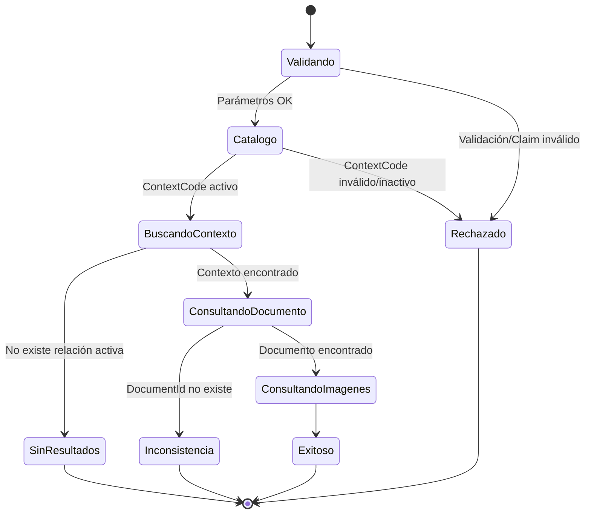
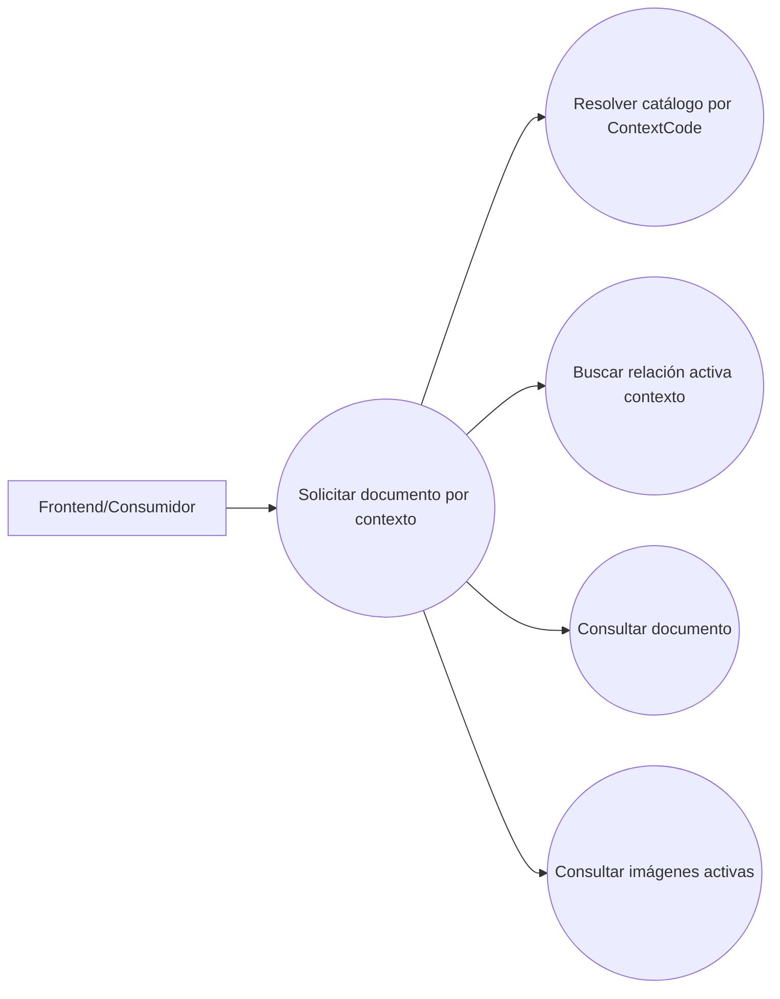
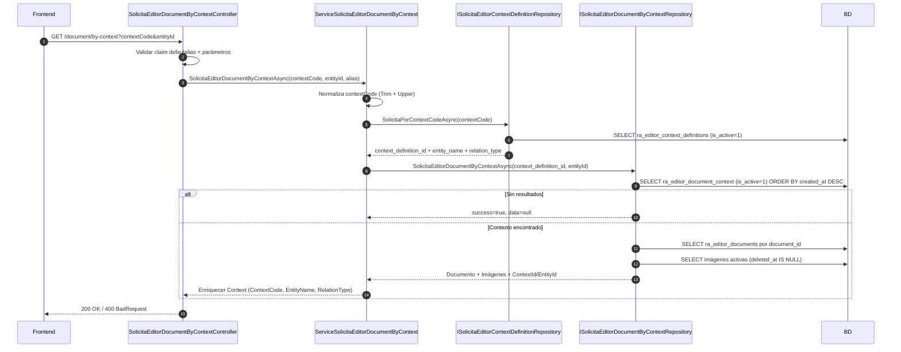
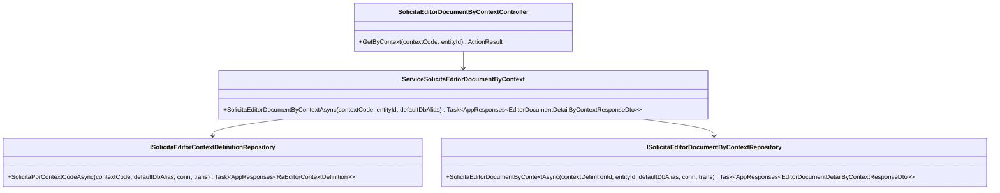
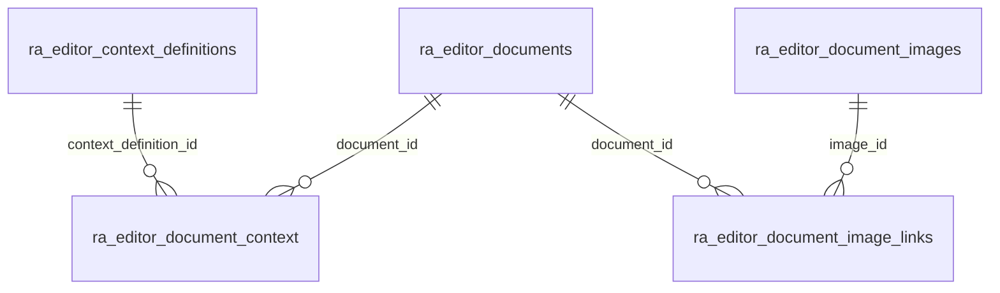

# SCRUM-149 — Arquitectura: SolicitaEditorDocumentByContext (Catálogo)

## Propósito

Recuperar un documento del editor Tiptap por un **contexto de negocio controlado por catálogo**, usando `ContextCode + EntityId`, sin depender de que el frontend conozca `DocumentId`.

## Tablas involucradas

- `ra_editor_context_definitions` (catálogo)
- `ra_editor_document_context` (relación activa)
- `ra_editor_documents` (documento)
- `ra_editor_document_image_links` (links)
- `ra_editor_document_images` (imágenes)

## Diagrama de Estado

## Diagrama de Casos de Uso

## Diagrama de Secuencia

## Secuencia literal (paso a paso)

1. El Controller valida `defaulalias`, `contextCode` y `entityId`.
2. El Service normaliza `contextCode` (`Trim().ToUpperInvariant()`).
3. El Service consulta el catálogo y valida que el `ContextCode` esté activo.
4. Con `context_definition_id`, el repositorio busca la relación activa más reciente para `entity_id`.
5. Si no existe relación activa: retorna `success=true` con `data=null`.
6. Si existe relación: consulta el documento por `document_id`.
7. Consulta imágenes asociadas activas (`deleted_at IS NULL`) y arma la lista `Images`.
8. El Service enriquece `Context` con datos del catálogo (`EntityName`, `RelationType`, `ContextCode`).

## Diagrama de Clases

## Diagrama de Tablas (relación lógica)

## Decisión obligatoria: múltiples contextos activos

Si existen múltiples filas activas para el mismo `(context_definition_id, entity_id)`, se retorna la **más reciente**:

- `ORDER BY created_at DESC, context_id DESC LIMIT 1`

## No alcance

- No modifica datos.
- No expone `image_bytes`.
- No retorna contextos inactivos ni definiciones inactivas.

