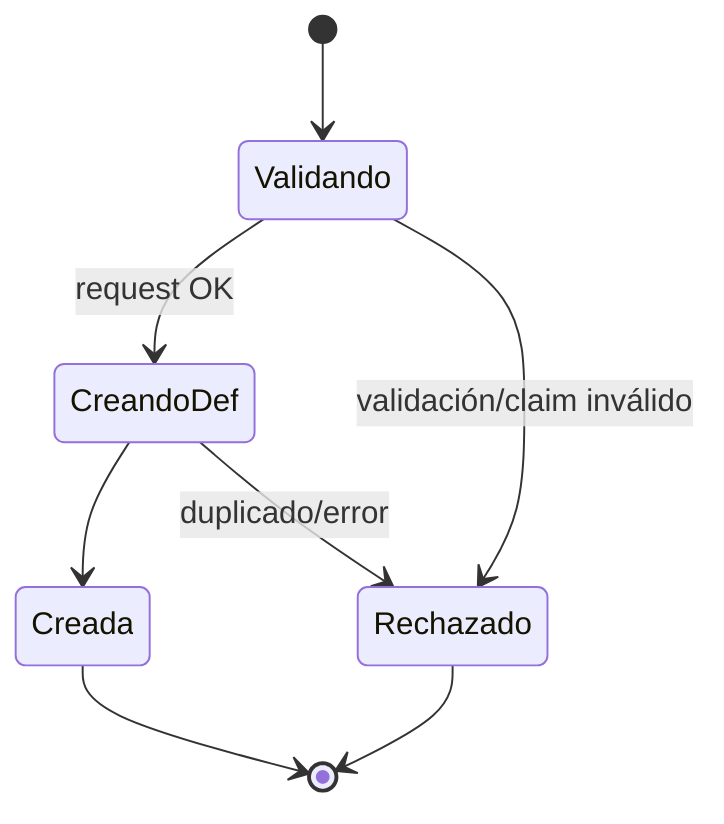
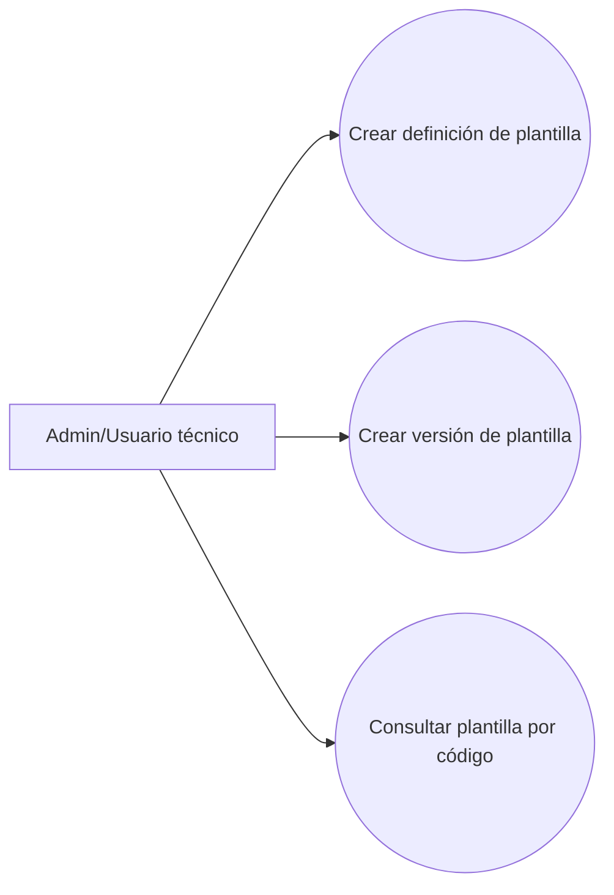
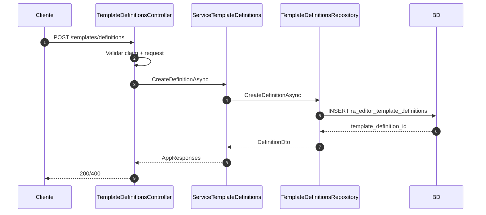
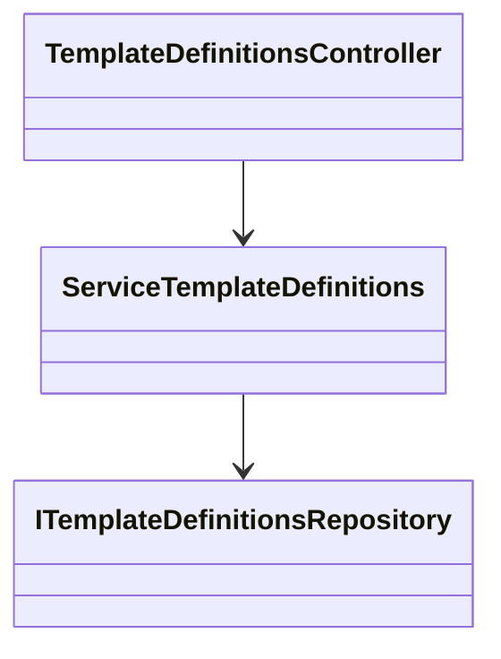
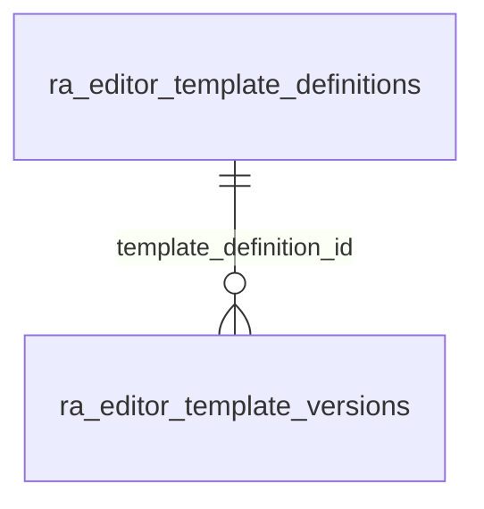

# SCRUM-150 — Arquitectura: Catálogo de Plantillas HTML del Editor

## Propósito

Proveer un catálogo formal de plantillas reutilizables del editor Tiptap con **definición** + **versionado**, evitando hardcodeo en frontend/backend.

## Tablas

- `ra_editor_template_definitions`
- `ra_editor_template_versions`

## Diagrama de Estado

## Diagrama de Casos de Uso

## Diagrama de Secuencia

## Secuencia literal (paso a paso)

1. Controller valida claim `defaulalias`.
2. Controller valida `TemplateCode` y `TemplateName`.
3. Service normaliza `TemplateCode` (trim + upper).
4. Repository valida duplicado por `template_code`.
5. Inserta la definición y retorna la definición persistida.

## Diagrama de Clases

## Diagrama de Tablas

