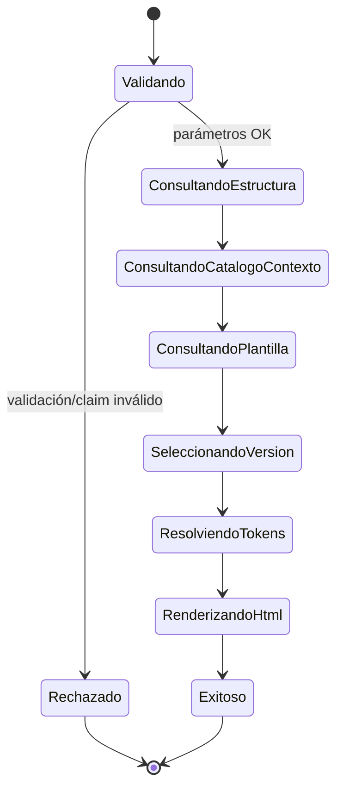
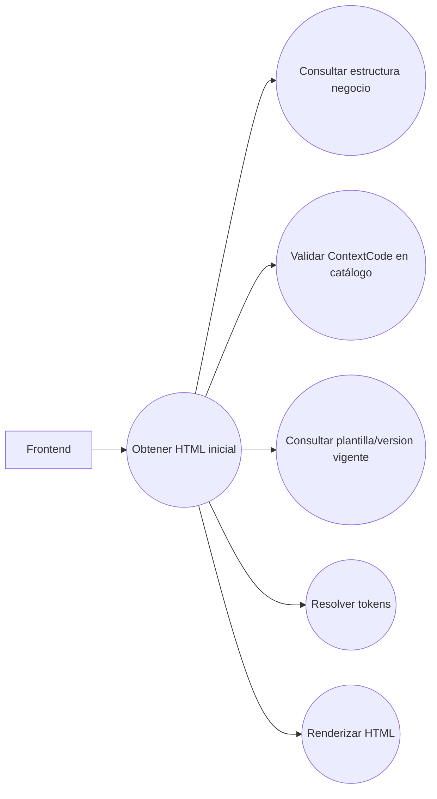
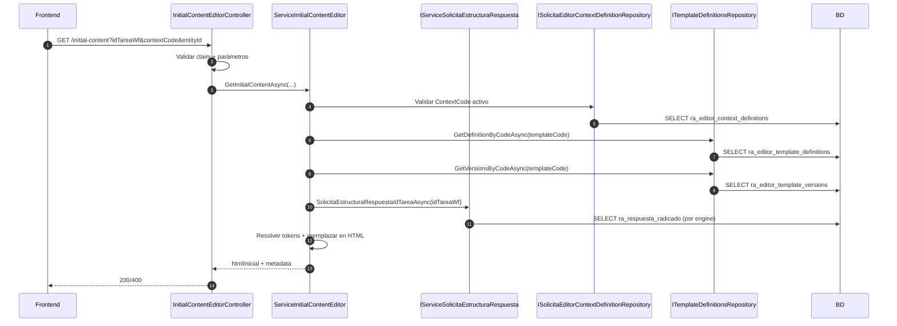
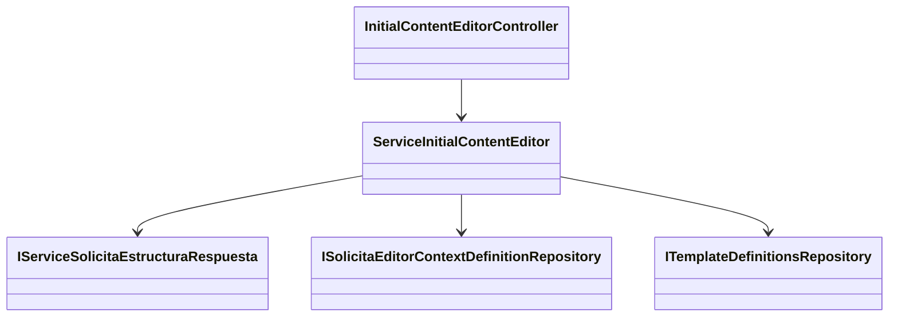

# SCRUM-151 — Arquitectura: Initial Content Editor

## Propósito

Generar `htmlInicial` para Tiptap a partir de:

- estructura de negocio (por `idTareaWf`)
- `ContextCode` (catálogo de contextos)
- plantilla HTML (catálogo de plantillas + versiones)
- resolución de tokens y reemplazo en HTML

## Diagrama de Estado

## Diagrama de Casos de Uso

## Diagrama de Secuencia

## Secuencia literal (paso a paso)

1. Controller valida claim `defaulalias` y parámetros (`idTareaWf`, `contextCode`, `entityId`).
2. Service normaliza `ContextCode` (`Trim().ToUpperInvariant()`).
3. Service valida `ContextCode` activo en `ra_editor_context_definitions`.
4. Service selecciona `TemplateCode` (MVP: `TemplateCode == ContextCode`).
5. Service consulta definición y versiones de la plantilla.
6. Service elige la versión vigente (activa, prioriza publicada y mayor versión).
7. Service consulta estructura de negocio por `idTareaWf`.
8. Service construye mapa de tokens desde la estructura y reemplaza `{{TOKEN}}` en el HTML.
9. Retorna `htmlInicial` sin persistir documento.

## Diagrama de Clases

