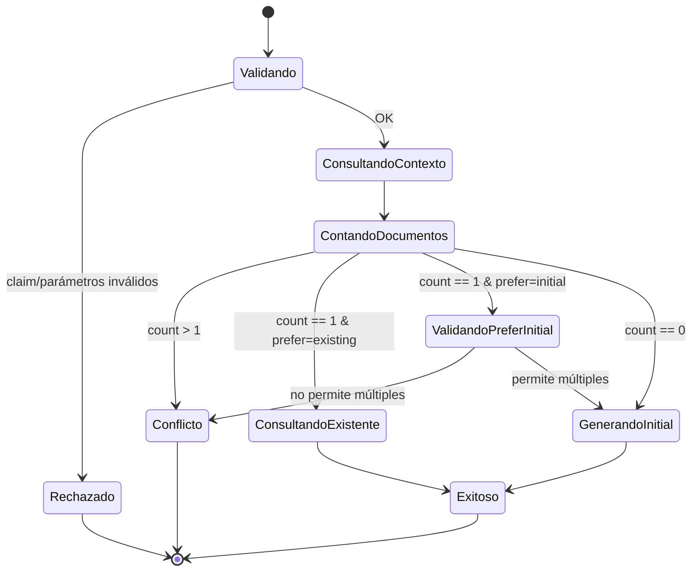
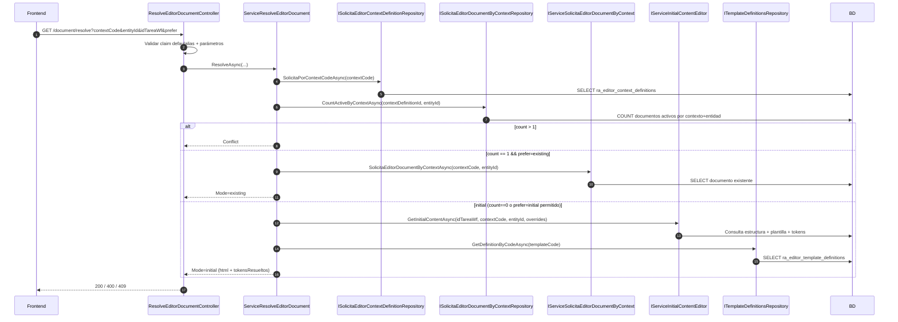

# SCRUM-154 — Arquitectura: Resolve Editor Document

## Propósito

Centralizar en backend la resolución de contenido del editor para que el frontend haga una sola llamada:

- Si existe documento → retorna `Mode=existing`.
- Si no existe documento → retorna `Mode=initial` (HTML inicial).
- Si `prefer=initial` → fuerza `Mode=initial` cuando el contexto lo permite.

## Componentes reales (código)

- Controller: `..\DocuArchi.Api\Controllers\GestorDocumental\Editor\ResolveEditorDocumentController.cs`
- Service: `..\MiApp.Services\Service\GestorDocumental\Editor\ServiceResolveEditorDocument.cs`
- DTO: `..\MiApp.DTOs\DTOs\GestorDocumental\Editor\EditorResolveDocumentResponseDto.cs`

## Diagrama de Estado

## Diagrama de Secuencia

## Decisiones relevantes

- El controller solo valida claim/parámetros y delega.
- El service concentra reglas de negocio:
  - valida contexto activo,
  - detecta múltiples documentos (conflicto),
  - decide existing vs initial,
  - obliga `idTareaWf` únicamente cuando se requiere `initial`.

## Deuda técnica identificada (para roadmap)

- Cuando hay múltiples documentos (409), falta un flujo oficial para que el frontend liste/seleccione un documento.
- Actualmente la detección de “documento activo” depende de la implementación del repositorio `CountActiveByContextAsync`.

