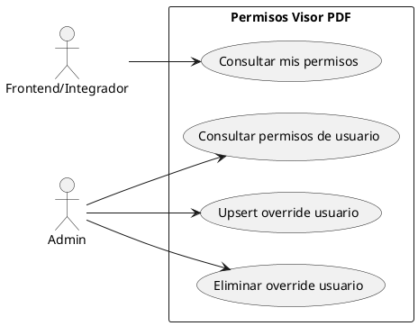
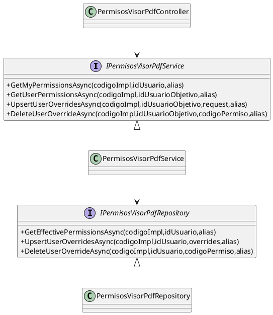
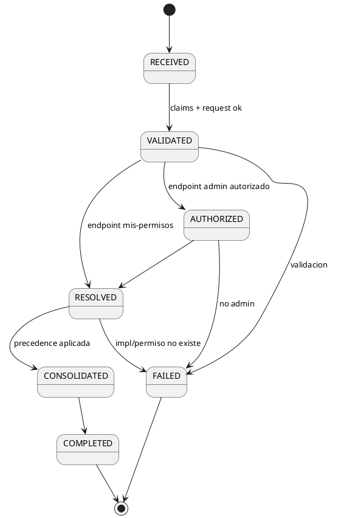
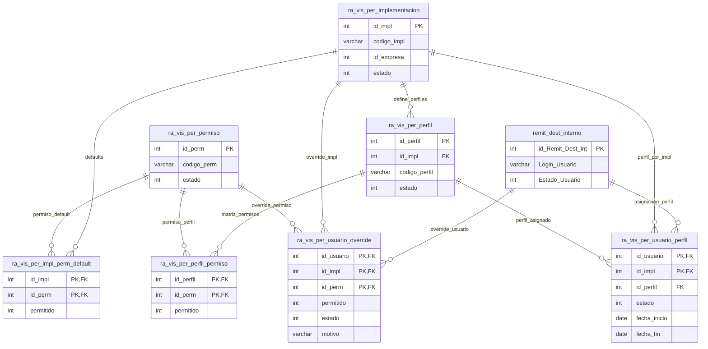

# SCRUM-206 - Diagramas Permisos Visor PDF (UML / PlantUML)

## Alcance
Arquitectura de permisos del visor PDF por implementación/usuario, con precedencia efectiva y administración de overrides.

## 1) Diagrama de Casos de Uso


## 2) Diagrama de Clases


## 3) Diagrama de Secuencia
```plantuml
@startuml
autonumber
actor Front as Frontend
participant C as PermisosVisorPdfController
participant S as PermisosVisorPdfService
participant R as PermisosVisorPdfRepository
participant DB as DB(ra_vis_per_*)

Front -> C : GET /mis-permisos
C -> S : GetMyPermissionsAsync(codigoImpl,usuarioid,alias)
S -> R : GetEffectivePermissionsAsync(...)
R -> DB : leer catalogo/defaults/perfil/override
R --> S : permissions + sources
S --> C : AppResponses<VisorPdfPermissionsResponseDto>
C --> Front : 200

@enduml
```

## 4) Diagrama de Estados


## 5) Diagrama Visual De Tablas (ER)


### Lectura rápida del modelo
- `ra_vis_per_implementacion` define cada contexto (`workflow`, `gestion_correspondencia`, etc.).
- `ra_vis_per_permiso` es el catálogo global (`pdf.view`, `pdf.print`, ...).
- `ra_vis_per_impl_perm_default` guarda el baseline por implementación.
- `ra_vis_per_perfil` + `ra_vis_per_perfil_permiso` definen roles y su matriz.
- `ra_vis_per_usuario_perfil` asigna un perfil a un usuario por implementación y vigencia.
- `ra_vis_per_usuario_override` aplica excepciones por usuario.
