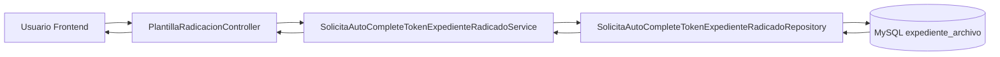
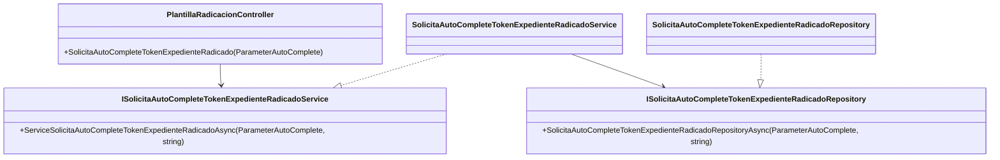
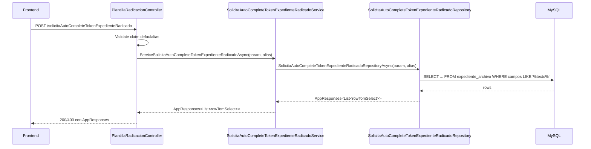
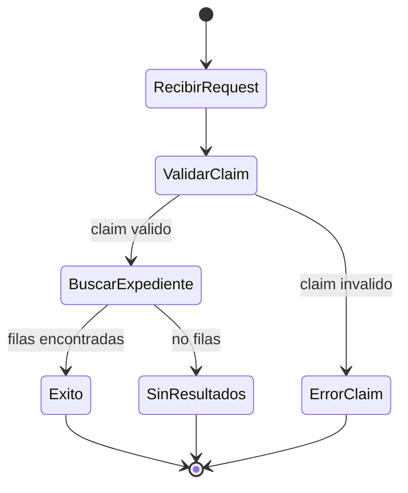

# SCRUM-56 Diagramas - AutoComplete Token Expediente Radicado

## Caso de Uso

```mermaid
flowchart LR
    U[Usuario Frontend] --> C[PlantillaRadicacionController]
    C --> S[SolicitaAutoCompleteTokenExpedienteRadicadoService]
    S --> R[SolicitaAutoCompleteTokenExpedienteRadicadoRepository]
    R --> DB[(MySQL expediente_archivo)]
    DB --> R --> S --> C --> U
```

## Diagrama de Clases

```mermaid
classDiagram
    class PlantillaRadicacionController {
      +SolicitaAutoCompleteTokenExpedienteRadicado(ParameterAutoComplete)
    }
    class ISolicitaAutoCompleteTokenExpedienteRadicadoService {
      +ServiceSolicitaAutoCompleteTokenExpedienteRadicadoAsync(ParameterAutoComplete, string)
    }
    class SolicitaAutoCompleteTokenExpedienteRadicadoService
    class ISolicitaAutoCompleteTokenExpedienteRadicadoRepository {
      +SolicitaAutoCompleteTokenExpedienteRadicadoRepositoryAsync(ParameterAutoComplete, string)
    }
    class SolicitaAutoCompleteTokenExpedienteRadicadoRepository

    PlantillaRadicacionController --> ISolicitaAutoCompleteTokenExpedienteRadicadoService
    SolicitaAutoCompleteTokenExpedienteRadicadoService ..|> ISolicitaAutoCompleteTokenExpedienteRadicadoService
    SolicitaAutoCompleteTokenExpedienteRadicadoService --> ISolicitaAutoCompleteTokenExpedienteRadicadoRepository
    SolicitaAutoCompleteTokenExpedienteRadicadoRepository ..|> ISolicitaAutoCompleteTokenExpedienteRadicadoRepository
```

## Diagrama de Secuencia

```mermaid
sequenceDiagram
    participant FE as Frontend
    participant API as PlantillaRadicacionController
    participant SVC as SolicitaAutoCompleteTokenExpedienteRadicadoService
    participant REP as SolicitaAutoCompleteTokenExpedienteRadicadoRepository
    participant DB as MySQL

    FE->>API: POST /solicitaAutoCompleteTokenExpedienteRadicado
    API->>API: Validate claim defaulalias
    API->>SVC: ServiceSolicitaAutoCompleteTokenExpedienteRadicadoAsync(param, alias)
    SVC->>REP: SolicitaAutoCompleteTokenExpedienteRadicadoRepositoryAsync(param, alias)
    REP->>DB: SELECT ... FROM expediente_archivo WHERE campos LIKE '%texto%'
    DB-->>REP: rows
    REP-->>SVC: AppResponses<List<rowTomSelect>>
    SVC-->>API: AppResponses<List<rowTomSelect>>
    API-->>FE: 200/400 con AppResponses
```

## Diagrama de Estado

```mermaid
stateDiagram-v2
    [*] --> RecibirRequest
    RecibirRequest --> ValidarClaim
    ValidarClaim --> ErrorClaim: claim invalido
    ValidarClaim --> BuscarExpediente: claim valido
    BuscarExpediente --> SinResultados: no filas
    BuscarExpediente --> Exito: filas encontradas
    Exito --> [*]
    SinResultados --> [*]
    ErrorClaim --> [*]
```
