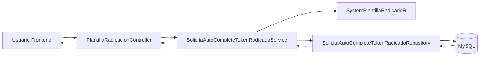
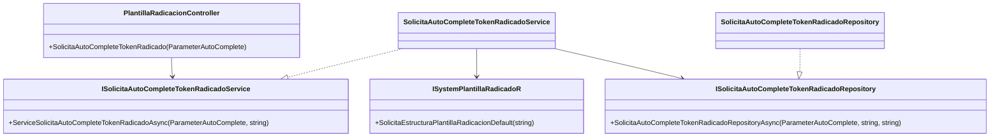
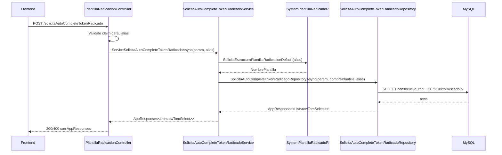
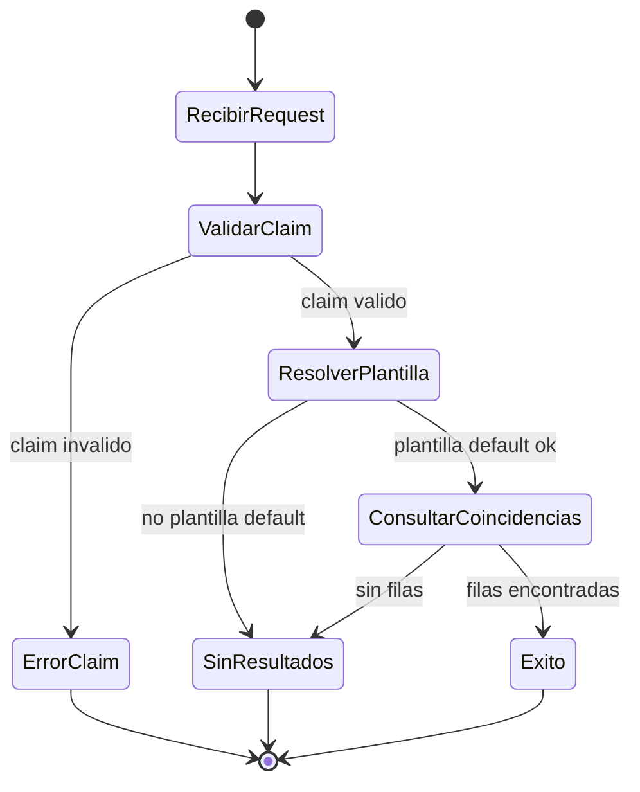

# SCRUM-55 Diagramas - AutoComplete Token Radicado

## Caso de Uso

```mermaid
flowchart LR
    U[Usuario Frontend] --> C[PlantillaRadicacionController]
    C --> S[SolicitaAutoCompleteTokenRadicadoService]
    S --> P[SystemPlantillaRadicadoR]
    S --> R[SolicitaAutoCompleteTokenRadicadoRepository]
    R --> DB[(MySQL)]
    DB --> R --> S --> C --> U
```

## Diagrama de Clases

```mermaid
classDiagram
    class PlantillaRadicacionController {
      +SolicitaAutoCompleteTokenRadicado(ParameterAutoComplete)
    }
    class ISolicitaAutoCompleteTokenRadicadoService {
      +ServiceSolicitaAutoCompleteTokenRadicadoAsync(ParameterAutoComplete, string)
    }
    class SolicitaAutoCompleteTokenRadicadoService
    class ISystemPlantillaRadicadoR {
      +SolicitaEstructuraPlantillaRadicacionDefault(string)
    }
    class ISolicitaAutoCompleteTokenRadicadoRepository {
      +SolicitaAutoCompleteTokenRadicadoRepositoryAsync(ParameterAutoComplete, string, string)
    }
    class SolicitaAutoCompleteTokenRadicadoRepository

    PlantillaRadicacionController --> ISolicitaAutoCompleteTokenRadicadoService
    SolicitaAutoCompleteTokenRadicadoService ..|> ISolicitaAutoCompleteTokenRadicadoService
    SolicitaAutoCompleteTokenRadicadoService --> ISystemPlantillaRadicadoR
    SolicitaAutoCompleteTokenRadicadoService --> ISolicitaAutoCompleteTokenRadicadoRepository
    SolicitaAutoCompleteTokenRadicadoRepository ..|> ISolicitaAutoCompleteTokenRadicadoRepository
```

## Diagrama de Secuencia

```mermaid
sequenceDiagram
    participant FE as Frontend
    participant API as PlantillaRadicacionController
    participant SVC as SolicitaAutoCompleteTokenRadicadoService
    participant SPR as SystemPlantillaRadicadoR
    participant REP as SolicitaAutoCompleteTokenRadicadoRepository
    participant DB as MySQL

    FE->>API: POST /solicitaAutoCompleteTokenRadicado
    API->>API: Validate claim defaulalias
    API->>SVC: ServiceSolicitaAutoCompleteTokenRadicadoAsync(param, alias)
    SVC->>SPR: SolicitaEstructuraPlantillaRadicacionDefault(alias)
    SPR-->>SVC: NombrePlantilla
    SVC->>REP: SolicitaAutoCompleteTokenRadicadoRepositoryAsync(param, nombrePlantilla, alias)
    REP->>DB: SELECT consecutivo_rad LIKE '%TextoBuscado%'
    DB-->>REP: rows
    REP-->>SVC: AppResponses<List<rowTomSelect>>
    SVC-->>API: AppResponses<List<rowTomSelect>>
    API-->>FE: 200/400 con AppResponses
```

## Diagrama de Estado

```mermaid
stateDiagram-v2
    [*] --> RecibirRequest
    RecibirRequest --> ValidarClaim
    ValidarClaim --> ErrorClaim: claim invalido
    ValidarClaim --> ResolverPlantilla: claim valido
    ResolverPlantilla --> SinResultados: no plantilla default
    ResolverPlantilla --> ConsultarCoincidencias: plantilla default ok
    ConsultarCoincidencias --> SinResultados: sin filas
    ConsultarCoincidencias --> Exito: filas encontradas
    Exito --> [*]
    SinResultados --> [*]
    ErrorClaim --> [*]
```
