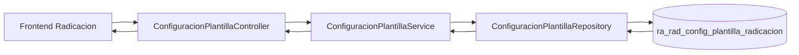
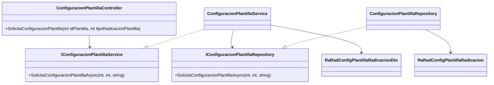
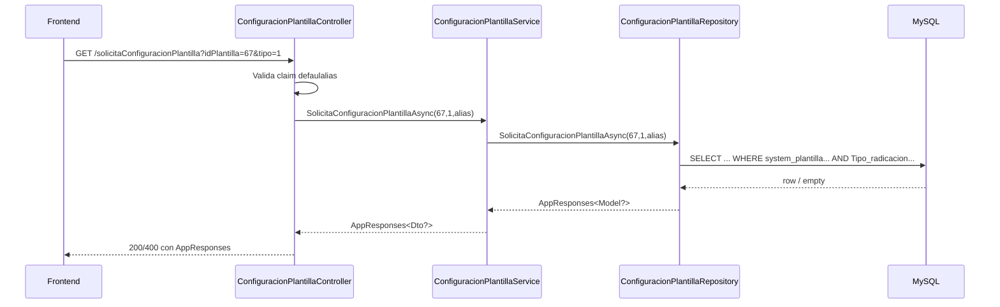
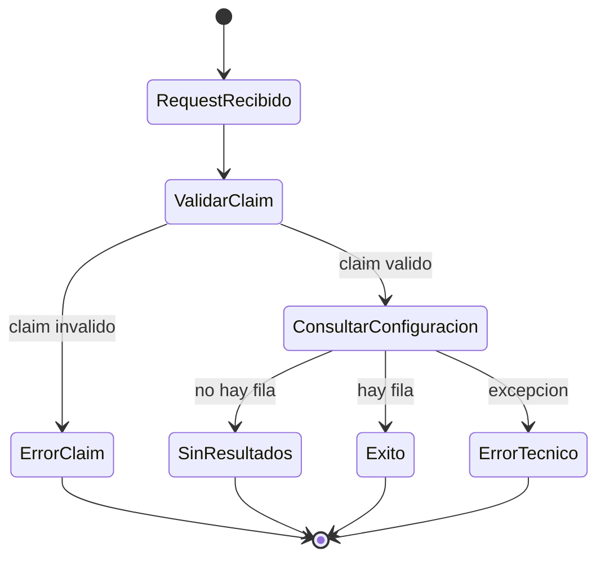

# SCRUM-57 Diagramas - Consulta Configuracion Plantilla

## Caso de Uso

```mermaid
flowchart LR
    FE[Frontend Radicacion] --> API[ConfiguracionPlantillaController]
    API --> SVC[ConfiguracionPlantillaService]
    SVC --> REP[ConfiguracionPlantillaRepository]
    REP --> DB[(ra_rad_config_plantilla_radicacion)]
    DB --> REP --> SVC --> API --> FE
```

## Diagrama de Clases

```mermaid
classDiagram
    class ConfiguracionPlantillaController {
      +SolicitaConfiguracionPlantilla(int idPlantilla, int tipoRadicacionPlantilla)
    }
    class IConfiguracionPlantillaService {
      +SolicitaConfiguracionPlantillaAsync(int, int, string)
    }
    class ConfiguracionPlantillaService
    class IConfiguracionPlantillaRepository {
      +SolicitaConfiguracionPlantillaAsync(int, int, string)
    }
    class ConfiguracionPlantillaRepository
    class RaRadConfigPlantillaRadicacion
    class RaRadConfigPlantillaRadicacionDto

    ConfiguracionPlantillaController --> IConfiguracionPlantillaService
    ConfiguracionPlantillaService ..|> IConfiguracionPlantillaService
    ConfiguracionPlantillaService --> IConfiguracionPlantillaRepository
    ConfiguracionPlantillaRepository ..|> IConfiguracionPlantillaRepository
    ConfiguracionPlantillaRepository --> RaRadConfigPlantillaRadicacion
    ConfiguracionPlantillaService --> RaRadConfigPlantillaRadicacionDto
```

## Diagrama de Secuencia

```mermaid
sequenceDiagram
    participant FE as Frontend
    participant API as ConfiguracionPlantillaController
    participant SVC as ConfiguracionPlantillaService
    participant REP as ConfiguracionPlantillaRepository
    participant DB as MySQL

    FE->>API: GET /solicitaConfiguracionPlantilla?idPlantilla=67&tipo=1
    API->>API: Valida claim defaulalias
    API->>SVC: SolicitaConfiguracionPlantillaAsync(67,1,alias)
    SVC->>REP: SolicitaConfiguracionPlantillaAsync(67,1,alias)
    REP->>DB: SELECT ... WHERE system_plantilla... AND Tipo_radicacion...
    DB-->>REP: row / empty
    REP-->>SVC: AppResponses<Model?>
    SVC-->>API: AppResponses<Dto?>
    API-->>FE: 200/400 con AppResponses
```

## Diagrama de Estado

```mermaid
stateDiagram-v2
    [*] --> RequestRecibido
    RequestRecibido --> ValidarClaim
    ValidarClaim --> ErrorClaim: claim invalido
    ValidarClaim --> ConsultarConfiguracion: claim valido
    ConsultarConfiguracion --> SinResultados: no hay fila
    ConsultarConfiguracion --> Exito: hay fila
    ConsultarConfiguracion --> ErrorTecnico: excepcion
    Exito --> [*]
    SinResultados --> [*]
    ErrorClaim --> [*]
    ErrorTecnico --> [*]
```
