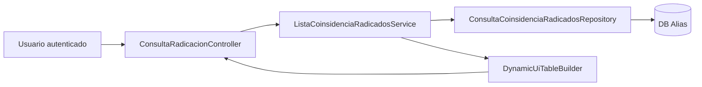
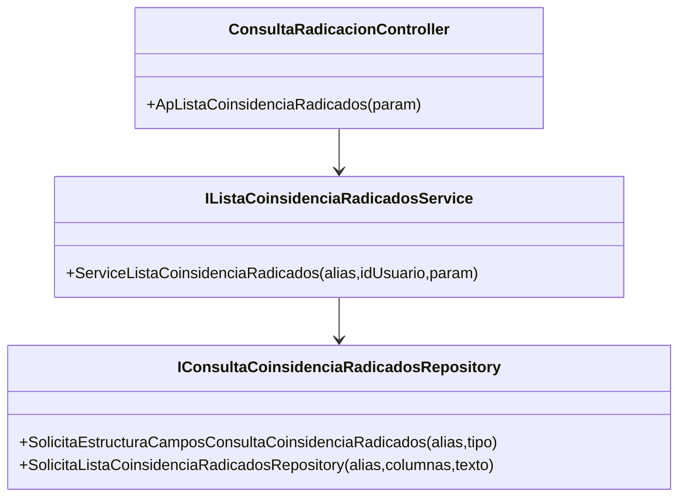
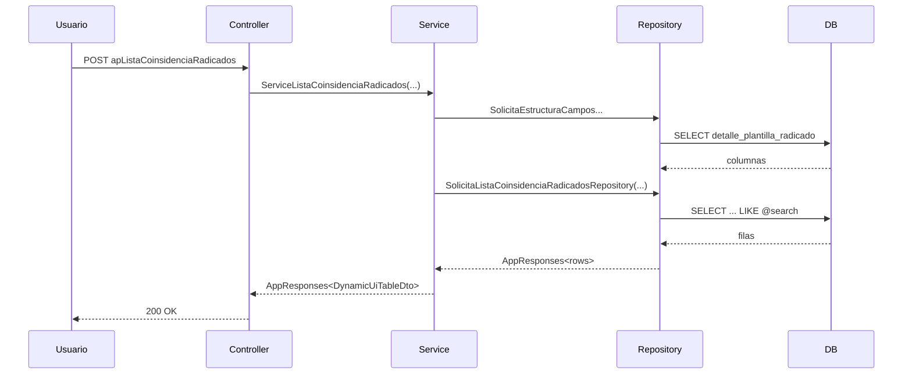
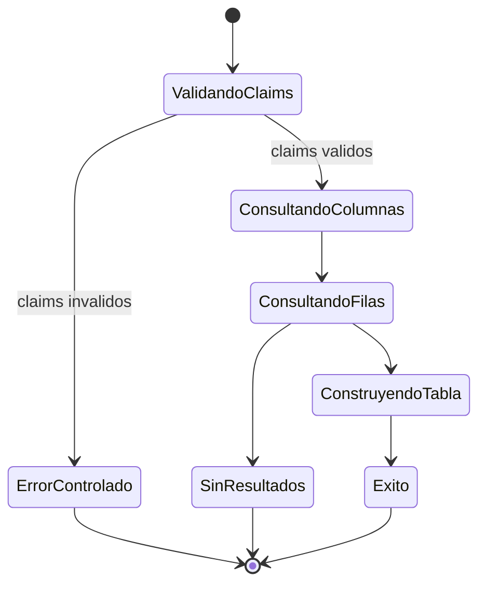

# Diagramas SCRUM-37

## Caso de uso

```mermaid
flowchart LR
    U[Usuario autenticado] --> C[ConsultaRadicacionController]
    C --> S[ListaCoinsidenciaRadicadosService]
    S --> R[ConsultaCoinsidenciaRadicadosRepository]
    R --> DB[(DB Alias)]
    S --> T[DynamicUiTableBuilder]
    T --> C
```

## Clases

```mermaid
classDiagram
    class ConsultaRadicacionController {
      +ApListaCoinsidenciaRadicados(param)
    }
    class IListaCoinsidenciaRadicadosService {
      +ServiceListaCoinsidenciaRadicados(alias,idUsuario,param)
    }
    class IConsultaCoinsidenciaRadicadosRepository {
      +SolicitaEstructuraCamposConsultaCoinsidenciaRadicados(alias,tipo)
      +SolicitaListaCoinsidenciaRadicadosRepository(alias,columnas,texto)
    }

    ConsultaRadicacionController --> IListaCoinsidenciaRadicadosService
    IListaCoinsidenciaRadicadosService --> IConsultaCoinsidenciaRadicadosRepository
```

## Secuencia

```mermaid
sequenceDiagram
    participant U as Usuario
    participant C as Controller
    participant S as Service
    participant R as Repository
    participant DB as DB

    U->>C: POST apListaCoinsidenciaRadicados
    C->>S: ServiceListaCoinsidenciaRadicados(...)
    S->>R: SolicitaEstructuraCampos...
    R->>DB: SELECT detalle_plantilla_radicado
    DB-->>R: columnas
    S->>R: SolicitaListaCoinsidenciaRadicadosRepository(...)
    R->>DB: SELECT ... LIKE @search
    DB-->>R: filas
    R-->>S: AppResponses<rows>
    S-->>C: AppResponses<DynamicUiTableDto>
    C-->>U: 200 OK
```

## Estado

```mermaid
stateDiagram-v2
    [*] --> ValidandoClaims
    ValidandoClaims --> ConsultandoColumnas: claims validos
    ValidandoClaims --> ErrorControlado: claims invalidos
    ConsultandoColumnas --> ConsultandoFilas
    ConsultandoFilas --> SinResultados
    ConsultandoFilas --> ConstruyendoTabla
    ConstruyendoTabla --> Exito
    ErrorControlado --> [*]
    SinResultados --> [*]
    Exito --> [*]
```
