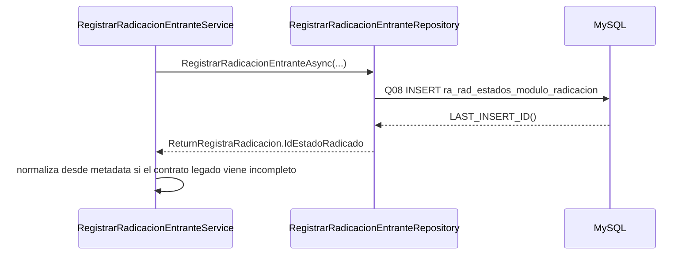

# SCRUM-101 - Diagramas

## Secuencia

```mermaid
sequenceDiagram
    participant S as RegistrarRadicacionEntranteService
    participant R as RegistrarRadicacionEntranteRepository
    participant DB as MySQL

    S->>R: RegistrarRadicacionEntranteAsync(...)
    R->>DB: Q08 INSERT ra_rad_estados_modulo_radicacion
    DB-->>R: LAST_INSERT_ID()
    R-->>S: ReturnRegistraRadicacion.IdEstadoRadicado
    S->>S: normaliza desde metadata si el contrato legado viene incompleto
```

## Nota SCRUM-30

Este ajuste amplía el contrato de salida del flujo de radicacion usado en la documentacion base de `SCRUM-30`.
