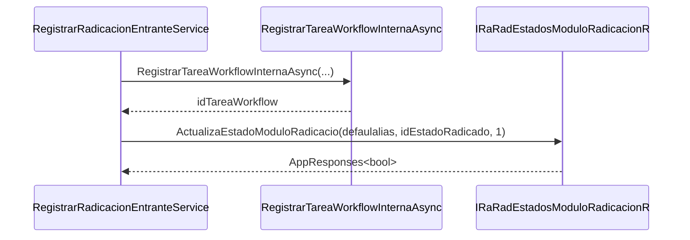

# SCRUM-102 - Diagramas

```mermaid
sequenceDiagram
    participant S as RegistrarRadicacionEntranteService
    participant TW as RegistrarTareaWorkflowInternaAsync
    participant RE as IRaRadEstadosModuloRadicacionR

    S->>TW: RegistrarTareaWorkflowInternaAsync(...)
    TW-->>S: idTareaWorkflow
    S->>RE: ActualizaEstadoModuloRadicacio(defaulalias, idEstadoRadicado, 1)
    RE-->>S: AppResponses<bool>
```
