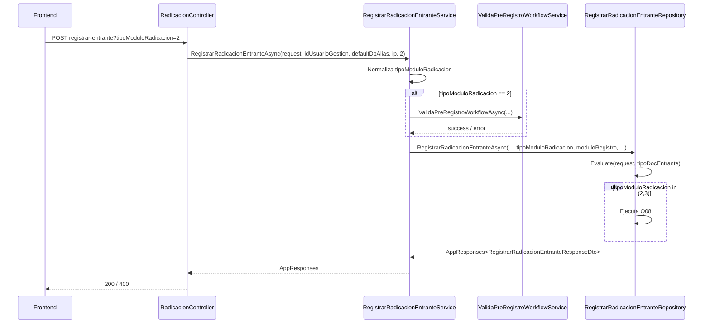
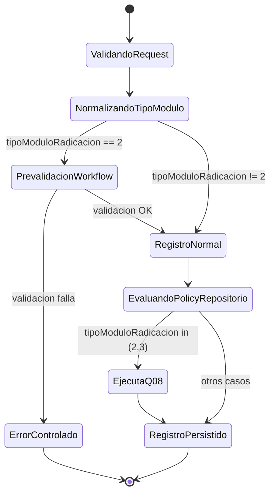

# SCRUM-75 - Diagramas

## Secuencia

```mermaid
sequenceDiagram
    participant FE as Frontend
    participant API as RadicacionController
    participant SVC as RegistrarRadicacionEntranteService
    participant WF as ValidaPreRegistroWorkflowService
    participant REP as RegistrarRadicacionEntranteRepository

    FE->>API: POST registrar-entrante?tipoModuloRadicacion=2
    API->>SVC: RegistrarRadicacionEntranteAsync(request, idUsuarioGestion, defaultDbAlias, ip, 2)
    SVC->>SVC: Normaliza tipoModuloRadicacion
    alt tipoModuloRadicacion == 2
        SVC->>WF: ValidaPreRegistroWorkflowAsync(...)
        WF-->>SVC: success / error
    end
    SVC->>REP: RegistrarRadicacionEntranteAsync(..., tipoModuloRadicacion, moduloRegistro, ...)
    REP->>REP: Evaluate(request, tipoDocEntrante)
    alt tipoModuloRadicacion in (2,3)
        REP->>REP: Ejecuta Q08
    end
    REP-->>SVC: AppResponses<RegistrarRadicacionEntranteResponseDto>
    SVC-->>API: AppResponses
    API-->>FE: 200 / 400
```

## Estado

```mermaid
stateDiagram-v2
    [*] --> ValidandoRequest
    ValidandoRequest --> NormalizandoTipoModulo
    NormalizandoTipoModulo --> PrevalidacionWorkflow: tipoModuloRadicacion == 2
    NormalizandoTipoModulo --> RegistroNormal: tipoModuloRadicacion != 2
    PrevalidacionWorkflow --> ErrorControlado: validacion falla
    PrevalidacionWorkflow --> RegistroNormal: validacion OK
    RegistroNormal --> EvaluandoPolicyRepositorio
    EvaluandoPolicyRepositorio --> EjecutaQ08: tipoModuloRadicacion in (2,3)
    EvaluandoPolicyRepositorio --> RegistroPersistido: otros casos
    EjecutaQ08 --> RegistroPersistido
    ErrorControlado --> [*]
    RegistroPersistido --> [*]
```
