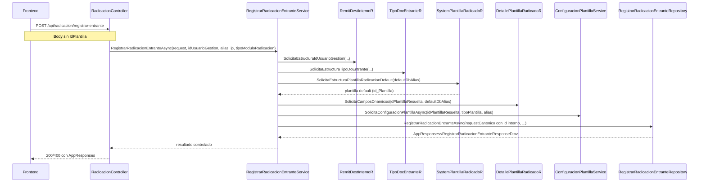
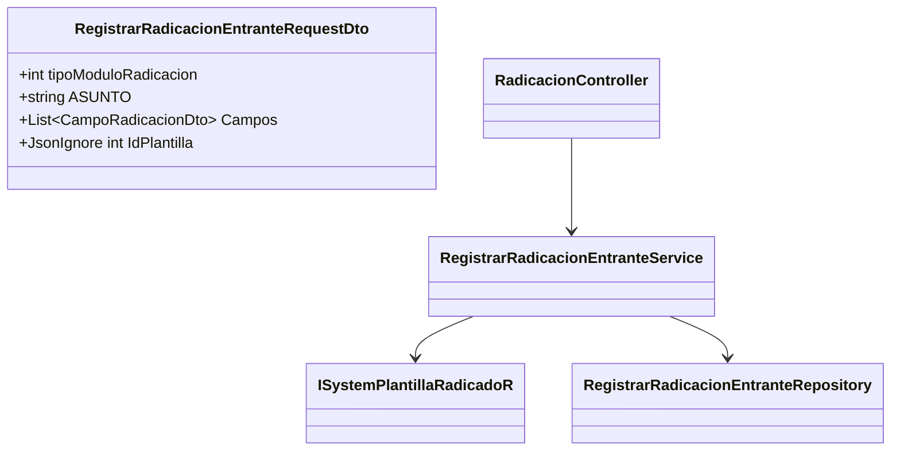
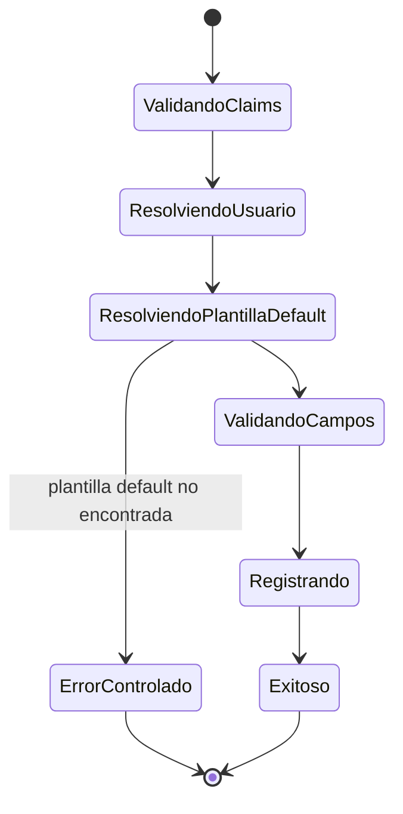

# SCRUM-76 - Diagramas

## Secuencia

```mermaid
sequenceDiagram
    participant FE as Frontend
    participant API as RadicacionController
    participant S as RegistrarRadicacionEntranteService
    participant U as RemitDestInternoR
    participant T as TipoDocEntranteR
    participant P as SystemPlantillaRadicadoR
    participant D as DetallePlantillaRadicadoR
    participant C as ConfiguracionPlantillaService
    participant R as RegistrarRadicacionEntranteRepository

    FE->>API: POST /api/radicacion/registrar-entrante
    Note over FE,API: Body sin IdPlantilla
    API->>S: RegistrarRadicacionEntranteAsync(request, idUsuarioGestion, alias, ip, tipoModuloRadicacion)
    S->>U: SolicitaEstructuraIdUsuarioGestion(...)
    S->>T: SolicitaEstructuraTipoDoEntrante(...)
    S->>P: SolicitaEstructuraPlantillaRadicacionDefault(defaultDbAlias)
    P-->>S: plantilla default (id_Plantilla)
    S->>D: SolicitaCamposDnamicos(idPlantillaResuelta, defaultDbAlias)
    S->>C: SolicitaConfiguracionPlantillaAsync(idPlantillaResuelta, tipoPlantilla, alias)
    S->>R: RegistrarRadicacionEntranteAsync(requestCanonico con id interno, ...)
    R-->>S: AppResponses<RegistrarRadicacionEntranteResponseDto>
    S-->>API: resultado controlado
    API-->>FE: 200/400 con AppResponses
```

## Clases impactadas

```mermaid
classDiagram
    class RegistrarRadicacionEntranteRequestDto {
      +int tipoModuloRadicacion
      +string ASUNTO
      +List~CampoRadicacionDto~ Campos
      +JsonIgnore int IdPlantilla
    }
    class RadicacionController
    class RegistrarRadicacionEntranteService
    class ISystemPlantillaRadicadoR
    class RegistrarRadicacionEntranteRepository

    RadicacionController --> RegistrarRadicacionEntranteService
    RegistrarRadicacionEntranteService --> ISystemPlantillaRadicadoR
    RegistrarRadicacionEntranteService --> RegistrarRadicacionEntranteRepository
```

## Estado

```mermaid
stateDiagram-v2
    [*] --> ValidandoClaims
    ValidandoClaims --> ResolviendoUsuario
    ResolviendoUsuario --> ResolviendoPlantillaDefault
    ResolviendoPlantillaDefault --> ErrorControlado: plantilla default no encontrada
    ResolviendoPlantillaDefault --> ValidandoCampos
    ValidandoCampos --> Registrando
    Registrando --> Exitoso
    ErrorControlado --> [*]
    Exitoso --> [*]
```
