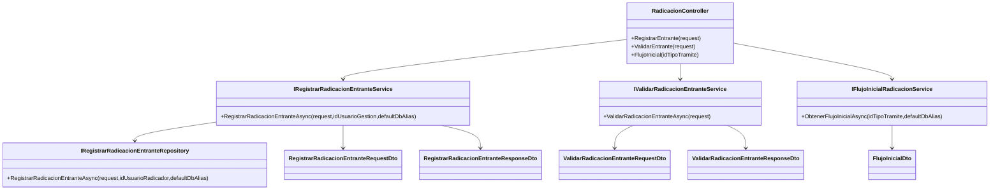

# Diagrama de Clases

```mermaid
classDiagram
    class RadicacionController {
      +RegistrarEntrante(request)
      +ValidarEntrante(request)
      +FlujoInicial(idTipoTramite)
    }

    class IRegistrarRadicacionEntranteService {
      +RegistrarRadicacionEntranteAsync(request,idUsuarioGestion,defaultDbAlias)
    }

    class IValidarRadicacionEntranteService {
      +ValidarRadicacionEntranteAsync(request)
    }

    class IFlujoInicialRadicacionService {
      +ObtenerFlujoInicialAsync(idTipoTramite,defaultDbAlias)
    }

    class IRegistrarRadicacionEntranteRepository {
      +RegistrarRadicacionEntranteAsync(request,idUsuarioRadicador,defaultDbAlias)
    }

    class RegistrarRadicacionEntranteRequestDto
    class RegistrarRadicacionEntranteResponseDto
    class ValidarRadicacionEntranteRequestDto
    class ValidarRadicacionEntranteResponseDto
    class FlujoInicialDto

    RadicacionController --> IRegistrarRadicacionEntranteService
    RadicacionController --> IValidarRadicacionEntranteService
    RadicacionController --> IFlujoInicialRadicacionService
    IRegistrarRadicacionEntranteService --> IRegistrarRadicacionEntranteRepository
    IRegistrarRadicacionEntranteService --> RegistrarRadicacionEntranteRequestDto
    IRegistrarRadicacionEntranteService --> RegistrarRadicacionEntranteResponseDto
    IValidarRadicacionEntranteService --> ValidarRadicacionEntranteRequestDto
    IValidarRadicacionEntranteService --> ValidarRadicacionEntranteResponseDto
    IFlujoInicialRadicacionService --> FlujoInicialDto
```
