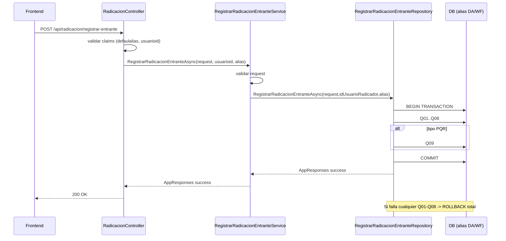

# Diagrama de Secuencia

```mermaid
sequenceDiagram
    participant FE as Frontend
    participant API as RadicacionController
    participant SVC as RegistrarRadicacionEntranteService
    participant REP as RegistrarRadicacionEntranteRepository
    participant DB as DB (alias DA/WF)

    FE->>API: POST /api/radicacion/registrar-entrante
    API->>API: validar claims (defaulalias, usuarioid)
    API->>SVC: RegistrarRadicacionEntranteAsync(request, usuarioid, alias)
    SVC->>SVC: validar request
    SVC->>REP: RegistrarRadicacionEntranteAsync(request,idUsuarioRadicador,alias)
    REP->>DB: BEGIN TRANSACTION
    REP->>DB: Q01..Q08
    alt tipo PQR
      REP->>DB: Q09
    end
    REP->>DB: COMMIT
    REP-->>SVC: AppResponses success
    SVC-->>API: AppResponses success
    API-->>FE: 200 OK

    Note over REP,DB: Si falla cualquier Q01-Q08 -> ROLLBACK total
```
