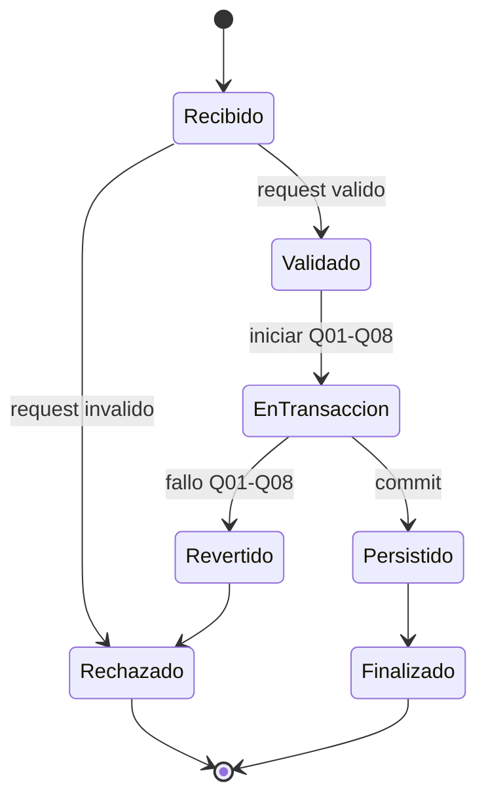

# Diagrama de Estado

```mermaid
stateDiagram-v2
    [*] --> Recibido
    Recibido --> Validado: request valido
    Recibido --> Rechazado: request invalido

    Validado --> EnTransaccion: iniciar Q01-Q08
    EnTransaccion --> Persistido: commit
    EnTransaccion --> Revertido: fallo Q01-Q08

    Persistido --> Finalizado
    Revertido --> Rechazado
    Rechazado --> [*]
    Finalizado --> [*]
```
