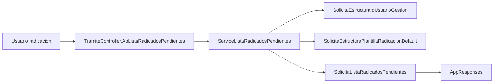
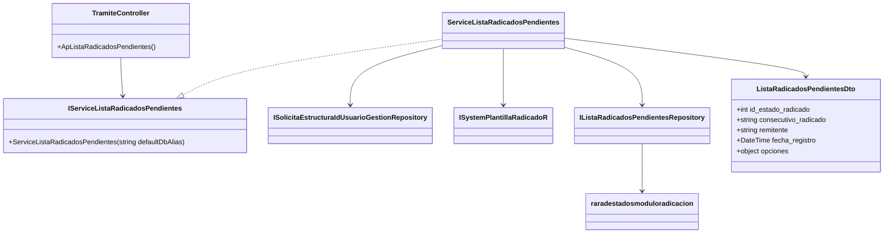
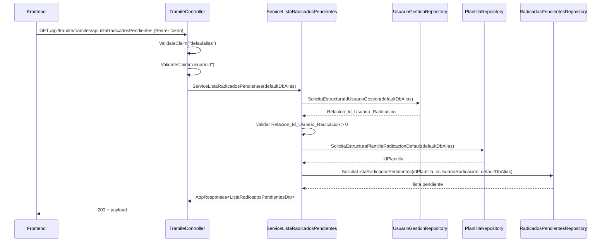
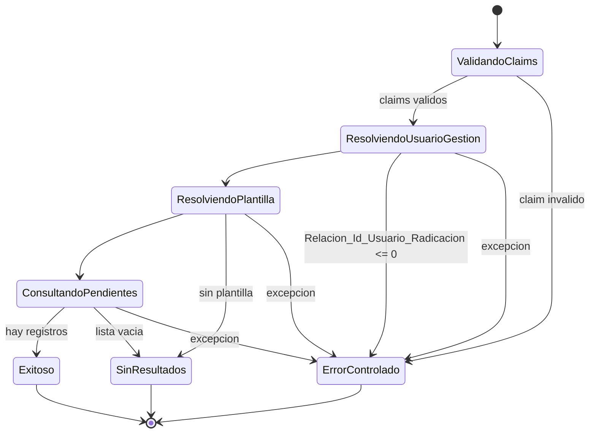

# SCRUM-30 - Diagramas de Analisis

## Caso de uso

```mermaid
flowchart LR
    U[Usuario radicacion] --> C[TramiteController.ApListaRadicadosPendientes]
    C --> S[ServiceListaRadicadosPendientes]
    S --> UG[SolicitaEstructuraIdUsuarioGestion]
    S --> PL[SolicitaEstructuraPlantillaRadicacionDefault]
    S --> RP[SolicitaListaRadicadosPendientes]
    RP --> R[AppResponses<ListaRadicadosPendientesDto>]
```

## Diagrama de clases

```mermaid
classDiagram
    class TramiteController {
      +ApListaRadicadosPendientes()
    }
    class IServiceListaRadicadosPendientes {
      +ServiceListaRadicadosPendientes(string defaultDbAlias)
    }
    class ServiceListaRadicadosPendientes
    class ISolicitaEstructuraIdUsuarioGestionRepository
    class ISystemPlantillaRadicadoR
    class IListaRadicadosPendientesRepository
    class ListaRadicadosPendientesDto {
      +int id_estado_radicado
      +string consecutivo_radicado
      +string remitente
      +DateTime fecha_registro
      +object opciones
    }
    class raradestadosmoduloradicacion

    TramiteController --> IServiceListaRadicadosPendientes
    ServiceListaRadicadosPendientes ..|> IServiceListaRadicadosPendientes
    ServiceListaRadicadosPendientes --> ISolicitaEstructuraIdUsuarioGestionRepository
    ServiceListaRadicadosPendientes --> ISystemPlantillaRadicadoR
    ServiceListaRadicadosPendientes --> IListaRadicadosPendientesRepository
    IListaRadicadosPendientesRepository --> raradestadosmoduloradicacion
    ServiceListaRadicadosPendientes --> ListaRadicadosPendientesDto
```

## Diagrama de secuencia

```mermaid
sequenceDiagram
    participant U as Frontend
    participant C as TramiteController
    participant S as ServiceListaRadicadosPendientes
    participant G as UsuarioGestionRepository
    participant P as PlantillaRepository
    participant R as RadicadosPendientesRepository

    U->>C: GET /api/tramite/tramites/apListaRadicadosPendientes (Bearer token)
    C->>C: ValidateClaim("defaulalias")
    C->>C: ValidateClaim("usuarioid")
    C->>S: ServiceListaRadicadosPendientes(defaultDbAlias)
    S->>G: SolicitaEstructuraIdUsuarioGestion(defaultDbAlias)
    G-->>S: Relacion_Id_Usuario_Radicacion
    S->>S: validar Relacion_Id_Usuario_Radicacion > 0
    S->>P: SolicitaEstructuraPlantillaRadicacionDefault(defaultDbAlias)
    P-->>S: idPlantilla
    S->>R: SolicitaListaRadicadosPendientes(idPlantilla, idUsuarioRadicacion, defaultDbAlias)
    R-->>S: lista pendiente
    S-->>C: AppResponses<ListaRadicadosPendientesDto>
    C-->>U: 200 + payload
```

## Diagrama de estado

```mermaid
stateDiagram-v2
    [*] --> ValidandoClaims
    ValidandoClaims --> ResolviendoUsuarioGestion: claims validos
    ValidandoClaims --> ErrorControlado: claim invalido
    ResolviendoUsuarioGestion --> ResolviendoPlantilla
    ResolviendoUsuarioGestion --> ErrorControlado: Relacion_Id_Usuario_Radicacion <= 0
    ResolviendoUsuarioGestion --> ErrorControlado: excepcion
    ResolviendoPlantilla --> ConsultandoPendientes
    ResolviendoPlantilla --> SinResultados: sin plantilla
    ResolviendoPlantilla --> ErrorControlado: excepcion
    ConsultandoPendientes --> Exitoso: hay registros
    ConsultandoPendientes --> SinResultados: lista vacia
    ConsultandoPendientes --> ErrorControlado: excepcion
    Exitoso --> [*]
    SinResultados --> [*]
    ErrorControlado --> [*]
```
