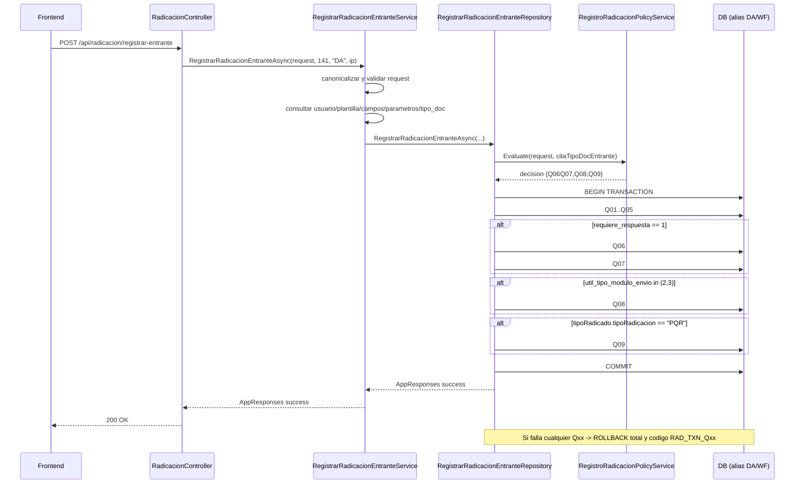

# Diagrama de Secuencia

```mermaid
sequenceDiagram
    participant FE as Frontend
    participant API as RadicacionController
    participant SVC as RegistrarRadicacionEntranteService
    participant REP as RegistrarRadicacionEntranteRepository
    participant POL as RegistroRadicacionPolicyService
    participant DB as DB (alias DA/WF)

    FE->>API: POST /api/radicacion/registrar-entrante
    API->>SVC: RegistrarRadicacionEntranteAsync(request, 141, "DA", ip)
    SVC->>SVC: canonicalizar y validar request
    SVC->>SVC: consultar usuario/plantilla/campos/parametros/tipo_doc
    SVC->>REP: RegistrarRadicacionEntranteAsync(...)
    REP->>POL: Evaluate(request, citaTipoDocEntrante)
    POL-->>REP: decision {Q06Q07,Q08,Q09}
    REP->>DB: BEGIN TRANSACTION
    REP->>DB: Q01..Q05
    alt requiere_respuesta == 1
      REP->>DB: Q06
      REP->>DB: Q07
    end
    alt util_tipo_modulo_envio in (2,3)
      REP->>DB: Q08
    end
    alt tipoRadicado.tipoRadicacion == "PQR"
      REP->>DB: Q09
    end
    REP->>DB: COMMIT
    REP-->>SVC: AppResponses success
    SVC-->>API: AppResponses success
    API-->>FE: 200 OK

    Note over REP,DB: Si falla cualquier Qxx -> ROLLBACK total y codigo RAD_TXN_Qxx
```
