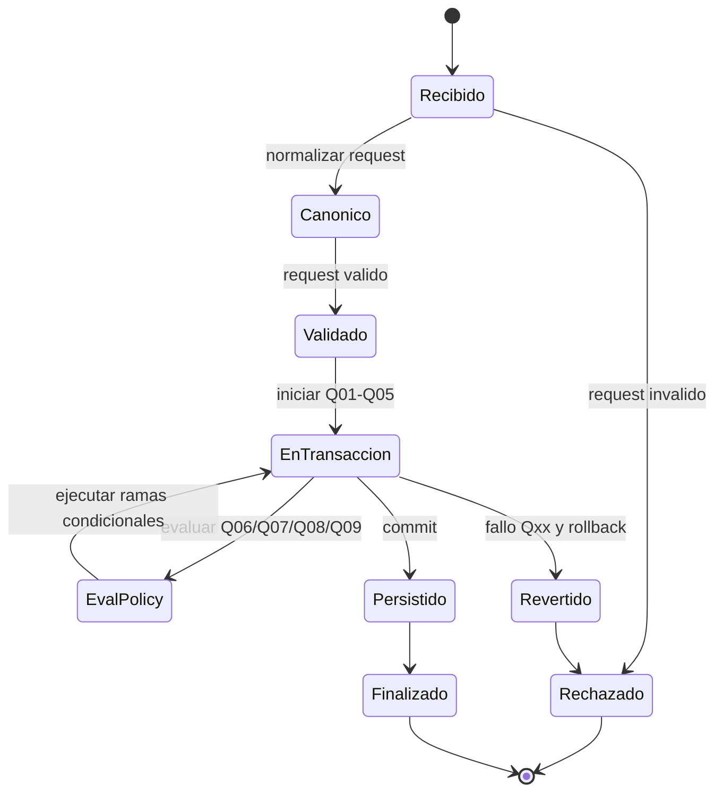

# Diagrama de Estado

```mermaid
stateDiagram-v2
    [*] --> Recibido
    Recibido --> Canonico: normalizar request
    Canonico --> Validado: request valido
    Recibido --> Rechazado: request invalido

    Validado --> EnTransaccion: iniciar Q01-Q05
    EnTransaccion --> EvalPolicy: evaluar Q06/Q07/Q08/Q09
    EvalPolicy --> EnTransaccion: ejecutar ramas condicionales
    EnTransaccion --> Persistido: commit
    EnTransaccion --> Revertido: fallo Qxx y rollback

    Persistido --> Finalizado
    Revertido --> Rechazado
    Rechazado --> [*]
    Finalizado --> [*]
```
