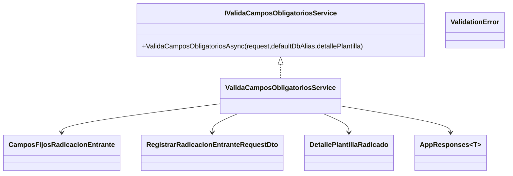

# Diagrama de Clases

```mermaid
classDiagram
    class IValidaCamposObligatoriosService {
      +ValidaCamposObligatoriosAsync(request,defaultDbAlias,detallePlantilla)
    }

    class ValidaCamposObligatoriosService
    class CamposFijosRadicacionEntrante
    class RegistrarRadicacionEntranteRequestDto
    class DetallePlantillaRadicado
    class ValidationError
    class AppResponses~T~

    IValidaCamposObligatoriosService <|.. ValidaCamposObligatoriosService
    ValidaCamposObligatoriosService --> CamposFijosRadicacionEntrante
    ValidaCamposObligatoriosService --> RegistrarRadicacionEntranteRequestDto
    ValidaCamposObligatoriosService --> DetallePlantillaRadicado
    ValidaCamposObligatoriosService --> AppResponses~List<ValidationError>~
```
