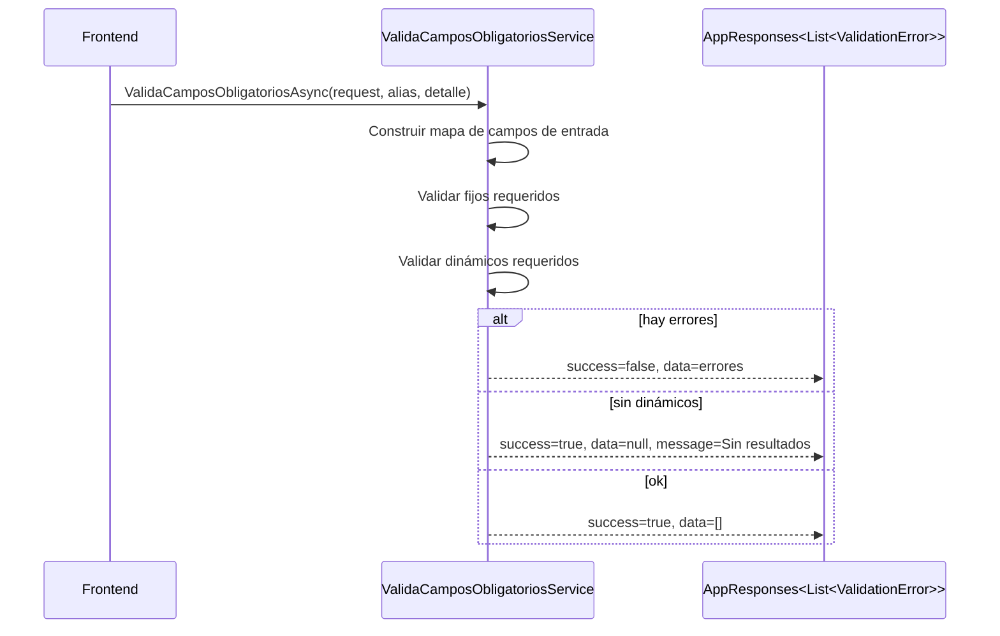

# Diagrama de Secuencia

```mermaid
sequenceDiagram
    participant FE as Frontend
    participant SVC as ValidaCamposObligatoriosService
    participant RES as AppResponses<List<ValidationError>>

    FE->>SVC: ValidaCamposObligatoriosAsync(request, alias, detalle)
    SVC->>SVC: Construir mapa de campos de entrada
    SVC->>SVC: Validar fijos requeridos
    SVC->>SVC: Validar dinámicos requeridos
    alt hay errores
      SVC-->>RES: success=false, data=errores
    else sin dinámicos
      SVC-->>RES: success=true, data=null, message=Sin resultados
    else ok
      SVC-->>RES: success=true, data=[]
    end
```
