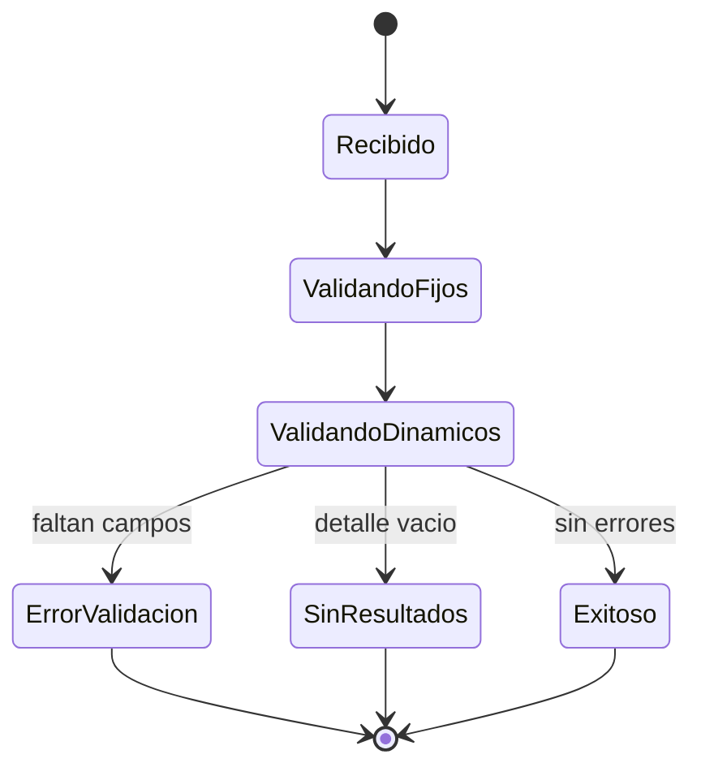

# Diagrama de Estado

```mermaid
stateDiagram-v2
    [*] --> Recibido
    Recibido --> ValidandoFijos
    ValidandoFijos --> ValidandoDinamicos
    ValidandoDinamicos --> ErrorValidacion: faltan campos
    ValidandoDinamicos --> SinResultados: detalle vacio
    ValidandoDinamicos --> Exitoso: sin errores
    ErrorValidacion --> [*]
    SinResultados --> [*]
    Exitoso --> [*]
```
