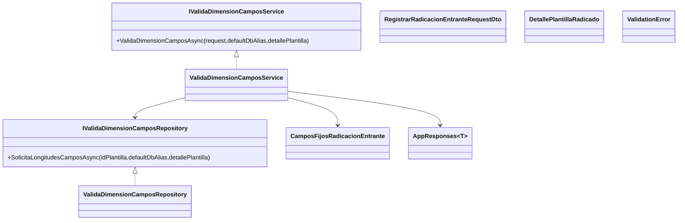

# Diagrama de Clases

```mermaid
classDiagram
    class IValidaDimensionCamposService {
      +ValidaDimensionCamposAsync(request,defaultDbAlias,detallePlantilla)
    }

    class ValidaDimensionCamposService
    class IValidaDimensionCamposRepository {
      +SolicitaLongitudesCamposAsync(idPlantilla,defaultDbAlias,detallePlantilla)
    }
    class ValidaDimensionCamposRepository
    class CamposFijosRadicacionEntrante
    class RegistrarRadicacionEntranteRequestDto
    class DetallePlantillaRadicado
    class ValidationError
    class AppResponses~T~

    IValidaDimensionCamposService <|.. ValidaDimensionCamposService
    IValidaDimensionCamposRepository <|.. ValidaDimensionCamposRepository
    ValidaDimensionCamposService --> IValidaDimensionCamposRepository
    ValidaDimensionCamposService --> CamposFijosRadicacionEntrante
    ValidaDimensionCamposService --> AppResponses~List<ValidationError>~
```
