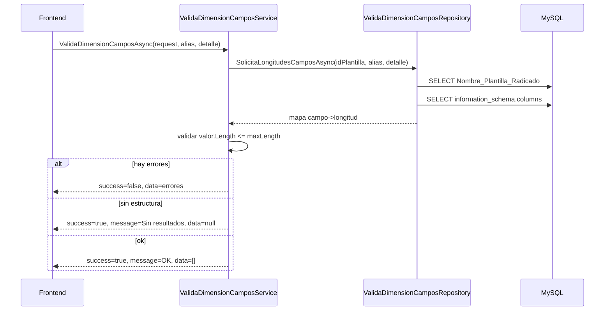

# Diagrama de Secuencia

```mermaid
sequenceDiagram
    participant FE as Frontend
    participant SVC as ValidaDimensionCamposService
    participant REP as ValidaDimensionCamposRepository
    participant DB as MySQL

    FE->>SVC: ValidaDimensionCamposAsync(request, alias, detalle)
    SVC->>REP: SolicitaLongitudesCamposAsync(idPlantilla, alias, detalle)
    REP->>DB: SELECT Nombre_Plantilla_Radicado
    REP->>DB: SELECT information_schema.columns
    REP-->>SVC: mapa campo->longitud
    SVC->>SVC: validar valor.Length <= maxLength
    alt hay errores
      SVC-->>FE: success=false, data=errores
    else sin estructura
      SVC-->>FE: success=true, message=Sin resultados, data=null
    else ok
      SVC-->>FE: success=true, message=OK, data=[]
    end
```
