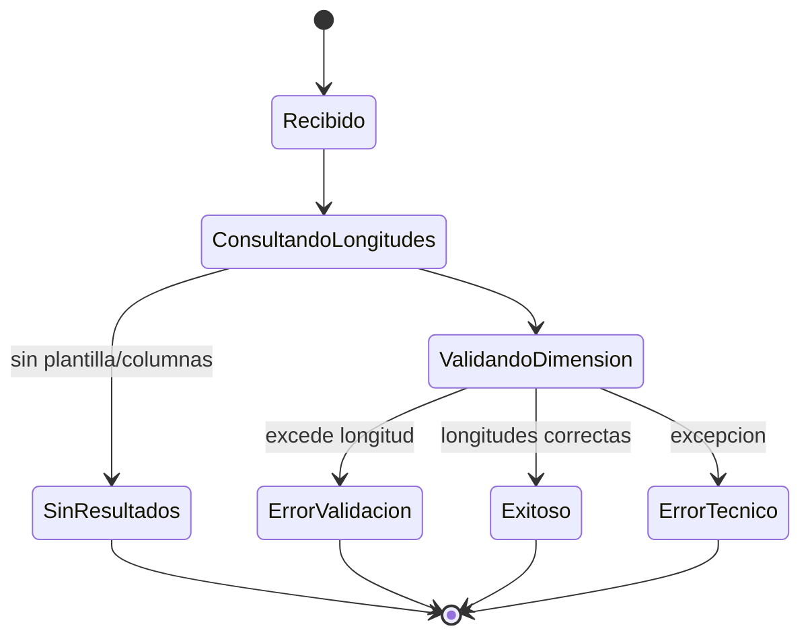

# Diagrama de Estado

```mermaid
stateDiagram-v2
    [*] --> Recibido
    Recibido --> ConsultandoLongitudes
    ConsultandoLongitudes --> SinResultados: sin plantilla/columnas
    ConsultandoLongitudes --> ValidandoDimension
    ValidandoDimension --> ErrorValidacion: excede longitud
    ValidandoDimension --> Exitoso: longitudes correctas
    ValidandoDimension --> ErrorTecnico: excepcion
    SinResultados --> [*]
    ErrorValidacion --> [*]
    Exitoso --> [*]
    ErrorTecnico --> [*]
```
