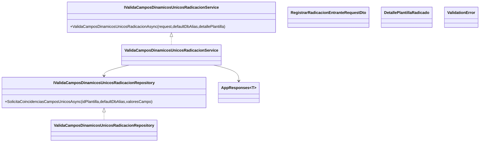

# Diagrama de Clases

```mermaid
classDiagram
    class IValidaCamposDinamicosUnicosRadicacionService {
      +ValidaCamposDinamicosUnicosRadicacionAsync(request,defaultDbAlias,detallePlantilla)
    }

    class ValidaCamposDinamicosUnicosRadicacionService
    class IValidaCamposDinamicosUnicosRadicacionRepository {
      +SolicitaCoincidenciasCamposUnicosAsync(idPlantilla,defaultDbAlias,valoresCampo)
    }
    class ValidaCamposDinamicosUnicosRadicacionRepository
    class RegistrarRadicacionEntranteRequestDto
    class DetallePlantillaRadicado
    class ValidationError
    class AppResponses~T~

    IValidaCamposDinamicosUnicosRadicacionService <|.. ValidaCamposDinamicosUnicosRadicacionService
    IValidaCamposDinamicosUnicosRadicacionRepository <|.. ValidaCamposDinamicosUnicosRadicacionRepository
    ValidaCamposDinamicosUnicosRadicacionService --> IValidaCamposDinamicosUnicosRadicacionRepository
    ValidaCamposDinamicosUnicosRadicacionService --> AppResponses~List<ValidationError>~
```
