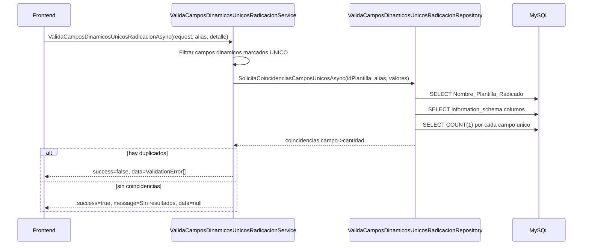

# Diagrama de Secuencia

```mermaid
sequenceDiagram
    participant FE as Frontend
    participant SVC as ValidaCamposDinamicosUnicosRadicacionService
    participant REP as ValidaCamposDinamicosUnicosRadicacionRepository
    participant DB as MySQL

    FE->>SVC: ValidaCamposDinamicosUnicosRadicacionAsync(request, alias, detalle)
    SVC->>SVC: Filtrar campos dinamicos marcados UNICO
    SVC->>REP: SolicitaCoincidenciasCamposUnicosAsync(idPlantilla, alias, valores)
    REP->>DB: SELECT Nombre_Plantilla_Radicado
    REP->>DB: SELECT information_schema.columns
    REP->>DB: SELECT COUNT(1) por cada campo unico
    REP-->>SVC: coincidencias campo->cantidad
    alt hay duplicados
      SVC-->>FE: success=false, data=ValidationError[]
    else sin coincidencias
      SVC-->>FE: success=true, message=Sin resultados, data=null
    end
```
