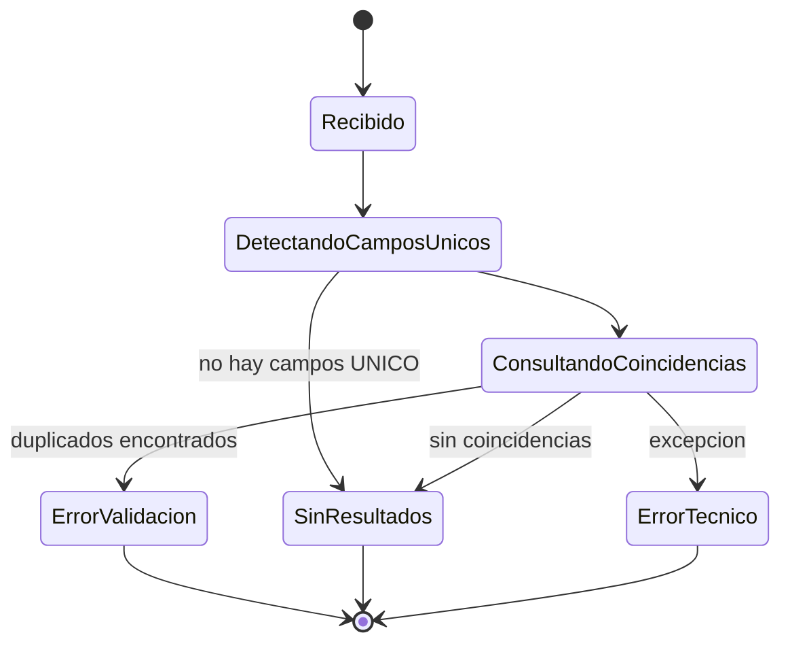

# Diagrama de Estado

```mermaid
stateDiagram-v2
    [*] --> Recibido
    Recibido --> DetectandoCamposUnicos
    DetectandoCamposUnicos --> SinResultados: no hay campos UNICO
    DetectandoCamposUnicos --> ConsultandoCoincidencias
    ConsultandoCoincidencias --> ErrorValidacion: duplicados encontrados
    ConsultandoCoincidencias --> SinResultados: sin coincidencias
    ConsultandoCoincidencias --> ErrorTecnico: excepcion
    ErrorValidacion --> [*]
    SinResultados --> [*]
    ErrorTecnico --> [*]
```
