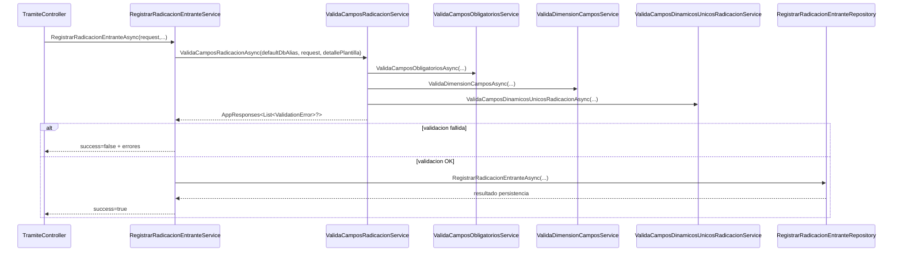

# Diagrama de Secuencia

```mermaid
sequenceDiagram
    participant C as TramiteController
    participant S as RegistrarRadicacionEntranteService
    participant O as ValidaCamposRadicacionService
    participant V1 as ValidaCamposObligatoriosService
    participant V2 as ValidaDimensionCamposService
    participant V3 as ValidaCamposDinamicosUnicosRadicacionService
    participant R as RegistrarRadicacionEntranteRepository

    C->>S: RegistrarRadicacionEntranteAsync(request,...)
    S->>O: ValidaCamposRadicacionAsync(defaultDbAlias, request, detallePlantilla)
    O->>V1: ValidaCamposObligatoriosAsync(...)
    O->>V2: ValidaDimensionCamposAsync(...)
    O->>V3: ValidaCamposDinamicosUnicosRadicacionAsync(...)
    O-->>S: AppResponses<List<ValidationError>?>
    alt validacion fallida
        S-->>C: success=false + errores
    else validacion OK
        S->>R: RegistrarRadicacionEntranteAsync(...)
        R-->>S: resultado persistencia
        S-->>C: success=true
    end
```
