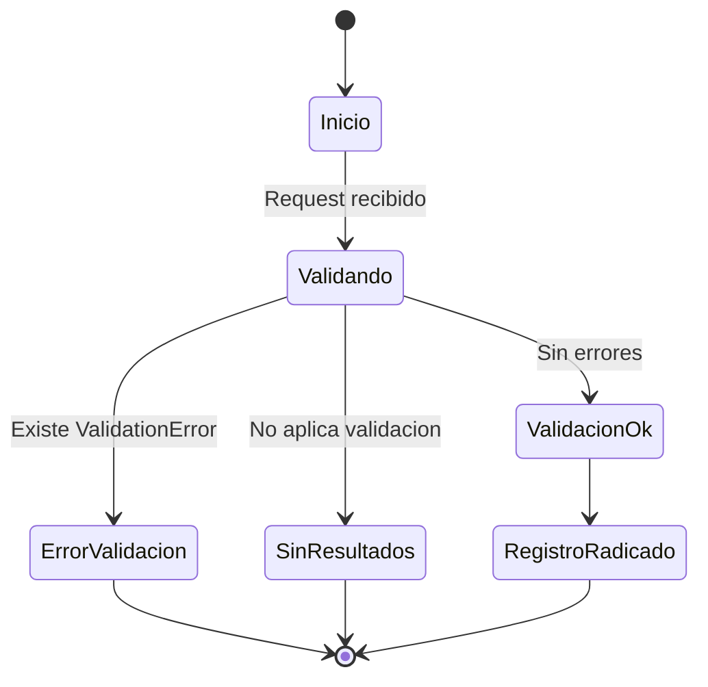

# Diagrama de Estado

```mermaid
stateDiagram-v2
    [*] --> Inicio
    Inicio --> Validando : Request recibido
    Validando --> ErrorValidacion : Existe ValidationError
    Validando --> SinResultados : No aplica validacion
    Validando --> ValidacionOk : Sin errores
    ErrorValidacion --> [*]
    SinResultados --> [*]
    ValidacionOk --> RegistroRadicado
    RegistroRadicado --> [*]
```
