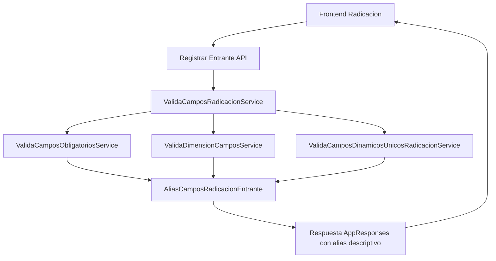

# Diagrama de Casos de Uso - SCRUM-50

```mermaid
flowchart TD
    A[Frontend Radicacion] --> B[Registrar Entrante API]
    B --> C[ValidaCamposRadicacionService]
    C --> D[ValidaCamposObligatoriosService]
    C --> E[ValidaDimensionCamposService]
    C --> F[ValidaCamposDinamicosUnicosRadicacionService]
    D --> G[AliasCamposRadicacionEntrante]
    E --> G
    F --> G
    G --> H[Respuesta AppResponses con alias descriptivo]
    H --> A
```
